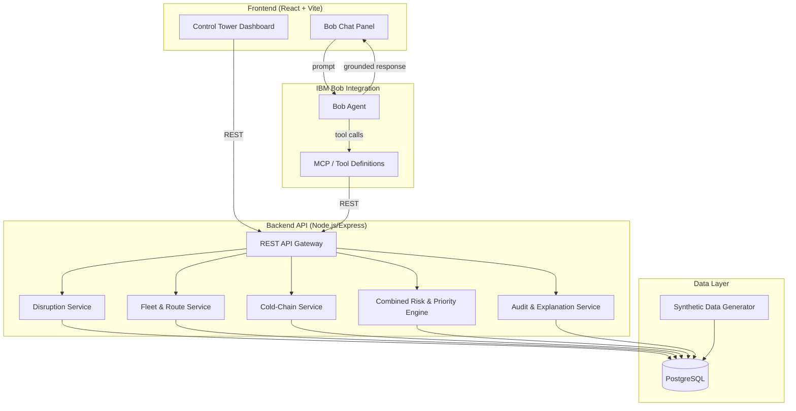
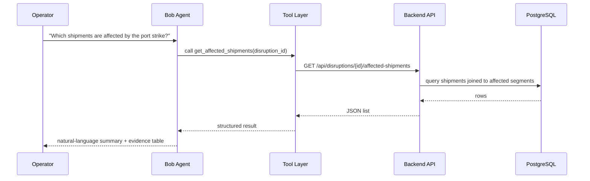
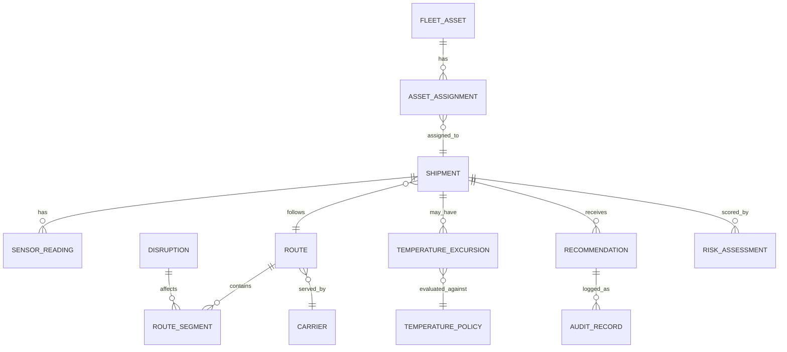

# DOCUMENT 1 — Main Project Proposal and Technical Solution Design

# ChainPulse
### AI Control Tower for Disruption Response, Fleet Redeployment & Cold-Chain Integrity — Powered by IBM Bob

**One-line description:** ChainPulse is a Bob-powered logistics control tower that turns disruption chaos into a ranked, explainable action plan — rerouting shipments, redeploying idle fleet, and catching cold-chain breaches before delivery.

**Tagline:** *"See the disruption. Trust the recommendation. Act before the cargo is lost."*

**Project category:** Logistics & Ports — L2: Supply Chain Disruption Assistant & Fleet Utilisation Optimizer (Bobathon 2026)

**Target users:** Supply-chain managers, control-tower operators, fleet managers, logistics coordinators, cold-chain compliance officers, operations managers at mid-to-large freight/3PL operators.

**Core value proposition:** ChainPulse fuses three problems that are normally handled in three different spreadsheets — disruption impact, fleet idle time, and cold-chain risk — into a single, explainable, human-approved decision layer, with IBM Bob as the conversational front end over verified backend data.

---

## 2. Executive Summary

When a port strike, storm, or geopolitical event hits, a mid-size freight operator does not lose one shipment — it loses visibility into *all* shipments that touch the affected lane, the vessels/trucks that are suddenly stranded elsewhere, and the cold-chain cargo whose temperature logs nobody is watching in the middle of the chaos. Today this is handled manually: an operator opens a spreadsheet, greps a route list, calls a few carriers, and hopes nothing perishable is quietly warming up in a container three states away. This does not scale past a handful of shipments, and cold-chain breaches are frequently discovered only at delivery — by which point a $500K+ vaccine or produce shipment is already a write-off.

ChainPulse addresses this by treating disruption response, fleet utilisation, and cold-chain monitoring as **one correlated risk problem**, not three separate dashboards. When a disruption is declared, the system immediately (1) identifies every affected shipment and ranks it by urgency, (2) proposes feasible reroutes and alternate carriers with transparent scoring, (3) scans the fleet for idle assets that can be redeployed to cover the gap, and (4) cross-checks cold-chain sensor streams for temperature excursions on shipments now sitting still or delayed. All of this is exposed through a Bob assistant that answers operator questions in natural language — but Bob never invents data: every claim it makes is grounded in a backend tool call whose result is shown alongside the answer.

The innovation is not "AI-powered dashboard" — it is the **combined priority engine** that merges disruption exposure and cold-chain risk into one ranked worklist, and the **explainability layer** that shows the operator exactly why a recommendation was made, what alternatives were rejected and why, and what data is missing, before any action is taken. Every recommendation requires human approval; ChainPulse never auto-executes a reroute or reassignment.

This is achievable by a two-person team in a buildathon timeframe because the MVP deliberately favours **deterministic rules and transparent scoring over heavy ML** — rule-based disruption matching, formula-based fleet scoring, and threshold-based cold-chain severity classification are fast to build, easy to explain to judges, and don't require training data we don't have. Machine learning is scoped honestly as future work where it would add real value (e.g., ETA delay prediction), not bolted on for its own sake.

The final demo will prove three things end to end: (1) a disruption event correctly narrows a shipment universe down to the affected subset and produces ranked, explainable reroute/redeployment recommendations; (2) a cold-chain shipment with a genuine temperature excursion is caught, classified by severity, and surfaced before delivery; (3) Bob can answer natural-language operator questions about both, grounded entirely in backend data, with a human decision required before anything is marked as acted upon.

---

## 3. Official Problem Alignment

### 3.1 Official L2 Requirements Coverage

| Official L2 requirement | Our feature | Input data | Processing logic | Output | Demo evidence |
|---|---|---|---|---|---|
| Identify shipments affected by an active disruption | Disruption Impact Engine | Disruption record (type, region, affected route segments, time window), Shipment→Route→Segment mapping | Rule-based segment intersection match | List of affected shipments with match reason | Activate port-strike disruption → affected shipment list populates live |
| Recommend rerouting or alternative carriers | Route & Carrier Recommendation | Route graph, carrier capacity/cost/ETA table, disruption exclusions | Constraint filter (hard) + weighted scoring (soft) | Ranked list of feasible alternate routes/carriers with score breakdown | Select affected shipment → view ranked alternatives with explanation |
| Identify idle fleet assets for redeployment | Fleet Utilisation & Idle Asset Detection | Fleet asset table, current assignment table, location/availability window | Idle-time calculation + compatibility rules | Idle asset list, ranked redeployment candidates | Idle truck flagged, matched to shipment needing capacity |
| Monitor cold-chain IoT sensor logs | Cold-Chain Monitoring | Simulated IoT sensor stream (temperature, timestamp, sensor ID, shipment ID) | Ingestion + data-quality checks (missing/duplicate/out-of-order) | Live sensor status per shipment | Sensor feed panel shows readings updating, flags a gap |
| Detect temperature excursions | Excursion Detection | Sensor readings vs. shipment temperature policy | Threshold breach detection + duration calculation | Excursion event (start, end, magnitude, duration) | Inject an excursion scenario → alert fires |
| Classify regulatory severity before delivery | Severity Classification | Excursion event, cargo type, configurable policy thresholds | Rule-based severity ladder (Normal → Warning → Major → Critical → Unknown/Review) | Severity label + rationale | Excursion classified as "Major" with duration/magnitude shown |

### 3.2 Proposed Enhancements (clearly not official requirements)

| Feature | Label | Why it adds value |
|---|---|---|
| Unified control-tower dashboard combining disruption + fleet + cold-chain views | Proposed feature | Judges (and real operators) need one screen, not three |
| Combined Disruption + Cold-Chain priority score | Proposed feature | Directly demonstrates "more than a dashboard" cross-domain reasoning |
| Explainable recommendation cards (score, factors, rejected alternatives) | Proposed feature | Responsible-AI requirement for logistics decisions |
| What-if scenario comparison (e.g., "what if Carrier C3 goes down") | Proposed feature | Showcases Bob's reasoning over hypothetical states |
| Human-approval workflow + audit trail | Proposed feature | Makes the system deployable-adjacent, not just a demo toy |
| Bob-generated 6-hour operational brief | Proposed feature | Concrete, judge-legible Bob output |
| ML-based ETA delay prediction | Future scope | Justified only with more data/time; MVP uses rule/formula baseline |

We do not claim any of the above are part of the official L2 statement; they are additions we believe strengthen the response to the six requirements above.

---

## 4. Problem Analysis

**Disruption propagation.** A single disruption event (e.g., a strike at one port) does not affect "a shipment" — it affects every shipment whose route passes through the affected segment, at any leg of a potentially multi-leg journey. The blast radius is a *graph traversal* problem, not a lookup.

**Route and carrier dependency.** Shipments are typically locked to a specific route and carrier at booking time. A disruption forces a decision under constraints: which alternate routes exist, which carriers actually serve them, whether those carriers have spare capacity, and whether the resulting ETA and cost are still acceptable.

**Shipment urgency vs. fleet idle time — a matching problem, not two separate facts.** An idle truck 40km from a stranded shipment is a redeployment opportunity; an idle truck reserved for tomorrow's job, or one incompatible with the cargo (e.g., non-refrigerated truck for cold cargo), is not. Idle time alone is a vanity metric; idle time *combined with compatibility and proximity* is an actionable one.

**Cold-chain sensitivity and detection latency.** Temperature excursions are time-integrated risks: a 2-minute door-opening blip is different from a 3-hour compressor failure, even at the same peak temperature. The core failure mode in the real world is not "we have no data" — it's "we have the data, but nobody is watching it in real time while everyone is focused on firefighting the disruption." That is precisely the moment ChainPulse is designed for: when operator attention is consumed by the disruption, the system does not stop watching the cold-chain feed.

**Human decision overload and conflicting priorities.** During a disruption, an operator faces dozens of affected shipments, a handful of idle assets, and several cold-chain alerts — simultaneously, under time pressure, without a single ranked list of what to look at first. Showing raw data is not the same as reducing the decision to a ranked, justified worklist.

**Why this is not a CRUD dashboard.** A CRUD dashboard shows the current rows in a table. ChainPulse additionally: **detects** risk states that are not directly stored (excursions, idle-but-compatible assets, disruption-affected shipments) by evaluating rules over raw data; **recommends** a specific next action ranked against alternatives, not just "here is the data, you decide"; **explains** why that action was recommended and what was rejected, so the operator does not have to trust a black box; and **records** the human decision as an auditable event, distinguishing a recommendation from an action actually taken. This chain — data → detection → recommendation → explanation → recorded decision — is the actual product.

---

## 5. Users and Personas

**Supply-Chain Manager**
- Responsibilities: overall network health, cost/service trade-offs, stakeholder reporting.
- Pain points: no single view across disruption, fleet, and cold-chain risk; finds out about problems too late.
- Questions asked: "What's our total disruption exposure right now?" "Which shipments are at the highest combined risk?"
- Bob interaction: *"Give me a network-wide risk summary."* → Bob calls the risk-overview tool and returns a ranked brief with evidence links.

**Control-Tower Operator**
- Responsibilities: real-time monitoring, first response to disruption events.
- Pain points: alert fatigue, manually cross-referencing route lists and shipment IDs under time pressure.
- Questions asked: "Which shipments are affected by the port strike?" "What's the fastest safe alternative for S102?"
- Bob interaction: *"Which shipments are affected by the Mumbai port strike?"* → grounded list with match reasons.

**Fleet Manager**
- Responsibilities: asset utilisation, redeployment decisions, avoiding idle cost.
- Pain points: idle-asset visibility is siloed from the disruption/shipment view.
- Questions asked: "Which idle trucks can I redeploy right now?"
- Bob interaction: *"Which idle trucks near the affected region can take on cold cargo?"* → filtered, compatibility-checked list.

**Logistics Coordinator**
- Responsibilities: day-to-day route/carrier bookings and rebooking during disruption.
- Pain points: manually calling carriers to check capacity; no ranked comparison.
- Questions asked: "Show alternate carriers for shipment S102."
- Bob interaction: returns ranked carrier options with cost/ETA/capacity/risk breakdown.

**Cold-Chain Compliance Officer**
- Responsibilities: ensuring temperature-sensitive cargo meets policy; audit readiness.
- Pain points: breaches discovered at delivery; unclear severity thresholds; missing sensor data.
- Questions asked: "Which cold-chain shipments have temperature excursions right now?"
- Bob interaction: returns excursion list with severity, duration, magnitude, and data-quality caveats (e.g., "3 readings missing — severity marked Unknown/Review").

**Operations Manager**
- Responsibilities: cross-functional prioritisation, resourcing decisions.
- Pain points: no consolidated action plan when disruption and cold-chain issues co-occur.
- Questions asked: "Give me a six-hour action plan."
- Bob interaction: returns a Bob-generated prioritised operational brief combining both risk types, each item traceable to source data.

---

## 6. Proposed Solution Overview

ChainPulse is a **unified logistics control tower** composed of 14 modules. "Owner" reflects primary technical ownership per the two-person plan (Document 2); both members review shared modules.

| # | Module | Purpose | Inputs | Processing | Outputs | User value | Owner | MVP? |
|---|---|---|---|---|---|---|---|---|
| 1 | Disruption Management | Register/activate/deactivate disruption events | Disruption type, region, affected segments, time window | CRUD + active-window check | Disruption records | Single source of truth for "what's currently disrupted" | M1 | Yes |
| 2 | Shipment Impact Analysis | Find shipments touched by a disruption | Shipments, routes, segments, disruption | Segment-intersection rule | Affected shipment list + reason | Removes manual cross-referencing | M1 | Yes |
| 3 | Route Recommendation | Suggest alternate routes | Route graph, disruption exclusions | Constraint filter + weighted score | Ranked route alternatives | Faster, justified rerouting | M1 | Yes |
| 4 | Alternative Carrier Recommendation | Suggest alternate carriers | Carrier capacity/cost/ETA | Constraint filter + weighted score | Ranked carrier alternatives | Avoids manual carrier calls | M1 | Yes |
| 5 | Fleet Utilisation Analysis | Compute asset idle time | Assets, assignments | Idle-time formula | Idle-time per asset | Visibility into underused assets | M1 | Yes |
| 6 | Idle Asset Detection | Flag genuinely available assets | Assignments, reservations | Rule: idle AND not reserved | Idle asset list | Avoids false "available" signals | M1 | Yes |
| 7 | Fleet Redeployment Recommendation | Match idle assets to shipments needing capacity | Idle assets, affected shipments, compatibility rules | Compatibility filter + proximity/score | Ranked redeployment suggestions | Turns idle cost into recovered capacity | M1 | Yes |
| 8 | Cold-Chain IoT Monitoring | Ingest sensor readings | Simulated sensor stream | Ingestion + data-quality checks | Sensor status per shipment | Real-time cold-chain visibility | M2 | Yes |
| 9 | Temperature Excursion Detection | Detect threshold breaches | Readings, policy thresholds | Threshold + duration calc | Excursion events | Catches breaches before delivery | M2 | Yes |
| 10 | Temperature Severity Classification | Classify excursion severity | Excursion event, cargo policy | Rule ladder | Severity label + rationale | Prioritises which breach matters most | M2 | Yes |
| 11 | Combined Risk & Priority Engine | Merge disruption + cold-chain risk into one score | Outputs of modules 2–10 | Weighted combination formula | Unified priority ranking | Cross-domain decision support | Shared | Yes |
| 12 | IBM Bob Assistant | Natural-language interface over all modules | Backend tool APIs | Tool-calling + grounded response synthesis | Conversational answers + evidence | Removes need to learn the UI | M2 | Yes |
| 13 | Dashboard and Alerts | Visualise everything above | All module outputs | Aggregation + live refresh | Screens, charts, alert banners | Single pane of glass | Shared | Yes |
| 14 | Audit and Explanation Layer | Record decisions, show reasoning | Recommendations, human actions | Append-only log + explanation renderer | Audit trail, explanation cards | Trust and accountability | Shared | Yes |

---

## 7. Detailed End-to-End Workflow

1. A port strike is activated. **(Rule-based — a CRUD write with validation.)**
2. The system identifies affected route segments by matching disruption region/type to the segment table. **(Rule-based.)**
3. The system finds shipments whose route includes an affected segment. **(Rule-based — graph/set intersection.)**
4. Shipments are ranked by urgency and impact (cargo value, deadline proximity, cold-chain flag). **(Score-based.)**
5. Alternate routes and carriers are generated from the route graph, excluding the disrupted segment. **(Rule-based constraint generation.)**
6. Feasible alternatives are filtered by hard constraints: capacity, carrier service area, compatible equipment. **(Rule-based.)**
7. Alternatives are ranked by a weighted score over cost, ETA, capacity margin, and residual risk. **(Score-based.)**
8. Idle fleet assets are identified from the assignment table (not currently assigned, not reserved). **(Rule-based.)**
9. Compatible idle assets are matched and ranked for redeployment by proximity, compatibility, and cost saved. **(Score-based.)**
10. Cold-chain sensor readings are checked continuously, independent of disruption state. **(Rule-based ingestion.)**
11. Temperature excursions are detected against the shipment's configured policy thresholds. **(Rule-based threshold detection.)**
12. Severity is classified using the configurable severity ladder (duration × magnitude → Normal/Warning/Major/Critical/Unknown). **(Rule-based.)**
13. Disruption risk and temperature risk are combined into one priority score per shipment. **(Score-based — weighted formula, no black box.)**
14. Bob explains the situation in natural language when asked, quoting the underlying tool results. **(Generative-AI-based, strictly grounded.)**
15. Bob generates a prioritised action brief for a given time horizon (e.g., "next 6 hours"), built from the ranked outputs of steps 4–13. **(Generative-AI-based, grounded — Bob formats and prioritises, it does not compute the scores itself.)**
16. The operator reviews the recommendation, accepts/rejects/modifies it, and the decision is recorded to the audit log. **(Human-in-the-loop, rule-based logging.)**

*Optimisation-based and ML-based steps are intentionally absent from the MVP critical path — see Section 12 for the justification.*

---

## 8. Architecture

### 8.1 High-Level Architecture (Mermaid)



### 8.2 Component Explanation

- **Frontend:** A single React/Vite app with two panels — the control-tower dashboard (data views) and the Bob chat panel (conversational layer). They share the same REST API client and data model.
- **Backend API:** A thin Express layer exposing REST endpoints per domain (disruption, fleet/route, cold-chain, risk, audit). Each service owns its own logic and talks only to the database — no service calls another service directly, keeping ownership boundaries clean for a two-person split.
- **Database:** A single PostgreSQL instance (relational, because the domain is heavily relational — shipments, routes, segments, carriers, assets, sensor readings all have clear foreign-key relationships).
- **Synthetic Data Generator:** A standalone script producing reproducible, seeded datasets (see Section 11).
- **Risk Engine:** A stateless computation module that reads from the other services' tables and produces the combined priority score — it does not own its own primary data, only derived scores (which are cached/stored for audit purposes).
- **Bob Integration:** Bob is configured with tool definitions that map 1:1 to backend REST endpoints. Bob never queries the database directly and never receives raw credentials.
- **Audit/Logging Layer:** Every recommendation shown to a user and every human decision (approve/reject/modify) is written to an append-only `audit_record` table.

### 8.3 Data Flow (Dashboard Path)

`User opens dashboard → Frontend calls REST APIs → Backend services query PostgreSQL → Aggregated JSON returned → Frontend renders tables/charts.`

### 8.4 Request Flow (Bob Path)

`User asks Bob a question → Bob Agent decides which tool(s) to call → Tool call hits backend REST endpoint → Backend returns structured JSON (never free text) → Bob composes a natural-language answer strictly from that JSON → Response + "evidence" (the raw JSON/table) shown together in the chat panel.`

### 8.5 Bob-to-Backend Tool Flow



### 8.6 Error Flow

If a tool call returns an error (timeout, 500, malformed input), Bob reports the failure explicitly ("I couldn't retrieve fleet data — the service returned an error") instead of guessing or fabricating an answer. The raw error is logged; the operator is directed to the dashboard as a fallback.

### 8.7 Fallback Behaviour When Bob Is Unavailable

The dashboard is fully functional without Bob — all data views, recommendations, and alerts are visible through the UI directly. Bob is an additive conversational layer, not a single point of failure for the core control-tower functionality. This is stated explicitly in the demo to show resilience.

---

## 9. Technology Stack

| Technology | Selected for | Solves | Mandatory/Optional |
|---|---|---|---|
| React + Vite | Frontend | Fast dev loop, component reuse across 12 dashboard screens | Mandatory |
| Node.js + Express | Backend API | Single-language stack (JS/TS across front+back) reduces two-person context switching | Mandatory |
| PostgreSQL | Database | Strong relational fit for shipments/routes/assets/sensors with FK integrity | Mandatory |
| Python (data generator scripts only) | Synthetic dataset generation | Pandas/Faker ecosystem is faster for reproducible, seeded data generation than hand-rolled JS | Optional (can be JS if team prefers one language) |
| Recharts / Chart.js | Temperature graphs, dashboards | Lightweight charting without a heavy visualization framework | Mandatory |
| IBM Bob (MCP tool integration) | Conversational layer | Core hackathon requirement; grounded Q&A over backend tools | Mandatory |
| Docker (optional) | Local dev consistency | Removes "works on my machine" for two-person setup | Optional — only if time permits |
| scikit-learn | Not used in MVP | — | Not selected for MVP (see Section 12); optional future scope only |

We deliberately choose **one** backend stack (Node/Express) rather than presenting Node vs. Python as open options, to keep a two-person team from fragmenting effort.

---

## 10. Data Model

### 10.1 Core Entities

| Entity | Purpose | Key fields | Relationships | Owner |
|---|---|---|---|---|
| Shipment | A single cargo movement | `id`, `route_id`, `cargo_type`, `is_cold_chain`, `cargo_value`, `deadline`, `status` | → Route; → SensorReading (if cold-chain) | M1 |
| Route | Planned path for a shipment | `id`, `origin`, `destination`, `carrier_id` | → RouteSegment[]; → Carrier | M1 |
| RouteSegment | A leg of a route | `id`, `route_id`, `region`, `mode` (sea/road/rail) | → Route | M1 |
| Carrier | Transport provider | `id`, `name`, `service_regions`, `capacity`, `cost_per_unit` | → Route | M1 |
| Disruption | An active event | `id`, `type`, `region`, `affected_segments[]`, `start_time`, `end_time`, `status` | → RouteSegment | M1 |
| FleetAsset | A truck/container/vessel | `id`, `type`, `capacity`, `refrigerated` (bool), `current_location` | → AssetAssignment | M1 |
| AssetAssignment | Current/future assignment of an asset | `id`, `asset_id`, `shipment_id`, `start_time`, `end_time`, `reserved` (bool) | → FleetAsset; → Shipment | M1 |
| SensorReading | A single IoT temperature reading | `id`, `shipment_id`, `sensor_id`, `timestamp`, `temperature_c`, `status` | → Shipment | M2 |
| TemperaturePolicy | Configurable cold-chain limits | `id`, `cargo_type`, `min_c`, `max_c`, `max_excursion_minutes` | → Shipment (via cargo_type) | M2 |
| TemperatureExcursion | A detected breach | `id`, `shipment_id`, `start_time`, `end_time`, `peak_deviation_c`, `duration_min`, `severity` | → Shipment | M2 |
| Recommendation | A generated suggestion | `id`, `type` (reroute/redeploy/etc.), `shipment_id`, `score`, `factors_json`, `status` (pending/accepted/rejected) | → Shipment | Shared |
| RiskAssessment | Combined priority score snapshot | `id`, `shipment_id`, `disruption_risk`, `coldchain_risk`, `combined_score`, `computed_at` | → Shipment | Shared |
| BobToolResponse | Cached record of a Bob tool call | `id`, `tool_name`, `input_json`, `output_json`, `timestamp` | — | M2 |
| AuditRecord | Immutable decision log | `id`, `entity_type`, `entity_id`, `action`, `actor`, `timestamp`, `notes` | polymorphic | Shared |

**Example record (Shipment):**
```json
{
  "id": "S102",
  "route_id": "R045",
  "cargo_type": "vaccine",
  "is_cold_chain": true,
  "cargo_value": 520000,
  "deadline": "2026-09-18T10:00:00Z",
  "status": "in_transit"
}
```

### 10.2 Entity Relationship Diagram (Mermaid)



---

## 11. Synthetic Dataset Design

### 11.1 Logistics Datasets

Shipments, routes, route segments, carriers, disruptions, fleet assets, and asset assignments are generated together so IDs are consistent and every shipment resolves to a real route/carrier/segment chain. Fields include capacity, ETA, and cost per leg so scoring formulas have real inputs to operate on.

### 11.2 Cold-Chain Datasets

Sensor readings are generated per cold-chain shipment at a fixed interval (e.g., every 15 minutes) for the duration of transit, with cargo types mapped to temperature policies. Deliberate data-quality defects are injected: missing readings (gaps), duplicate readings (same timestamp twice), and out-of-order readings (timestamp earlier than the previous record) — these are not bugs, they are test fixtures for the data-quality layer.

### 11.3 Required Scenario Coverage

The generator must produce, by construction (not by chance): normal shipments with no issues; shipments affected by an active disruption; shipments with no feasible alternative route (to test graceful "no option" handling); idle assets that are genuinely available and idle assets that are reserved (to test the reservation-aware filter); compatible and incompatible asset/cargo pairs; short (sub-threshold) and prolonged (breach) temperature excursions; sensor failure (a sensor that stops reporting entirely); and shipments carrying both an active disruption and a cold-chain excursion simultaneously, to exercise the combined risk engine.

### 11.4 Linkage, Ground Truth, and Reproducibility

Every generated scenario carries a `scenario_id` tag alongside its normal FK relationships, so a specific test case (e.g., "prolonged excursion case #7") can be looked up directly rather than searched for. The generator uses a fixed random seed, so the same command produces the same dataset every run — this is what makes the demo reproducible and the test matrix (Section 20) deterministic. Ground truth (e.g., "this excursion *should* classify as Major") is computed by the generator itself at creation time and stored separately, so classification logic can be validated against a known-correct answer, not just eyeballed.

### 11.5 Validation

A validation script checks referential integrity (no orphaned foreign keys), checks that every declared scenario type actually exists in the generated data at least once, and re-derives a few ground-truth labels independently to catch generator bugs.

### 11.6 Honesty About Synthetic Data

Synthetic data is acceptable for a prototype because the goal is to demonstrate *correct reasoning over realistic data shapes*, not to prove real-world accuracy. It cannot prove that the scoring weights are optimal for a real network, that real carriers behave as modeled, or that the system would scale to production data volumes — these require live data and are explicitly named as limitations (Section 24). We do not claim access to, or use of, any real company's shipment data.

---

## 12. AI, ML, Rules, and Optimisation Strategy

### 12.1 Deterministic Rules

Used for: disruption-to-segment matching, shipment-to-disruption matching, temperature threshold checks, asset/cargo compatibility, capacity hard constraints. These are used wherever a wrong answer is unacceptable and the logic is genuinely binary (a segment either intersects the disruption region or it doesn't).

### 12.2 Scoring and Ranking

Used for: shipment priority, route ranking, carrier ranking, fleet redeployment ranking, and cold-chain risk contribution to the combined score. Weighted linear formulas are used (see Section 13) because they are transparent, fast to compute, and easy to explain to both operators and judges — every score can be decomposed into its contributing factors on demand.

### 12.3 Optimisation

A full combinatorial optimiser (e.g., mixed-integer programming for global fleet reassignment) is **not used in the MVP**. Reasoning: with a handful of affected shipments and idle assets per disruption event, a ranked greedy match (best-scoring compatible pair, then next-best, etc.) produces a defensible and explainable result far faster to build and to justify to evaluators than an optimisation solver would. If time permits, a simple constraint-based bipartite matching (assets ↔ shipments) could be added as an enhancement — decision variables would be binary assignment indicators, the objective would minimise total redeployment cost plus unmet-capacity penalty, and constraints would be one-asset-per-shipment and capacity limits. This is listed as an "if time permits" enhancement, not MVP.

### 12.4 Machine Learning

No ML component is forced into the MVP. We evaluated three candidates honestly:

- **ETA delay prediction:** genuinely valuable in production, but requires historical delay data we don't have; a rule-based baseline (fixed buffer per disruption type) is used instead, and ML is named as future scope.
- **Sensor anomaly detection:** threshold-based detection already covers the required regulatory-style excursion detection; an ML anomaly model would add value for *subtler* drift patterns, but that is not what the official requirement asks for, so it is future scope.
- **Demand/idle-time forecasting:** not required by L2 and out of scope entirely.

If we do build one experimental ML component (time permitting), it would be a simple regression baseline for ETA delay, with: input features = disruption type, region, historical average delay for that segment; target = delay in hours; training data = the synthetic dataset's simulated historical delays; evaluation metric = MAE against a naive baseline (fixed buffer); baseline method = the fixed buffer itself; risk = overfitting to synthetic patterns; fallback = revert to the fixed-buffer rule if the model underperforms the baseline. This is explicitly labeled experimental/future scope in the demo, not a load-bearing MVP feature.

### 12.5 IBM Bob / Generative AI

**What Bob does:** answers operator questions in natural language, synthesises multi-tool results into a coherent brief, and explains recommendations already computed by the backend.

**What Bob does not do:** compute scores, invent data, decide fleet assignments, or execute any action — Bob is a read/explain layer with human approval required for anything that changes system state.

**Backend tools Bob can call:** `get_active_disruptions`, `get_affected_shipments(disruption_id)`, `get_route_alternatives(shipment_id)`, `get_carrier_alternatives(shipment_id)`, `get_idle_assets(region)`, `get_redeployment_candidates(shipment_id)`, `get_sensor_status(shipment_id)`, `get_temperature_excursions(filter)`, `get_combined_risk(shipment_id)`, `get_audit_log(entity_id)`.

**Hallucination control:** every tool returns structured JSON; Bob's system prompt instructs it to answer *only* from tool outputs and to say "I don't have that information" rather than guess when a tool returns empty/null; the UI displays the raw tool JSON next to Bob's answer so any mismatch is immediately visible to the operator.

**Human approval preserved:** Bob can recommend, but the accept/reject/modify action is a UI button clicked by the human operator, which is what actually writes to the `audit_record` and (in MVP) to a "planned action" status — no live system state is changed by a mere Bob response.

---

## 13. Algorithms and Formulas

**Disruption-to-shipment matching**
```
affected(shipment) = TRUE if ∃ segment ∈ shipment.route.segments
                      such that segment.region == disruption.region
                      AND disruption.status == "active"
```
Assumption: region-level granularity is sufficient for MVP (not GPS polygon intersection). Limitation: coarse regions may over- or under-match at edges; acceptable for a prototype, flagged as a limitation.

**Shipment impact classification**
```
impact_score = w1*cargo_value_norm + w2*deadline_urgency_norm + w3*is_cold_chain_flag
```
where each factor is normalised 0–1 and weights sum to 1 (defaults w1=0.4, w2=0.4, w3=0.2, configurable).

**Route scoring**
```
route_score = w1*(1 - normalized_cost) + w2*(1 - normalized_eta) + w3*capacity_margin - w4*residual_risk
```

**Carrier scoring:** same formula shape as route scoring, applied over carrier-level cost/ETA/capacity fields.

**Fleet idle-time calculation**
```
idle_minutes(asset) = now - asset.last_assignment.end_time   (if no current/reserved assignment)
```

**Asset compatibility**
```
compatible(asset, shipment) = (asset.capacity >= shipment.volume)
                               AND (shipment.is_cold_chain → asset.refrigerated == TRUE)
                               AND (asset.current_location within redeployment radius)
```

**Redeployment score**
```
redeployment_score = w1*(1/distance) + w2*idle_minutes_norm + w3*capacity_fit
```

**Temperature excursion detection**
```
excursion_active = temperature_c < policy.min_c OR temperature_c > policy.max_c
```

**Excursion duration**
```
duration_min = last_breach_timestamp - first_breach_timestamp
```

**Temperature severity classification (ladder)**
```
IF missing_readings_during_window → "Unknown / Review Required"
ELSE IF duration_min <= policy.max_excursion_minutes AND magnitude <= minor_threshold → "Warning"
ELSE IF duration_min > policy.max_excursion_minutes AND magnitude <= major_threshold → "Major"
ELSE IF magnitude > major_threshold OR duration_min > critical_duration → "Critical"
ELSE → "Normal"
```

**Combined priority score**
```
combined_score = α * disruption_risk_score + β * coldchain_risk_score
```
Defaults α = 0.5, β = 0.5, configurable per deployment; both sub-scores are normalised 0–1 before combination so neither domain silently dominates.

For every formula: variables are named plainly in code and UI tooltips; weights are configuration values, not hardcoded magic numbers; all formulas assume clean, complete input data unless explicitly handling missing data (as in the severity ladder); none of these are presented as scientifically validated models — they are transparent, tunable heuristics appropriate for an MVP decision-support tool, not a certified safety system.

---

## 14. Cold-Chain Severity Classification

We do **not** claim universal regulatory compliance. Actual acceptable limits depend on cargo type, specific product, applicable carrier/customer agreement, and jurisdictional regulatory context. ChainPulse implements a **configurable policy framework**: each cargo type maps to a `TemperaturePolicy` record (min/max temperature, maximum tolerable excursion duration) that an operator can edit — the system does not hardcode "the" correct vaccine temperature range as a universal truth.

**Severity statuses:** Normal, Warning, Major, Critical, Unknown/Review Required.

**Edge cases handled explicitly:**
- Temperature exactly at the policy limit → treated as within bounds (boundary is inclusive), documented behaviour.
- Brief excursion within the configured tolerance window → Warning, not Major.
- Prolonged excursion beyond tolerance → Major or Critical depending on magnitude.
- Repeated excursions on the same shipment → each is logged individually, and the shipment's overall status reflects the worst individual excursion.
- Missing sensor readings during a time window → classification defaults to "Unknown / Review Required" rather than silently assuming "Normal."
- Sensor failure (no readings for an extended period) → flagged distinctly from a normal reading gap.
- Out-of-order readings → reordered by timestamp before evaluation; if ambiguous, flagged for review.
- Shipment already delivered → excursion detection stops; any excursion found after delivery timestamp is logged as post-delivery and excluded from pre-delivery severity scoring.
- Shipment near delivery → time-to-delivery is surfaced alongside severity so an operator can judge urgency of intervention.
- Unknown cargo temperature policy (no matching policy record) → classification is "Unknown / Review Required," never silently skipped.

---

## 15. Risk and Explainability

Unexplained scores invite two failure modes: operators blindly trust a wrong recommendation, or they distrust and ignore a correct one. ChainPulse shows, for every recommendation: the recommendation itself, its numeric score, the main contributing factors and their individual values, the hard constraints that were checked, the data sources used, any uncertainty/missing-data caveats, the top alternatives that were considered and rejected (with the reason), and the current human decision status (pending/accepted/rejected/modified).

**Example — rerouting recommendation:**
> Recommend: Reroute S102 via Route R089 (Carrier C7). Score: 0.81. Factors: cost -12% vs. current, ETA +6h vs. current, capacity margin 34%, residual disruption risk 0.05. Rejected alternative: Route R091 (Carrier C3) — score 0.62, rejected due to insufficient capacity margin (8%). Data used: live carrier capacity table, disruption exclusion list. Status: Pending human approval.

**Example — fleet redeployment recommendation:**
> Recommend: Redeploy Asset T-114 (refrigerated truck, idle 6.2h) to Shipment S102. Score: 0.77. Factors: distance 18km, idle time 6.2h, capacity fit 100%. Rejected alternative: Asset T-088 — incompatible (non-refrigerated) for cold-chain cargo. Status: Pending human approval.

**Example — critical cold-chain alert:**
> Alert: Shipment S204 — Critical temperature excursion. Peak deviation +6.4°C above policy max, duration 47 minutes (policy tolerance: 15 minutes). 2 sensor readings missing during the window (flagged, not assumed normal). Status: Requires immediate compliance review.

---

## 16. IBM Bob Conversation Design

| User question | Backend tool call(s) | Structured data returned (example) | Bob response | Evidence shown | Human decision required |
|---|---|---|---|---|---|
| "Which shipments are affected by the port strike?" | `get_affected_shipments(D01)` | `[{id:"S102",reason:"segment SEA-1 disrupted"}, ...]` | "3 shipments are affected: S102, S140, S177 — all route through the disrupted SEA-1 segment." | Raw list table | No (informational) |
| "Which shipment is most urgent?" | `get_affected_shipments` + impact scores | ranked list with `impact_score` | "S102 is highest priority (score 0.86) — high cargo value and a deadline in 18 hours." | Score breakdown | No |
| "Why is shipment S102 critical?" | `get_combined_risk(S102)` | disruption_risk, coldchain_risk, combined_score, factors | Explains factor-by-factor per Section 15 template | Factor table | No |
| "Which idle trucks can be redeployed?" | `get_idle_assets(region)` | list of idle+compatible assets | "T-114 and T-098 are idle and compatible." | Idle asset table | No |
| "Show alternate carriers for shipment S102." | `get_carrier_alternatives(S102)` | ranked carrier list | Ranked summary with scores | Carrier comparison table | Yes, if operator wants to act |
| "Which cold-chain shipments have temperature excursions?" | `get_temperature_excursions()` | excursion list with severity | Summarised by severity | Excursion table | No |
| "Give me a six-hour action plan." | multiple tools combined | combined prioritised list | Bob-generated brief, one line per action, each linked to source data | Full evidence bundle | Yes, per item |
| "What happens if carrier C3 becomes unavailable?" | `get_carrier_alternatives` with C3 excluded (what-if mode) | recomputed ranking | "Without C3, S140 would shift to Carrier C9, adding 4 hours ETA." | Before/after comparison | No (hypothetical) |
| "Are there any shipments with missing sensor data?" | `get_sensor_status(filter=missing)` | list of shipments with gaps | Lists them, flags severity as Unknown/Review where relevant | Gap table | No |
| "Explain why this recommendation was rejected." | `get_audit_log(recommendation_id)` | audit entry with rejection reason | Quotes the logged human rejection reason | Audit entry | No |

Bob is explicitly instructed never to invent routes, carriers, sensor values, temperature policies, fleet availability, regulatory conclusions, or accuracy claims it cannot source from a tool call.

---

## 17. API Design

| Method | Endpoint | Purpose | Input | Output | Owner | Error cases |
|---|---|---|---|---|---|---|
| GET | `/api/disruptions` | List disruptions | query filters | Disruption[] | M1 | none (empty array on no match) |
| POST | `/api/disruptions` | Create/activate disruption | Disruption payload | created Disruption | M1 | 400 invalid payload |
| GET | `/api/disruptions/:id/affected-shipments` | Get affected shipments | disruption id | Shipment[] with reason | M1 | 404 unknown disruption |
| GET | `/api/shipments/:id/route-alternatives` | Ranked route alternatives | shipment id | RouteOption[] | M1 | 404 shipment; 200 with empty list if none feasible |
| GET | `/api/shipments/:id/carrier-alternatives` | Ranked carrier alternatives | shipment id | CarrierOption[] | M1 | same as above |
| GET | `/api/fleet/idle` | Idle assets | region filter | FleetAsset[] | M1 | none |
| GET | `/api/shipments/:id/redeployment-candidates` | Ranked redeployment matches | shipment id | AssetOption[] | M1 | 404 shipment |
| GET | `/api/shipments/:id/sensor-readings` | Sensor readings | shipment id, time range | SensorReading[] | M2 | 404 shipment; flags gaps |
| GET | `/api/excursions` | Temperature excursions | filters (severity, active) | Excursion[] | M2 | none |
| GET | `/api/alerts/coldchain` | Active cold-chain alerts | none | Alert[] | M2 | none |
| GET | `/api/shipments/:id/risk` | Combined risk assessment | shipment id | RiskAssessment | Shared | 404 shipment |
| POST | `/api/bob/query` | Bob conversational query | prompt text | Bob response + evidence | M2 | 502 if Bob backend unreachable |
| GET | `/api/audit` | Audit log | entity filters | AuditRecord[] | Shared | none |
| POST | `/api/recommendations/:id/decision` | Record human decision | accept/reject/modify + notes | updated Recommendation + AuditRecord | Shared | 404 recommendation; 409 already decided |

**Example JSON — `GET /api/shipments/S102/risk`:**
```json
{
  "shipment_id": "S102",
  "disruption_risk": 0.78,
  "coldchain_risk": 0.35,
  "combined_score": 0.565,
  "factors": {
    "affected_by_disruption": "D01",
    "impact_score": 0.86,
    "excursion_severity": "Warning"
  },
  "computed_at": "2026-09-14T09:12:00Z"
}
```

---

## 18. UI and Dashboard Design

| Screen | Purpose | Components | Data displayed | User actions | Empty state | Loading state | Error state |
|---|---|---|---|---|---|---|---|
| Control Tower Overview | Network-wide snapshot | Summary cards, priority list | Active disruptions, top-risk shipments | Drill into a shipment | "No active disruptions" | Skeleton cards | "Unable to load overview" + retry |
| Disruption Screen | Manage disruption events | Form + active list | Disruption records | Activate/deactivate | "No disruptions recorded" | Spinner | Inline form validation errors |
| Affected Shipment List | View disruption impact | Sortable table | Shipment id, reason, impact score | Sort, filter, drill in | "No shipments affected" | Table skeleton | Retry banner |
| Shipment Details | Full shipment context | Tabs (route, risk, sensors, history) | All shipment data | Approve/reject recommendation | — | Spinner per tab | Per-tab error message |
| Route/Carrier Comparison | Compare alternatives | Ranked cards with score breakdown | Alternatives + rejected list | Select alternative | "No feasible alternatives" | Spinner | Retry banner |
| Fleet Utilisation Screen | Fleet-wide idle view | Table + map/list | All assets, idle time | Filter by region/type | "No fleet data" | Skeleton | Retry banner |
| Idle Asset Screen | Redeployment candidates | Ranked list | Idle+compatible assets | Assign/redeploy | "No idle assets" | Spinner | Retry banner |
| Cold-Chain Monitoring Screen | Live sensor overview | Status grid | Per-shipment sensor health | Drill into shipment | "No cold-chain shipments" | Spinner | Retry banner |
| Temperature Graph | Single-shipment detail | Line chart with policy bounds | Readings over time, excursion overlay | Zoom/pan | "No readings yet" | Chart skeleton | "Sensor data unavailable" |
| Risk/Priority Screen | Combined ranked worklist | Sortable ranked table | Combined scores | Open shipment | "No active risk items" | Skeleton | Retry banner |
| Bob Chat Panel | Conversational interface | Chat window + evidence panel | Bob responses + raw tool JSON | Ask questions | Suggested starter questions | Typing indicator | "Bob is unavailable — use the dashboard" |
| Audit/History Screen | Decision trail | Timeline/table | All recorded decisions | Filter by entity | "No decisions recorded yet" | Skeleton | Retry banner |

---

## 19. Security, Reliability, and Responsible AI

- **Input validation:** all API inputs validated server-side (type, required fields, referential existence) before touching the database.
- **Authentication assumption:** MVP assumes a single trusted operator session (no multi-tenant auth); this is explicitly named as a limitation, not hidden.
- **API protection:** rate limiting and basic request size limits on public endpoints; no admin/destructive endpoints exposed without a confirmation step.
- **Environment variables:** all secrets (DB credentials, Bob API keys) in `.env`, never committed, never sent to the frontend.
- **Logging:** structured request logs server-side; separate from the audit trail (which is business-decision logging, not technical logging).
- **Audit trail:** append-only; recommendations and human decisions are never overwritten, only superseded by a new record.
- **Human approval:** no recommendation is auto-executed; every state-changing action requires an explicit operator click.
- **Model/service fallback:** dashboard functions fully if Bob is down (Section 8.7); rule-based baseline used if any future ML component underperforms (Section 12.4).
- **Bob grounding:** enforced via tool-only answers and visible evidence (Section 12.5, 16).
- **Uncertainty display:** "Unknown/Review Required" states are shown explicitly rather than defaulted to a false "Normal."
- **Data quality checks:** missing/duplicate/out-of-order sensor readings are detected and surfaced, not silently dropped.
- **Failure handling:** every API error returns a structured error object; the frontend never shows a blank screen on failure.

We do not claim production-grade security (no penetration testing, no formal auth/identity provider, no encryption-at-rest beyond default Postgres config) — these are named honestly in Section 24.

---

## 20. Testing and Evaluation

| # | Scenario | Input | Expected result | Owner | Evidence | Pass/Fail |
|---|---|---|---|---|---|---|
| 1 | Normal shipment | No disruption, no cold-chain flag | No alerts, low priority score | M1 | Screenshot + log | ☐ |
| 2 | Disruption affecting multiple shipments | Active disruption covering 3 shipments | All 3 appear in affected list | M1 | API response | ☐ |
| 3 | Disruption outside shipment's route | Disruption region ≠ shipment route region | Shipment not flagged | M1 | API response | ☐ |
| 4 | Disruption outside active time window | Disruption end_time in past | Shipment not flagged | M1 | API response | ☐ |
| 5 | Shipment already delivered | status = delivered | Excluded from active recommendations | Shared | API response | ☐ |
| 6 | No alternate route available | No feasible route after exclusion | UI shows "no feasible alternatives," not an error | M1 | Screenshot | ☐ |
| 7 | Alternate route insufficient capacity | Capacity < shipment volume | Route filtered out, not silently ranked | M1 | API response | ☐ |
| 8 | Carrier unavailable | Carrier marked inactive | Excluded from alternatives | M1 | API response | ☐ |
| 9 | Idle asset available | Asset not assigned/reserved | Appears in idle list | M1 | API response | ☐ |
| 10 | Idle asset reserved for future work | Asset has future reservation | Excluded from redeployment candidates | M1 | API response | ☐ |
| 11 | Asset incompatible with cargo | Non-refrigerated asset, cold-chain shipment | Excluded from candidates | M1 | API response | ☐ |
| 12 | Temperature at exact threshold | Reading == policy limit | Classified Normal (inclusive boundary) | M2 | API response | ☐ |
| 13 | Short excursion | Duration < tolerance | Classified Warning | M2 | API response | ☐ |
| 14 | Long excursion | Duration > tolerance, high magnitude | Classified Major/Critical | M2 | API response | ☐ |
| 15 | Repeated excursions | Multiple breach events | Worst severity surfaced, each logged | M2 | API response | ☐ |
| 16 | Missing sensor readings | Gap in readings during window | Classified Unknown/Review | M2 | API response | ☐ |
| 17 | Duplicate sensor readings | Same timestamp twice | De-duplicated before evaluation | M2 | Unit test | ☐ |
| 18 | Out-of-order readings | Timestamp earlier than previous | Reordered before evaluation | M2 | Unit test | ☐ |
| 19 | Sensor failure | No readings for extended period | Flagged distinctly from a normal gap | M2 | API response | ☐ |
| 20 | Unknown temperature policy | No policy for cargo type | Classified Unknown/Review, not skipped | M2 | API response | ☐ |
| 21 | Combined disruption + cold-chain risk | Shipment has both | Combined score reflects both factors | Shared | API response | ☐ |
| 22 | Bob unavailable | Bob service down | Dashboard still functional; chat shows fallback message | Shared | Screenshot | ☐ |
| 23 | Backend unavailable | API down | Frontend shows retry banner, not blank screen | Shared | Screenshot | ☐ |
| 24 | Conflicting records | Two overlapping assignments for one asset | Flagged, not silently resolved | M1 | Unit test | ☐ |
| 25 | Invalid input | Malformed API payload | 400 response with clear message | Shared | API response | ☐ |

Test types covered: unit tests (formulas, classification logic), integration tests (service-to-DB), API tests (endpoint contracts), UI tests (empty/loading/error states), data validation tests (generator output), Bob grounding tests (no-hallucination checks against known tool outputs), and end-to-end tests (full disruption→recommendation→decision flow).

---

## 21. Demo Storyline (5–8 minutes)

| # | Step | Presenter |
|---|---|---|
| 1 | Normal network overview — dashboard with no active issues | Member 1 |
| 2 | Activate a port-strike disruption | Member 1 |
| 3 | Affected shipment identification appears live | Member 1 |
| 4 | Shipment prioritisation ranking shown | Member 1 |
| 5 | Route/carrier alternatives with explanation | Member 1 |
| 6 | Idle fleet identification | Member 1 |
| 7 | Redeployment recommendation with rejected-alternative explanation | Member 1 |
| 8 | Switch to a cold-chain shipment with a live temperature excursion | Member 2 |
| 9 | Severity classification shown with rationale | Member 2 |
| 10 | Ask Bob to explain the situation — grounded response with evidence | Member 2 |
| 11 | Ask Bob for a consolidated 6-hour action plan (combines both domains) | Member 2 |
| 12 | Trigger one failure/edge case (e.g., Bob unavailable fallback, or "no feasible route") | Either |
| 13 | Show the audit trail and state limitations honestly | Both |

---

## 22. Innovation and Differentiation

- **Cross-domain risk correlation:** disruption exposure and cold-chain risk are combined into one score, not shown as two unrelated dashboards.
- **Compatibility-aware redeployment:** idle time alone is not the recommendation trigger — proximity, compatibility, and cost jointly are.
- **Explainable recommendations with rejected alternatives shown**, not just a single opaque "best" answer.
- **Grounded Bob assistant** that visibly cannot hallucinate data because its answers are always paired with the raw tool evidence.
- **Human-in-the-loop by design**, not as an afterthought — every recommendation has a pending/accepted/rejected/modified lifecycle in the audit trail.
- **Synthetic data engineered with realistic failure cases** (missing/duplicate/out-of-order sensor readings, reserved-but-idle assets) rather than only "happy path" demo data.
- **Unified operational brief:** Bob's 6-hour action plan is the single artifact that proves the cross-domain reasoning actually works, not just that two separate features exist.

We avoid the phrase "AI-powered" without mechanism: every AI/ML/generative claim in this document states exactly which module produces it and how.

---

## 23. MVP and Future Scope

### MVP (realistically buildable and demoable by two students)
All 14 modules from Section 6 marked "Yes" in the MVP column; rule-based and score-based logic throughout; Bob grounded over the 10 tools in Section 16; full audit trail; the 25-scenario test matrix in Section 20.

### If time permits
Simple bipartite-matching optimisation for fleet redeployment (Section 12.3); what-if scenario comparison mode for Bob; ML ETA-delay baseline experiment (Section 12.4); Docker Compose for one-command local setup.

### Future production version
Live external feeds (real weather/port-strike/AIS data); real carrier API integrations; advanced optimisation (full MIP solver for network-wide fleet assignment); production-grade ML models trained on real historical data; real IoT sensor streaming (MQTT/Kafka ingestion); enterprise authentication (SSO, RBAC); workflow execution engine (actually triggering carrier bookings); formal human-approval workflow with multi-level sign-off; monitoring and model governance for any deployed ML component.

### Scope-cutting order (if time becomes limited during the buildathon)
1. Drop the "if time permits" bipartite-matching optimisation first — greedy ranking already satisfies the requirement.
2. Drop the Bob what-if scenario mode next — core Bob Q&A (Section 16) covers the required functionality.
3. Reduce UI screens to the essential 6 (Overview, Affected Shipments, Route/Carrier Comparison, Fleet/Idle, Cold-Chain Monitoring, Bob Chat) before cutting any backend logic.
4. Never cut: disruption matching, cold-chain excursion detection/severity, and the combined risk score — these are the six official requirements and the demo's core proof points.

---

## 24. Limitations and Honest Claims

- All data is synthetic; no real shipment, sensor, or carrier data is used or claimed.
- No live external feeds (weather, AIS, news) are integrated in the MVP — disruptions are manually activated for the demo.
- Temperature severity thresholds are configurable, not universally regulatory-compliant; real deployments require input from actual compliance/regulatory stakeholders.
- Recommendation scores are transparent heuristics, not validated optimisation or ML models — they have not been evaluated against real outcomes.
- Any ML component (if built) is an experimental baseline, not a production-grade model, and has known limitations (Section 12.4).
- Bob's grounding reduces but does not provably eliminate hallucination risk; the evidence panel exists precisely so a human can catch a mismatch.
- No action is ever auto-executed; the system does not claim to replace human judgment, only to accelerate and structure it.
- No claims of guaranteed cost savings, accuracy percentages, or SLA compliance are made anywhere in this submission.

---

## 25. Final Deliverables

Source code (frontend + backend); synthetic dataset generator script; generated datasets (with fixed seed); database schema (SQL/migration files); architecture diagrams (this document + `docs/architecture.md`); API documentation (Section 17 + OpenAPI/README); working frontend and backend; IBM Bob integration (tool definitions + prompts); test report (Section 20 matrix, completed); screenshots (≥3, per submission guide); demo script (Section 21); README; presentation deck; individual contribution report (Document 2, Section 14).
