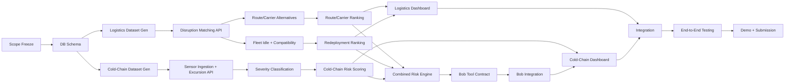

# DOCUMENT 2 — Two-Person Implementation, Execution and Contribution Plan
## ChainPulse — L2: Supply Chain Disruption Assistant & Fleet Utilisation Optimizer

**Member 1 — Logistics and Optimisation Engineer**
**Member 2 — Cold-Chain, AI and Bob Engineer**

(Labels temporary — rename per actual team member preference before submission.)

Both members hold core technical ownership, backend and frontend/integration responsibility, dataset work, testing, documentation, demo delivery, and evaluator-question readiness. Neither member is confined to a single layer (frontend-only, docs-only, etc.).

---

## 1. Team Operating Model

- **Shared repository:** single GitHub repo, structured per the Bobathon submission template (`submission.yaml`, `README.md`, `docs/`, `src/`, `demo/`, `presentation/`).
- **Git branches:** `main` (always demoable), feature branches per task (`feat/disruption-matching`, `feat/coldchain-severity`, etc.).
- **Pull requests:** every feature branch merges via PR; the other member reviews before merge (see Definition of Done, Section 10).
- **Shared API contracts:** the API table in Document 1 (Section 17) is the contract; changes to it require both members' agreement before implementation continues.
- **Daily sync:** short daily check-in (15 min) — what's done, what's blocked, what's next; more frequent during Phases 2–5.
- **Task board:** simple Kanban (To Do / In Progress / Review / Done) using GitHub Projects or Issues.
- **Issue tracking:** every backlog task (Section 4) is a GitHub Issue, tagged with owner and phase.
- **Definition of done:** see Section 10 — applies to every task before it's marked complete.
- **Integration checkpoints:** fixed points where both members' work must connect (Section 11).
- **Contribution evidence:** commit history, PR reviews, and the individual contribution report (Section 14) together provide auditable evidence of each member's work.

---

## 2. Balanced Ownership

### Member 1 — Primary Ownership
Shipment/route/carrier/fleet/disruption data model and generator; disruption-to-shipment matching; route and carrier alternative recommendation; fleet idle-time calculation and asset compatibility; fleet redeployment ranking; logistics-domain APIs (disruption, shipment-impact, route, carrier, fleet endpoints); logistics dashboard screens; logistics test suite.

### Member 2 — Primary Ownership
Sensor and temperature-policy data model and generator; cold-chain ingestion and data-quality checks; temperature excursion detection and severity classification; risk explanation rendering; optional ML experiment (ETA baseline, if time permits); Bob tool definitions and grounding; cold-chain domain APIs; cold-chain dashboard screens and Bob chat interface; AI/Bob test suite.

### Shared Ownership
Architecture (Document 1, Section 8); database schema/contract; API contract (Document 1, Section 17); combined priority score formula and its API; end-to-end integration; end-to-end test scenarios; README and submission docs; presentation deck; final demo; scope-cutting decisions (Document 1, Section 23).

| Work item | Member 1 | Member 2 | Shared |
|---|---|---|---|
| Logistics data + APIs | ✅ Owner | — | Review |
| Cold-chain data + APIs | — | ✅ Owner | Review |
| Combined risk engine | Contributor | Contributor | ✅ Owner |
| Frontend logistics screens | ✅ Owner | — | Review |
| Frontend cold-chain + Bob chat | — | ✅ Owner | Review |
| Architecture & DB schema | Contributor | Contributor | ✅ Owner |
| Testing (domain-specific) | ✅ Owner (logistics) | ✅ Owner (cold-chain/Bob) | — |
| Testing (end-to-end) | Contributor | Contributor | ✅ Owner |
| Docs/README/Deck | Contributor | Contributor | ✅ Owner |

If effort ends up unbalanced at any checkpoint, redistribute backlog tasks (Section 4) based on remaining estimated hours, not by strict role adherence.

---

## 3. Phase-Wise Execution Plan

### Phase 0 — Understanding and Scope Freeze

| Phase | Member 1 tasks | Member 2 tasks | Shared tasks | Dependencies | Deliverables | Definition of done |
|---|---|---|---|---|---|---|
| 0 | Extract logistics-side official requirements | Extract cold-chain-side official requirements | Agree MVP scope, architecture, tech stack, DB design, API contract, repo setup, git strategy, task board | None | Frozen scope doc, initialized repo, task board populated | Both members can restate the 6 official requirements and the MVP boundary identically |

### Phase 1 — Dataset and Data Contract

**Member 1:** logistics datasets — shipments, routes, route segments, carriers, fleet assets, disruption scenarios (including no-alternative and reserved-idle-asset cases).
**Member 2:** cold-chain datasets — sensor readings, temperature policies, excursion scenarios (short/prolonged/repeated), sensor failure and missing/duplicate/out-of-order reading cases.
**Shared:** consistent ID scheme, timestamp format, `scenario_id` tagging, data dictionary, referential integrity across the two halves, validation script.

### Phase 2 — Independent Vertical Slices

Each member builds a complete, independently demoable slice (input → processing → API → test → basic UI):
- **Member 1:** disruption activation → affected-shipment detection → route/carrier alternatives, exposed via API and a minimal table UI.
- **Member 2:** sensor ingestion → excursion detection → severity classification, exposed via API and a minimal table/chart UI.

Checkpoint: both slices run independently against the seeded dataset before Phase 3 begins.

### Phase 3 — Intelligence and Recommendation Logic

**Member 1:** route ranking, carrier ranking, shipment priority scoring, fleet redeployment ranking.
**Member 2:** temperature severity refinement, cold-chain risk scoring, evidence generation for explanations, Bob tool implementation, grounded response testing.
**Shared:** common risk-score format (0–1 normalised), common "reason code" vocabulary so both domains' explanations look consistent in the UI, combined-priority-score schema and endpoint.

### Phase 4 — Dashboard and User Experience

**Member 1:** Disruption screen, Affected Shipment List, Shipment Details (route/carrier tabs), Fleet Utilisation/Idle Asset screens.
**Member 2:** Cold-Chain Monitoring screen, Temperature Graph, Alerts, Bob Chat panel.
**Shared:** navigation shell, shared design system/components, single API client, consistent empty/loading/error states, responsive layout basics.

### Phase 5 — Integration

Connect: shipment IDs across both domains, disruption IDs into the fleet/route flow, fleet asset IDs into redeployment, sensor-to-shipment links into the risk engine, combined risk output surfaced on both the Overview and Risk/Priority screens, Bob's tool access wired to both domains' finished APIs, dashboard-wide error handling, and a data-refresh strategy (polling interval or manual refresh for MVP). Both members participate jointly — this phase is explicitly not solo work.

### Phase 6 — Testing and Hardening

Domain-specific tests owned per Section 12; shared end-to-end tests run jointly against the full 25-scenario matrix (Document 1, Section 20).

### Phase 7 — Demo, Documentation, and Submission

Both members: rehearse the demo script (Document 1, Section 21 / this document Section 13), finalize README and `docs/` files per the Bobathon submission template, complete `submission.yaml`, record the demo video, take ≥3 screenshots, finalize the presentation deck, prepare answers to likely evaluator questions (Section 13), and record individual contributions (Section 14).

---

## 4. Detailed Task Backlog (representative sample — expand as Issues in the tracker)

| Task ID | Task name | Description | Owner | Reviewer | Priority | Effort | Dependency | Deliverable | Acceptance criteria | Backup if blocked |
|---|---|---|---|---|---|---|---|---|---|---|
| T-01 | DB schema design | Design and migrate full schema (Doc 1 §10) | Shared | Both | High | Medium | Phase 0 scope freeze | Migration files | Schema matches ER diagram, passes lint | Work on API contract doc |
| T-02 | Logistics dataset generator | Generate shipments/routes/carriers/fleet/disruptions | M1 | M2 | High | Medium | T-01 | Seeded dataset script | Validation script passes, all required scenario types present | Write cold-chain generator instead |
| T-03 | Cold-chain dataset generator | Generate sensor readings/policies/excursions | M2 | M1 | High | Medium | T-01 | Seeded dataset script | Validation script passes, all defect types present | Write API stubs |
| T-04 | Disruption-shipment matching API | Implement rule-based matching (Doc 1 §13) | M1 | M2 | High | Small | T-02 | `/api/disruptions/:id/affected-shipments` | Correct on all 25 test scenarios' relevant cases | Work on route scoring |
| T-05 | Route/carrier alternative API | Constraint filter + weighted scoring | M1 | M2 | High | Medium | T-04 | `/api/shipments/:id/route-alternatives` etc. | Rejects infeasible options, ranks feasible ones correctly | Work on fleet idle-time calc |
| T-06 | Fleet idle-time + compatibility | Idle calc + compatibility rule | M1 | M2 | Medium | Small | T-02 | `/api/fleet/idle` | Reserved assets excluded correctly | Work on redeployment scoring |
| T-07 | Redeployment ranking API | Score idle assets against affected shipments | M1 | M2 | Medium | Medium | T-05, T-06 | `/api/shipments/:id/redeployment-candidates` | Ranking matches manual calculation on test data | Work on dashboard table UI |
| T-08 | Sensor ingestion + data-quality checks | Handle missing/duplicate/out-of-order readings | M2 | M1 | High | Medium | T-03 | `/api/shipments/:id/sensor-readings` | All three defect types correctly detected/handled | Work on severity ladder logic |
| T-09 | Excursion detection | Threshold + duration calc | M2 | M1 | High | Small | T-08 | `/api/excursions` | Boundary case (exact threshold) handled per spec | Work on Bob tool stubs |
| T-10 | Severity classification | Rule ladder (Doc 1 §13/§14) | M2 | M1 | High | Medium | T-09 | Severity field on excursion | All edge cases in Doc 1 §14 pass | Work on temperature chart UI |
| T-11 | Combined risk engine | Weighted combination of both domains | Shared | Both | High | Medium | T-05, T-10 | `/api/shipments/:id/risk` | Score changes correctly when either sub-score changes | N/A — shared, no solo blocker path |
| T-12 | Bob tool definitions | Implement the 10 tools (Doc 1 §12.5, §16) | M2 | M1 | High | Large | T-04–T-11 APIs live | Bob agent config | Each tool call returns correct structured JSON | Work on evidence-panel UI |
| T-13 | Bob grounding tests | Verify no-hallucination behavior | M2 | M1 | High | Medium | T-12 | Test report section | Bob refuses to answer when tool returns empty | Work on audit log UI |
| T-14 | Logistics dashboard screens | Disruption/Shipment/Route/Fleet screens | M1 | M2 | High | Large | T-04–T-07 APIs | React screens | Match empty/loading/error spec (Doc 1 §18) | Work on API docs |
| T-15 | Cold-chain + Bob dashboard screens | Cold-chain/Temperature/Alerts/Chat | M2 | M1 | High | Large | T-08–T-13 | React screens | Match empty/loading/error spec | Work on test fixtures |
| T-16 | Audit trail | Recommendation decision logging | Shared | Both | Medium | Medium | T-05, T-07, T-10 | `/api/recommendations/:id/decision`, `/api/audit` | Every decision is immutable and retrievable | N/A — shared |
| T-17 | End-to-end integration | Wire all IDs and flows together | Shared | Both | High | Large | All above | Working full-stack demo | Full disruption→recommendation→decision flow works live | N/A — shared |
| T-18 | Test matrix execution | Run all 25 scenarios | Shared (split by domain) | Both | High | Medium | T-17 | Completed test matrix | All scenarios pass or documented as known issue | N/A — shared |
| T-19 | README + docs/ submission files | Fill submission template docs | Shared | Both | Medium | Medium | T-17 | Complete `docs/` folder | No placeholder text remains (per submission guide) | N/A — shared |
| T-20 | Demo video + screenshots | Record per submission guide | Shared | Both | Medium | Small | T-17 | `demo/` folder complete | ≥3 screenshots, working video link | N/A — shared |

*(This is a representative slice of the full backlog; the team should mirror this format for every remaining feature in Document 1 Section 6 as GitHub Issues before Phase 1 begins.)*

---

## 5. Timeline Options

### 5.1 3-Day Intensive Plan

| Day | Member 1 | Member 2 | Shared | Deliverable | Completion criteria |
|---|---|---|---|---|---|
| 1 | Logistics dataset + disruption matching + route/carrier API | Cold-chain dataset + ingestion + excursion detection | Schema, API contract, repo setup | Two independent vertical slices | Both slices run against seeded data |
| 2 | Route/carrier ranking, fleet idle/compatibility, redeployment ranking | Severity classification, Bob tool definitions, grounding tests | Combined risk engine | Intelligence layer complete | Combined score API returns correct values on test data |
| 3 | Logistics dashboard screens, joint integration | Cold-chain/Bob dashboard screens, joint integration | End-to-end testing, README, demo rehearsal, submission | Full working demo | All 25 test scenarios attempted; submission checklist complete |

### 5.2 7-Day Plan

| Day | Member 1 | Member 2 | Shared | Deliverable | Completion criteria |
|---|---|---|---|---|---|
| 1 | Requirement extraction, dataset design | Requirement extraction, dataset design | Scope freeze, architecture, DB schema, repo setup | Phase 0 complete | Both restate MVP scope identically |
| 2 | Logistics dataset generator | Cold-chain dataset generator | Data dictionary, ID scheme | Seeded datasets exist | Validation script passes |
| 3 | Disruption matching, route/carrier alternative API | Sensor ingestion, excursion detection | API contract locked | Vertical slices begin | Each domain's first API endpoint returns real data |
| 4 | Fleet idle/compatibility, redeployment ranking | Severity classification, evidence generation | — | Vertical slices complete | Each slice independently demoable |
| 5 | Route/carrier/fleet ranking refinement | Bob tool definitions, grounding tests | Combined risk engine | Intelligence layer complete | Combined score verified against manual calc |
| 6 | Logistics dashboard screens | Cold-chain/Bob dashboard screens | Navigation shell, design system | UI complete | All screens hit real APIs, empty/loading/error states present |
| 7 | Integration + logistics tests | Integration + cold-chain/Bob tests | End-to-end tests, README, demo rehearsal, submission | Final submission | Submission checklist 100% complete |

### 5.3 14-Day Plan

| Days | Member 1 | Member 2 | Shared | Deliverable | Completion criteria |
|---|---|---|---|---|---|
| 1–2 | Requirement extraction, dataset design | Requirement extraction, dataset design | Scope freeze, architecture, DB schema | Phase 0 complete | Frozen scope doc approved by both |
| 3–4 | Logistics dataset generator + validation | Cold-chain dataset generator + validation | Data dictionary, ID scheme, integrity checks | Seeded, validated datasets | Validation script passes with all scenario types present |
| 5–6 | Disruption matching, route/carrier alternative API | Sensor ingestion, data-quality checks, excursion detection | API contract locked | Independent vertical slices | Each slice independently demoable |
| 7–8 | Fleet idle/compatibility, redeployment ranking | Severity classification, evidence generation | Combined risk engine draft | Intelligence layer v1 | Combined score API live |
| 9–10 | Logistics dashboard screens | Bob tool definitions + grounding tests + cold-chain dashboard | Navigation shell, shared components | UI + Bob integration complete | All screens + Bob chat functional |
| 11 | Integration support, bugfixing | Integration support, bugfixing | Full end-to-end wiring | Working integrated system | Full disruption→decision flow works live |
| 12 | Logistics test matrix execution | Cold-chain/Bob test matrix execution | Shared end-to-end tests | Completed test matrix | All 25 scenarios documented pass/fail |
| 13 | Docs, demo prep | Docs, demo prep | README, submission.yaml, presentation deck | Submission package draft | No placeholder text remains |
| 14 | Rehearsal, polish | Rehearsal, polish | Final review, video recording, submission | Final submission | Submission checklist 100% complete, GitHub Action green |

---

## 6. Parallel Work Map

**Can happen in parallel:** logistics dataset generation ↔ cold-chain dataset generation; logistics backend ↔ cold-chain backend; logistics dashboard screens ↔ cold-chain/Bob dashboard screens; route/carrier ranking ↔ severity classification; unit tests for each domain; documentation of each domain's own module.

**Requires coordination (cannot proceed solo):** shared ID scheme and DB schema; API response format conventions (so the frontend design system works across both domains); the combined priority score and its endpoint; the Bob tool contract (Bob needs both domains' finalized APIs); the final integrated dashboard; end-to-end demo scenarios.

**Preventing idle time:** whenever a shared/coordination task blocks one member, that member switches to a same-domain backup task (Section 9) rather than waiting; coordination points are scheduled as short synchronous check-ins (15–30 min), not open-ended pairing sessions, so both members return to parallel work quickly.

---

## 7. Dependency Graph (Mermaid)

Items that can start immediately after Scope Freeze: both dataset generators (C1, C2) in parallel. Items that can be mocked before their real dependency is ready: dashboard screens can render against mocked API responses shaped like the finalized contract, before the real backend logic is finished. Items that must wait for integration: the Bob tool contract (H) needs both domains' APIs finalized. Items that can be deferred: the optional ML ETA-delay experiment and the bipartite-matching optimiser sit outside this critical path entirely (see Document 1, Section 23).

---

## 8. Responsibility Matrix (RACI-style)

| Work item | Member 1 | Member 2 | Shared review | Dependency | Evidence |
|---|---|---|---|---|---|
| Architecture | C | C | R/A | Scope freeze | Doc 1 §8, this repo's `docs/architecture.md` |
| Dataset generation | A (logistics) | A (cold-chain) | R | DB schema | Generator scripts + validation report |
| Database | C | C | R/A | — | Migration files |
| APIs | A (logistics) | A (cold-chain) | R | Datasets | Endpoint tests |
| Logistics logic | A | C | R | Dataset | Unit tests |
| Fleet logic | A | I | R | Logistics data | Unit tests |
| Cold-chain logic | I | A | R | Dataset | Unit tests |
| Bob integration | C | A | R | Finalized APIs | Grounding test report |
| UI | A (logistics screens) | A (cold-chain/Bob screens) | R | APIs | Screenshots |
| Testing | A (logistics) | A (cold-chain/Bob) | R/A (e2e) | Integration | Test matrix |
| Documentation | C | C | R/A | Near-final build | `docs/` folder |
| Demo | C | C | R/A | Integration complete | Video, rehearsal notes |
| Presentation | C | C | R/A | Demo ready | Slide deck |
| Evaluator questions | C | C | R/A | Everything above | Prepared Q&A sheet (Section 13) |

*(A = Accountable, R = Responsible/Review, C = Consulted, I = Informed)*

---

## 9. Backup Tasks and Blocker Strategy

**Member 1 backup tasks:** test fixture generation for logistics scenarios; API documentation for finished logistics endpoints; mock data for the cold-chain team if their generator is delayed; dashboard polish (shared components, styling); route/carrier scoring-weight experiments; integration tests; README sections for logistics modules.

**Member 2 backup tasks:** sensor edge-case generation (additional missing/duplicate/out-of-order variations); Bob prompt iteration and grounding tests against already-live APIs; UI empty/loading/error state polish; data validation script improvements; evaluation report drafting; cold-chain chart visual polish; grounding test expansion.

> **Rule:** If a member is blocked for more than 30–45 minutes, they switch to a backup task from the list above while documenting the blocker (in the task board/Issue) so it's visible and can be unblocked at the next sync.

---

## 10. Definition of Done

A feature is complete only when: code is committed to the shared repo; its input/output is documented (even briefly, in the module's own README or docstring); the normal case works against seeded data; edge cases relevant to that feature (per Document 1 §20) have been considered; at least one test exists; an error state exists (API error response or UI error state, as applicable); UI or API evidence exists (screenshot or example response); the other member has reviewed it via PR; it works with the shared seeded dataset (not only ad-hoc local data); and it is included in at least one demo scenario or explicitly marked as backup/future scope.

---

## 11. Integration Checkpoints

| # | Checkpoint | Required inputs | Responsible | Acceptance criteria | Failure recovery plan |
|---|---|---|---|---|---|
| 1 | Schema checkpoint | Finalized ER diagram | Shared | Both members can query all core tables locally | Revisit schema in a joint session before proceeding |
| 2 | Dataset checkpoint | Both generators run, validation script passes | M1, M2 | All required scenario types present (Doc 1 §11.3) | Patch generator, re-run, re-validate |
| 3 | API checkpoint | Contract-matching endpoints live | M1, M2 | Endpoints match the Section 17 contract exactly | Adjust contract jointly, update both sides |
| 4 | Vertical-slice checkpoint | Independent domain slices | M1, M2 | Each slice demoable alone against seeded data | Extend Phase 2 by a day if needed, cut a "if time permits" feature |
| 5 | Dashboard checkpoint | All screens hitting real APIs | M1, M2 | No screen is still using mock data | Prioritize the 6 essential screens (Doc 1 §23) |
| 6 | Bob checkpoint | All 10 tools implemented and tested | M2, reviewed by M1 | Grounding tests pass, no hallucination on tested cases | Reduce to a smaller tool set covering the required demo questions only |
| 7 | End-to-end checkpoint | Full flow wired | Shared | Disruption→recommendation→decision flow works live, start to finish | Isolate and fix the specific broken link; do not restart the flow from scratch |
| 8 | Final demo checkpoint | Rehearsed run-through | Shared | Both members can present their half without notes | One more rehearsal pass; trim scope if timing runs long |

---

## 12. Testing Ownership

| Test category | Owner | Notes |
|---|---|---|
| Logistics unit/integration tests | Member 1 | Disruption matching, route/carrier scoring, fleet idle/compatibility |
| Cold-chain unit/integration tests | Member 2 | Ingestion, excursion detection, severity classification |
| Bob grounding tests | Member 2 | Verified against M1's finished APIs too, since Bob calls both domains |
| API contract tests | Owning member per endpoint | Cross-checked by the other in PR review |
| UI state tests (empty/loading/error) | Owning member per screen | — |
| End-to-end tests (all 25 scenarios) | Shared | Split scenarios by domain first, then jointly run the combined-risk and Bob-related scenarios together |

---

## 13. Demo Presentation Split

**Member 1 presents:** problem context and the six official requirements; disruption impact and affected-shipment detection; shipment prioritisation; route/carrier alternatives with explanation; fleet utilisation and redeployment recommendation.

**Member 2 presents:** cold-chain monitoring and live sensor status; temperature excursion detection; severity classification with rationale; risk explanation format; IBM Bob demonstration (grounded Q&A + the 6-hour operational brief).

**Both present jointly:** architecture overview; how the two domains integrate into the combined risk score; limitations (Document 1, Section 24); future scope and the scope-cutting order (Document 1, Section 23); evaluator Q&A.

**Anticipated evaluator questions and who answers:**
- "How does Bob avoid hallucinating fleet or sensor data?" → Member 2 (tool-grounding design).
- "Why rules and scoring instead of ML?" → Either (Document 1, Section 12 justification).
- "How would this scale to a real carrier network?" → Member 1 (architecture + limitations).
- "What happens if the cold-chain sensor data is incomplete?" → Member 2 (Unknown/Review Required design).
- "What did each of you actually build?" → Both, referencing the contribution report (Section 14).

---

## 14. Individual Contribution Report — Template

*(One copy per member, filled in before submission.)*

- **Role:** [Member 1 — Logistics and Optimisation Engineer / Member 2 — Cold-Chain, AI and Bob Engineer]
- **Owned modules:** [list, per Document 1 §6]
- **Dataset work:** [which generator(s), which scenario types]
- **Backend work:** [which APIs/services]
- **Frontend work:** [which screens]
- **AI/logic work:** [which formulas, rules, or Bob tools implemented]
- **APIs:** [endpoint list owned]
- **Tests:** [test categories/scenarios owned]
- **Reviews:** [PRs reviewed for the other member]
- **Documentation:** [which README/docs sections written]
- **Demo responsibility:** [which demo steps presented]
- **Git evidence:** [commit count / PR links — link, don't just claim]
- **Screenshots:** [attach relevant screens built]
- **Challenges solved:** [1–2 concrete technical problems solved, described specifically]
- **Final learning:** [one honest reflection]

---

## 15. Risk Register

| Risk | Probability | Impact | Mitigation | Owner | Fallback |
|---|---|---|---|---|---|
| Scope expansion beyond MVP | Medium | High | Enforce Document 1 §23 scope-cutting order at every checkpoint | Shared | Cut "if time permits" features first |
| ML experiment takes too long | Medium | Low (already optional) | Time-box to a few hours; never block MVP path | M2 | Drop entirely, keep rule-based baseline |
| API contract mismatch between domains | Medium | High | Lock contract at Phase 0/checkpoint 3; changes require joint sign-off | Shared | Roll back to last agreed contract version |
| Database schema changes mid-build | Low | High | Freeze schema at checkpoint 1; use migrations for any necessary change | Shared | Joint session to resolve before continuing |
| Bob hallucination in demo | Medium | High | Grounding tests (checkpoint 6) before demo; evidence panel always visible | M2 | Fall back to dashboard-only for that demo segment |
| Synthetic data too weak/unrealistic | Low | Medium | Explicit scenario coverage requirements (Doc 1 §11.3) + validation script | M1/M2 | Patch generator before final demo |
| No feasible route/carrier found for demo shipment | Low | Low (this is a valid test case) | Ensure a "no alternative" case is a deliberate scenario, not a bug | M1 | Present it as the "graceful no-option handling" edge case |
| No idle asset available for demo shipment | Low | Low | Seed data guarantees at least one compatible idle asset | M1 | Same as above |
| Missing sensor data during demo | Low | Low (valid test case) | Deliberately scripted into the demo dataset | M2 | Present as the "Unknown/Review Required" edge case |
| Integration delay (Phase 5 runs long) | Medium | High | Start integration checkpoints early (mocked contracts in Phase 2–4) | Shared | Extend Phase 5 by borrowing time from "if time permits" scope |
| One member becomes blocked | Medium | Medium | 30–45 minute rule + backup task list (Section 9) | Shared | Switch to backup task, document blocker |
| Demo failure (live bug during presentation) | Low | High | Rehearse full run-through at least twice; have a recorded backup demo video | Shared | Fall back to the recorded demo video |
| Unfinished "if time permits" feature | Medium | Low | Clearly labeled as such in the deck; never presented as complete | Shared | Mention honestly as future scope |

---

## 16. Final Execution Checklist

- [ ] Official requirements mapped (Document 1, Section 3)
- [ ] MVP frozen (Document 1, Section 23)
- [ ] Architecture approved by both members
- [ ] Database schema completed and migrated
- [ ] Shared IDs finalised across both domains
- [ ] Synthetic datasets generated and validated
- [ ] Logistics slice working independently
- [ ] Cold-chain slice working independently
- [ ] Route/carrier recommendations working
- [ ] Fleet redeployment working
- [ ] Temperature excursion detection working
- [ ] Severity classification working
- [ ] All 10 Bob tools working and grounded
- [ ] Dashboard integrated (all screens on real APIs)
- [ ] Edge cases tested (25-scenario matrix run)
- [ ] End-to-end demo working live
- [ ] README completed (no placeholder text)
- [ ] `submission.yaml` fully completed
- [ ] `docs/` folder complete (problem-statement, solution-overview, architecture, setup-guide)
- [ ] Demo video recorded and linked
- [ ] ≥3 screenshots added
- [ ] Presentation deck completed
- [ ] Both members rehearsed the full demo
- [ ] Individual contribution reports completed for both members
- [ ] GitHub Actions "Validate Submission" is green
- [ ] Repository set to Public
- [ ] Entry form submitted before deadline
