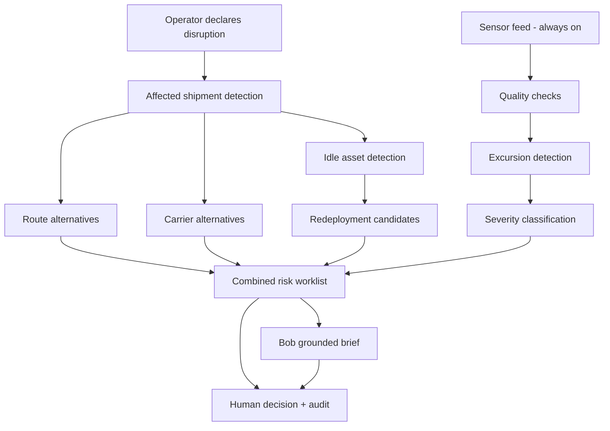
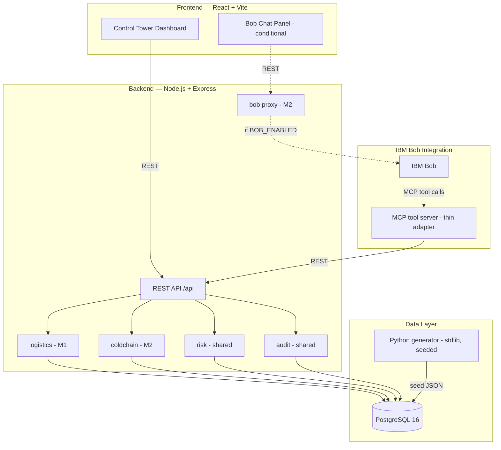
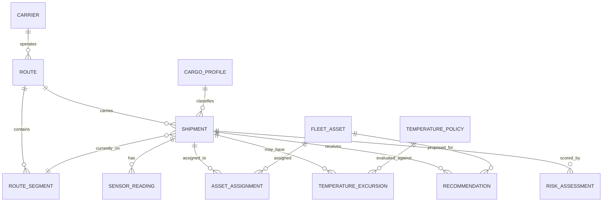
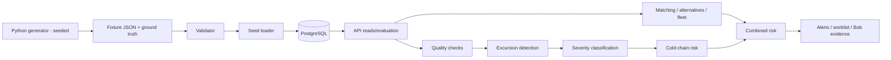
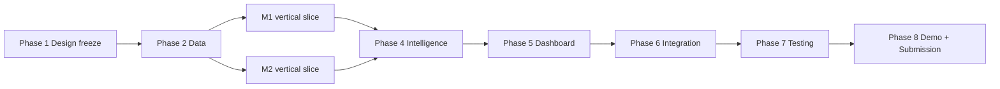

# PHASE 1 — REQUIREMENTS FREEZE AND SYSTEM DESIGN

**Project:** ChainSentinel (working name) — L2 Supply Chain Disruption Assistant & Fleet Utilisation Optimizer
**Event:** Bobathon 2026 · Logistics & Ports · Problem L2 ("Ongoing Pain")
**Document status:** APPROVED — Phase 1A closure (2026-09-14); sign-off: `docs/PHASE_1_SIGNOFF.md`
**Date:** 2026-09-14
**Prepared by:** OpenCode Go / DeepSeek V4.1 Flash (technical lead role), for both team members

---

## Document control

### Sources verified before writing

| Source | Location | Status |
|---|---|---|
| Official Industry Problem Statements 2026 (L2) | `C:\Users\ronit\Downloads\Industry Problem Statements - 2026.pdf` (not yet copied into repo) | Read; authoritative |
| Bobathon Submission Template Guide | `Bobathon_Submission_Template_Guide.pdf` | Read; authoritative for packaging/scoring |
| Claude's project blueprint (ChainSentinel) | `ChainSentinel_L2_Solution_Blueprint.docx` | Read; reference |
| Document 1 — Proposal and Technical Design (ChainPulse) | `Document1_Proposal_and_Technical_Design.md` | Read; reference |
| Document 2 — Implementation and Contribution Plan | `Document2_Implementation_Execution_Contribution_Plan.md` | Read; reference |
| Phase 0 outputs (shared + M1 + M2 + final review) | `docs/phase-0/` (24 files) | Read; team-approved baseline |
| Source code / package files | none exist | Verified: project is pre-implementation |

### Label legend (used throughout)

| Label | Meaning |
|---|---|
| `[FILE]` | Requirement/decision directly supported by the original provided documents (official PDFs, blueprint, Documents 1–2) |
| `[P0]` | Frozen in a Phase 0 team output (`docs/phase-0/*`) |
| `[TEAM]` | Decision made by the team (adopted from Phase 0 final review recommendations or this design) |
| `[ASSUMPTION]` | Reasonable placeholder that must be confirmed or configured, never presented as fact |
| `[CLARIFY]` | Still requires explicit team confirmation before or during Phase 2 |

### Phase 0 handoff note

- The team has declared Phase 0 approved. The `phase-0-final-review.md` recorded four blocking items (BL-1…BL-4). This design **consolidates the missing Member 2 design elements** (combined risk, Bob integration, cold-chain API/UI, test coverage) at design level from existing Phase 0 sources.
- Factual carry-over into `[CLARIFY]`: the six Member 2 detailed documents are not present in `docs/phase-0/`; the review checklist signature table is empty; the amendment dispositions below are adopted here for the first time.
- **Adopted amendment dispositions** (from `phase-0-final-review.md` §3.1): A-1, A-2, A-3, A-5, A-6, A-7, A-8, A-9, B-1, B-2, B-3, B-5, B-6, B-7, B-8 **approved into this design**; A-4 and B-4 **deferred**; B-C1 **fixed as a documentation correction**. Confirmation is requested in §21 (Q1).

### Phase numbering note

This document uses the team lead's framing: **Phase 1 = requirements freeze + system design**. The original `phase-plan.md` called data generation "Phase 1". §16 maps the renumbering; the team must confirm it (§21 Q2).

---

## 1. Final problem statement

`[FILE]` **Official L2 problem (verbatim intent):** Supply-chain disruptions — weather events, port strikes, geopolitical crises — cascade across hundreds of active shipments in ways that are impossible to track manually. Fleet assets (trucks, containers, vessels) sit idle while other routes are overloaded. Cold-chain shipments (vaccines, perishables) are especially vulnerable — a single temperature excursion across any leg can spoil a $500K+ cargo, but breaches are only discovered at delivery, when it is too late to act.

`[FILE]` **Official challenge:** Build a Bob solution that (1) identifies which shipments are affected by an active disruption, (2) recommends re-routing or carrier alternatives, (3) identifies idle fleet assets for redeployment, and (4) monitors cold-chain IoT sensor logs to detect temperature excursions and classify their regulatory severity before delivery.

`[P0]` **Team decomposition of bullet 4 into three testable capabilities:** monitor logs (R4), detect excursions (R5), classify severity with configurable policy rules (R6). No capability added or removed.

`[TEAM]` **Final problem statement for this project:** Mid-size freight/3PL operators lose visibility during disruptions across three correlated risks — disruption impact, fleet idle capacity, and cold-chain integrity — because each is handled in a separate spreadsheet/tool. ChainSentinel is a Bob-powered control tower that turns a declared disruption into a ranked, explainable, human-approved action plan: affected shipments with reasons, feasible route/carrier alternatives, redeployable idle assets, and cold-chain excursions classified before delivery — with every claim traceable to backend data.

`[TEAM]` **Explicit non-goals:** no real datasets, no live external feeds, no ML in the MVP, no universal regulatory compliance claims, no auto-execution, no production security claims.

`[ASSUMPTION]` The $500K+ figure is the official statement's illustrative example; the system uses synthetic cargo values and makes no savings claims.

---

## 2. Target users and use cases

`[FILE]` Personas (Document 1 §5; blueprint §2.1):

| Persona | Responsibility | Pain point | Key question |
|---|---|---|---|
| Supply-Chain Manager | Network health, cost/service trade-offs, reporting | No single view across disruption, fleet and cold-chain risk | "What's our total exposure right now?" |
| Control-Tower Operator | Real-time monitoring, first response | Alert fatigue; manual cross-referencing under time pressure | "Which shipments are affected by the strike?" |
| Fleet Manager | Asset utilisation, redeployment | Idle visibility siloed from shipment/disruption view | "Which idle trucks can I redeploy now?" |
| Logistics Coordinator | Route/carrier booking and rebooking | Manual carrier calls; no ranked comparison | "Show alternate carriers for S102." |
| Cold-Chain Compliance Officer | Temperature-sensitive cargo policy, audit readiness | Breaches discovered at delivery; unclear thresholds | "Which cold-chain shipments have excursions now?" |
| Operations Manager | Cross-functional prioritisation | No consolidated action plan when risks co-occur | "Give me a six-hour action plan." |

`[P0]` Use cases:

| ID | Use case | Primary persona | FR mapping |
|---|---|---|---|
| UC-01 | Declare/activate a disruption | Control-Tower Operator | FR-01 |
| UC-02 | See all affected shipments ranked with reasons | Operator / Manager | FR-02, FR-03 |
| UC-03 | Compare feasible route/carrier alternatives with trade-offs | Logistics Coordinator | FR-04, FR-05 |
| UC-04 | Approve/reject/modify a recommendation | Coordinator / Operator | FR-15, FR-16 |
| UC-05 | Find idle, compatible fleet assets | Fleet Manager | FR-06, FR-07 |
| UC-06 | Redeploy an asset to a shipment | Fleet Manager | FR-08, FR-15 |
| UC-07 | Watch cold-chain sensor status live | Compliance Officer | FR-09, FR-10 |
| UC-08 | Review and classify excursions by severity | Compliance Officer | FR-11, FR-12, FR-13 |
| UC-09 | See combined priority worklist | Manager / Operator | FR-14 |
| UC-10 | Ask Bob grounded questions / get an action brief | All | FR-17, FR-18 |
| UC-11 | Trace decisions in the audit trail | Compliance / Manager | FR-16 |

---

## 3. Functional requirements

Priority: **M** = MVP · **T** = if time permits · **F** = future.

| ID | Requirement | Source | Pri | Owner | Acceptance evidence |
|---|---|---|---|---|---|
| FR-01 | Create/activate/deactivate disruptions with validation, active-window rule and audit | `[FILE]` L2 b1; `[P0]` scope-freeze | M | M1 | API + tests; `is_currently_active` correct |
| FR-02 | Identify affected shipments by region-code matching + active window; exclude delivered/cancelled | `[FILE]` L2 b1 | M | M1 | Affected list with match reason on all matching scenarios |
| FR-03 | Classify impact status (`unaffected/at_risk/delayed/blocked/critical/unknown_review`) and rank by transparent impact score | `[P0]` A-1/A-2 | M | M1 | LT-01…LT-10 pass; reason on every row |
| FR-04 | Recommend ranked route alternatives with hard filters, weighted score, factor breakdown, rejected list, graceful no-option | `[FILE]` L2 b2 | M | M1 | LT-11/12/14/15; no-option is 200 + reasons |
| FR-05 | Recommend ranked carrier alternatives with backing route, exclusions and rejections | `[FILE]` L2 b2 | M | M1 | LT-13; inactive/over-capacity rejected |
| FR-06 | Fleet utilisation view with derived operational states and anomaly flags | `[FILE]` L2 b3 | M | M1 | LT-16/22/23; states match fixtures |
| FR-07 | Idle detection: available + no active assignment + not reserved/future-committed | `[FILE]` L2 b3 | M | M1 | LT-17; reserved in `excluded[]` only |
| FR-08 | Redeployment candidates ranked by proximity/idle/capacity fit with compatibility filters and contention surfacing | `[FILE]` L2 b3 | M | M1 | LT-18/19/20/21 |
| FR-09 | Ingest sensor readings (single/batch ≤500) with validation and storage | `[FILE]` L2 b4 | M | M2 | CT-01…CT-04; future timestamps rejected |
| FR-10 | Data-quality checks: gaps, duplicates, out-of-order, implausible, sensor failure — surfaced, never silently dropped | `[P0]` scope-freeze | M | M2 | CT-08…CT-11/CT-20 |
| FR-11 | Detect excursions: boundary-inclusive thresholds, grouping, duration/peak, recovery, closure, post-delivery exclusion | `[FILE]` L2 b4 | M | M2 | CT-02/05/06/07/15 |
| FR-12 | Classify severity (Warning/Major/Critical/Unknown-Review) with rationale, data-quality caveats and recommended action | `[FILE]` L2 b4; `[P0]` B-8 | M | M2 | CT-05/06/12/13/22; no universal claims |
| FR-13 | Manage configurable temperature policies (list/update, versioned, audited) | `[FILE]` L2 b4 ("regulatory severity", configurable rules) | M | M2 | CT-23; version bump + audit |
| FR-14 | Combined disruption + cold-chain priority score with explainable factors and ranked overview | `[P0]` scope-freeze (proposed) | M | Shared | CT-16; arithmetic verified; factors returned |
| FR-15 | Recommendation lifecycle pending → accepted/rejected/modified with single transition and server-side score recompute | `[FILE]` blueprint §5.2; `[P0]` A-5 | M | Shared | LT-25; 409 on repeat |
| FR-16 | Append-only audit trail for decisions, policy updates, excursion reviews | `[FILE]` Document 1 §19; `[P0]` ADR-007 | M | Shared | Audit retrievable; no update/delete path |
| FR-17 | Grounded Bob assistant over 11 frozen tools with evidence and explicit failure handling | `[FILE]` submission rubric 5; `[P0]` api-contract §5 | M | M2 | CT-17/18/19; no invented facts |
| FR-18 | Explainability: every score/alert shows factors, constraints, rejected options, confidence, data-quality caveats | `[FILE]` Document 1 §15; `[P0]` P3 | M | Shared | UI + API evidence on every recommendation/alert |
| FR-19 | Control-tower dashboard with essential screens, empty/loading/error/unknown states | `[FILE]` Document 1 §18; `[P0]` scope-freeze | M | Shared | Screens on real APIs; states tested |
| FR-20 | Reproducible seeded synthetic datasets with scenario tags, ground truth and validator | `[FILE]` Document 1 §11; `[P0]` scope-freeze | M | Shared | Validator passes; all scenarios present |
| FR-21 | Excursion review lifecycle `open → acknowledged → closed` with audit | `[P0]` B-7 | M | M2 | CT-24; transitions + audit |
| FR-22 | What-if mode (exclude a carrier, recompute) | `[FILE]` Document 1 §16 (proposed) | T | M2 | Only if complete; never claimed early |
| FR-23 | Greedy bipartite fleet matching across multiple shipments | `[FILE]` Document 1 §12.3 (proposed) | T | M1 | Only if complete |
| FR-24 | ML ETA delay / sensor anomaly / learned risk | `[FILE]` Document 1 §12.4; `[P0]` AI/ML decision | F | — | Future only; no MVP claims |
| FR-25 | Live feeds, MQTT/Kafka, PostGIS, auth/SSO, execution APIs, LLM text extraction | `[FILE]` Document 1 §23; `[P0]` scope-freeze | F | — | Future only |

`[P0]` **Submission obligations (not product features):** template repo + `submission.yaml` + README + four `docs/` files + `src/` code + demo video + ≥3 screenshots + deck + green validation action + public repo (O1–O11 in `requirements-matrix.md`).

---

## 4. Non-functional requirements

| ID | Requirement | Source | Pri |
|---|---|---|---|
| NFR-01 | **Determinism/reproducibility:** fixed seed; same command → identical fixtures; injectable `now` for tests | `[P0]` ADR-003 | M |
| NFR-02 | **Explainability:** no bare scores — every recommendation/alert/risk carries factors, constraints and confidence | `[FILE]` Document 1 §15 | M |
| NFR-03 | **Data-quality integrity:** missing/invalid data produces explicit review states; never treated as safe/compliant | `[FILE]` L2 b4; `[P0]` scope-freeze | M |
| NFR-04 | **Bob grounding:** answers only from tool JSON; empty/error reported, never guessed; evidence always visible | `[FILE]` submission rubric 5 | M |
| NFR-05 | **Resilience:** dashboard fully functional with Bob disabled; every API error returns the standard envelope; no blank screens | `[P0]` ADR-004/005 | M |
| NFR-06 | **Security baseline:** secrets only in `.env` (git-ignored); `.env.example` complete; no credentials in frontend; single-operator auth assumption documented as a limitation | `[FILE]` submission guide §4.4; `[P0]` ADR-005 | M |
| NFR-07 | **Auditability:** audit records append-only; recommendation and excursion state changes are single-transition | `[P0]` ADR-007 | M |
| NFR-08 | **Local reproducibility:** PostgreSQL via one Docker command (native fallback documented); startup order documented; setup guide tested on a clean terminal | `[FILE]` submission guide §4.3; `[P0]` ADR-005 | M |
| NFR-09 | **Interactive performance on demo scale:** ≤100 shipments, ≤30 assets, ≤500-reading batches respond within the UI's normal interaction budget | `[TEAM]` | M |
| NFR-10 | **Honesty:** limitations documented; no accuracy, savings or compliance claims; synthetic data labelled | `[FILE]` submission guide §7; `[P0]` scope-freeze §5 | M |
| NFR-11 | **Maintainability:** module boundaries; PR review; Definition of Done on every task; one language across app + MCP | `[P0]` ADR-002, team-ownership | M |
| NFR-12 | **Portability:** Windows/macOS dev; no paid services; Docker optional beyond Postgres | `[P0]` risk R-14 | M |
| NFR-13 | **Input validation:** all API inputs validated server-side (`zod`); unknown fields rejected | `[P0]` api-contract §1 | M |
| NFR-14 | **Rate/size limits** on public endpoints | `[FILE]` Document 1 §19 (proposed) | T |

---

## 5. Complete feature list

`[FILE]` Module map (Document 1 §6) with priority and ownership:

| # | Module | Pri | Owner | FRs |
|---|---|---|---|---|
| 1 | Disruption Management | M | M1 | FR-01 |
| 2 | Shipment Impact Analysis | M | M1 | FR-02, FR-03 |
| 3 | Route Recommendation | M | M1 | FR-04 |
| 4 | Alternative Carrier Recommendation | M | M1 | FR-05 |
| 5 | Fleet Utilisation Analysis | M | M1 | FR-06 |
| 6 | Idle Asset Detection | M | M1 | FR-07 |
| 7 | Fleet Redeployment Recommendation | M | M1 | FR-08 |
| 8 | Cold-Chain IoT Monitoring | M | M2 | FR-09, FR-10 |
| 9 | Temperature Excursion Detection | M | M2 | FR-11 |
| 10 | Temperature Severity Classification | M | M2 | FR-12, FR-13 |
| 11 | Combined Risk & Priority Engine | M | Shared | FR-14 |
| 12 | IBM Bob Assistant | M | M2 | FR-17 |
| 13 | Dashboard and Alerts | M | Shared | FR-19 |
| 14 | Audit and Explanation Layer | M | Shared | FR-15, FR-16, FR-18, FR-21 |
| 15 | Synthetic Data Generator + Validator | M | Shared | FR-20 |

**If time permits (`T`):** what-if mode (FR-22), greedy bipartite matching (FR-23), map view, extra scenarios, full Docker Compose, `GET /api/routes/:id`, `GET /api/sensors/:id`, `GET /api/cargo-profiles`.
**Future (`F`):** FR-24, FR-25.

---

## 6. User journey / workflow

`[FILE]` End-to-end workflow (Document 1 §7, condensed to the frozen design):

1. Operator declares a disruption (type, region, window, severity) → activation validated and audited.
2. System matches disruption region against route segments and derives each shipment's exposure window.
3. Affected shipments listed with impact status, match reason and impact score (delivered/cancelled excluded).
4. Ranked route alternatives generated (hard filters → weighted score → rejected reasons).
5. Ranked carrier alternatives generated (backing route, exclusions).
6. Idle assets derived (available + no active/reserved assignment) with anomaly flags.
7. Compatible assets ranked for affected shipments (capacity, refrigeration, distance; contention surfaced).
8. Cold-chain feed runs **independently of disruption state**: readings ingested, quality-checked, excursions detected.
9. Severity classified against configurable policy; unknown data/policy → review state.
10. Combined priority score merges disruption + cold-chain risk into one worklist.
11. Bob answers grounded questions and produces a prioritised action brief from tool output only.
12. Operator accepts/rejects/modifies recommendations and acknowledges/closes excursions → append-only audit.



`[FILE]` Demo storyline (Document 1 §21): normal network → activate port strike → affected list → prioritisation → alternatives → idle fleet → redeployment → cold-chain excursion → severity → Bob explanation → 6-hour brief → one failure/edge case → audit + limitations.

---

## 7. System architecture

`[P0]` Selected architecture (ADR-001…007). No alternatives remain open.



| Component | Technology | Responsibility | Owner |
|---|---|---|---|
| Frontend | React + Vite, React Router, Recharts, plain CSS tokens | Dashboard screens, states, evidence rendering | Shared (split by domain) |
| API gateway | Express 4 + `zod` | Routing, validation, error envelope | Shared |
| Logistics service | Node (ESM) | Disruptions, shipments, routes, carriers, fleet, alternatives | M1 |
| Cold-chain service | Node | Ingestion, quality, excursions, severity, policies | M2 |
| Risk service | Node | Combined score, snapshots, overview | Shared |
| Audit service | Node | Append-only records, decisions | Shared |
| Bob proxy | Node | Optional `/api/bob/query`; 503 when disabled | M2 |
| MCP tool server | Node, thin adapter | 11 read-only tools → REST | M2 (contract tests M1) |
| Database | PostgreSQL 16 (Docker) | 13 entities + 2 additive | Shared |
| Data generator | Python 3.11 stdlib | Seeded fixtures + ground truth | Shared (M1 lead loader) |

**Key flows**
- **Dashboard path:** UI → REST → service → DB → JSON → render (factors shown).
- **Bob path:** question → Bob picks tool → MCP → REST → structured JSON → answer + evidence. Bob never touches the DB.
- **Ingestion path:** simulator → `POST /api/sensor-readings` → quality flags → detection → severity → alerts/risk.
- **Error path:** any failure returns the standard envelope; Bob reports the failure; UI shows retry/fallback.
- **Bob-unavailable:** `BOB_ENABLED=false` → chat shows fallback message; all six capabilities remain available via dashboard/API; MCP tools still testable directly.

`[TEAM]` Deployment: local demo only (`NOT DEPLOYED` acceptable per submission guide FAQ); no cloud infrastructure.

---

## 8. Frontend modules

`[P0]` Screen inventory (logistics screens from `member-1-logistics-ui.md`; cold-chain/Bob screens consolidated from Document 1 §18 + `member-2-coldchain-requirements.md`; essential-6 marked ★):

| ID | Screen | Owner | Primary APIs | States required |
|---|---|---|---|---|
| S1 ★ | Overview / risk worklist | Shared | `/api/risk/overview`, `/api/disruptions?status=active` | loading, empty, error |
| S2 ★ | Disruptions (list + create) | M1 | `/api/disruptions` (GET/POST/PATCH) | loading, empty, error, validation errors |
| S3 ★ | Affected shipments | M1 | `/api/disruptions/:id/affected-shipments` | loading, empty (valid), error, unknown/timing chips |
| S4 ★ | Shipment detail (route/risk/sensors/recommendations/audit tabs) | M1 (tabs shared) | `/api/shipments/:id`, `/api/shipments/:id/risk`, `/api/shipments/:id/sensor-readings` | per-tab loading/empty/error; delivered read-only |
| S5 ★ | Route/carrier comparison + decisions | M1 | `/api/shipments/:id/route-alternatives`, `.../carrier-alternatives`, `/api/recommendations*` | card skeletons, no-option, 409 refresh |
| S6 ★ | Fleet utilisation + idle tab | M1 | `/api/fleet`, `/api/fleet/idle` | skeleton, empty, error, anomaly chips |
| S7 | Redeployment drawer | M1 | `/api/shipments/:id/redeployment-candidates`, `/api/fleet/redeployments/recommend` | skeleton, no-option, contention, 409 refresh |
| S8 ★ | Cold-chain monitoring | M2 | `/api/alerts/coldchain`, `/api/shipments?is_cold_chain=true` | skeleton, empty, error, unknown/review |
| S9 | Temperature history graph | M2 | `/api/shipments/:id/sensor-readings` | chart skeleton, no readings, sensor failure, gap overlay |
| S10 | Excursion detail + review | M2 | `/api/excursions/:id`, `PATCH /api/excursions/:id` | loading, error, unknown/review rationale |
| S11 | Sensor health | M2 | sensor health block (B-2) | reporting/delayed/failed/unknown |
| S12 | Risk explanation | Shared | `/api/shipments/:id/risk` | loading, error, factor table |
| S13 ★ | Bob chat + evidence panel | M2 | `POST /api/bob/query` (or MCP direct) | typing, Bob-unavailable fallback, tool-error evidence |
| S14 | Audit/history | Shared (M1 screen, M2 writes) | `/api/audit` | timeline skeleton, empty, error |

`[TEAM]` UI conventions: scores always with factor breakdown; status badges use text + icon (not colour alone); state-changing actions require confirmation and show the resulting audit link; frontend never computes business scores.

---

## 9. Backend modules

`[P0]` ADR-002 structure:

```
src/
├── backend/src/
│   ├── logistics/   # M1: disruptions, shipments, routes, carriers, fleet, alternatives
│   ├── coldchain/   # M2: readings, quality, excursions, severity, policies, alerts
│   ├── risk/        # Shared: combined score, snapshots, overview
│   ├── audit/       # Shared: audit records, decisions
│   ├── bob/         # M2: optional /api/bob/query proxy
│   └── common/      # config, db, validation, errors, logging
├── backend/migrations/     # numbered .sql
├── backend/scripts/        # migrate, seed, validate
├── frontend/               # screens, API client, shared components
├── data-generator/         # Python stdlib: fixtures + ground truth + validator
└── mcp-server/             # 11 frozen tools → REST
```

### 9.1 Complete repository tree (frozen — C6)

Compiled from the official submission template guide and this design. Top-level template files must remain; everything else lives inside `src/` or `docs/`.

```text
bob-ai-hackathon-[team-name]/
├── submission.yaml                  # required metadata (skeleton in place; Q4 pending)
├── README.md                        # no [placeholder] or TODO text at submission
├── CONTRIBUTING.md                  # template file — keep (replace with official copy)
├── .gitignore                       # pre-configured — do not commit .env/node_modules
├── PHASE_1_SYSTEM_DESIGN.md         # Phase 1 design (root; see CQ3)
├── PHASE_1_CHECKPOINT.md            # Phase 1 verification (root)
├── .github/
│   └── workflows/validate.yml       # official validator — replace placeholder, do not modify
├── docs/
│   ├── problem-statement.md         # required
│   ├── solution-overview.md         # required
│   ├── architecture.md              # required (diagram + component table)
│   ├── setup-guide.md               # required, tested on a clean terminal
│   ├── phase-0/                     # 30 planning/contract docs (shared + M1 + M2)
│   ├── reference/                   # official PDFs (copied in Phase 1A)
│   ├── PHASE_1_SIGNOFF.md           # Phase 1A sign-off
│   ├── PHASE_1_EXPLAIN_BACK.md      # Phase 1A explain-back verification
│   └── PHASE_1A_CLOSURE_REPORT.md   # Phase 1A closure report
├── src/
│   ├── README.md                    # layout explanation (template requirement)
│   ├── .env.example                 # every variable documented
│   ├── backend/
│   │   ├── package.json             # express, pg, zod (no ORM)
│   │   ├── src/
│   │   │   ├── common/              # config, db, validation, errors, logging
│   │   │   ├── logistics/           # M1
│   │   │   ├── coldchain/           # M2
│   │   │   ├── risk/                # shared
│   │   │   ├── audit/               # shared
│   │   │   ├── bob/                 # M2 (optional proxy)
│   │   │   └── server.js            # entry point (Phase 3)
│   │   ├── migrations/              # numbered .sql
│   │   └── scripts/                 # migrate, seed, validate
│   ├── frontend/                    # React + Vite (JS): index.html, src/main.jsx
│   ├── data-generator/              # Python 3.11 stdlib: generate.py + fixtures
│   └── mcp-server/                  # Node MCP adapter: src/index.js (11 tools)
├── demo/
│   ├── demo-video-link.txt          # 3–5 min video URL
│   ├── live-demo-url.txt            # NOT DEPLOYED
│   └── screenshots/                 # ≥3 sequential PNGs
└── presentation/
    └── slides.pdf                   # required order (problem → impact)
```

| Module | Responsibilities | Key endpoints | Owner | Depends on |
|---|---|---|---|---|
| `common` | config/env, pg pool, zod schemas, error envelope, logging | `/api/health` | Shared | — |
| `logistics` | matching, impact status/score, alternatives, fleet, redeployment, recommendation creation | 3.1–3.11, 4.1–4.3, 4.4–4.5 | M1 | schema, seed |
| `coldchain` | ingestion, quality, excursions, severity, policies, alerts, review lifecycle | 3.12–3.17, 4.6 | M2 | schema, seed |
| `risk` | combined score, snapshot persistence, ranked overview | 3.18–3.19 | Shared | logistics + coldchain |
| `audit` | append-only writes, decision endpoint | 3.21–3.22 | Shared | all |
| `bob` | optional query proxy; explicit 503 | 3.23 | M2 | Bob access |
| `mcp-server` | 11 tools, read-only, JSON passthrough | — | M2 | REST live |
| `data-generator` | fixtures, scenario tags, ground truth, validator | — | Shared | data contract |

---

## 10. Database design / schema

`[P0]` Canonical: `data-contract.md`. `[TEAM]` Adopted additions: A-3 (planned/actual times), B-1 (`cargo_profile`), B-6 (add `implausible` to `data_quality`), RC-3 (nested risk factors). `[CLARIFY]` Q1 confirmation.



| Table | PK | Key columns | Notes |
|---|---|---|---|
| `shipment` | `S###` | route_id FK, cargo_type, is_cold_chain, cargo_value_usd, volume_units, deadline, status, current_segment_id FK, planned_departure/arrival, actual_departure/arrival (A-3) | status: planned/in_transit/delayed/delivered/cancelled |
| `route` | `R###` | origin_node, destination_node, carrier_id FK, status, distance, duration, cost | capacity derived (min segment) |
| `route_segment` | `SEG-###` | route_id FK, seq, name, region_code, mode, nodes, distance, duration, capacity_units, cost_usd, dest_lat/lon | region_code = match key |
| `carrier` | `C##` | name, service_regions[], modes[], capacity_units, cost_index, reliability_score, status | reliability informational (A-4 deferred) |
| `disruption` | `D##` | type, region_code, start/end, severity 1–5, status, description, created_by | end null = open-ended |
| `fleet_asset` | `A###` | type, capacity_units, refrigerated, current_lat/lon, current_region_code, status, available_since | idle derived, never stored |
| `asset_assignment` | `AA-####` | asset_id FK, shipment_id FK, start/end, reserved, status | overlap = flagged anomaly |
| `sensor_reading` | `SR-######` | shipment_id FK, sensor_id, timestamp, temperature_c, humidity_pct, source | quality flags derived |
| `temperature_policy` | `TP-*` | cargo_type, min_c, max_c, max_excursion_minutes, minor/major_deviation_c, critical_duration_minutes, version, effective_from | versioned + audited |
| `temperature_excursion` | `EX-####` | shipment_id FK, policy_id FK, start/end, peak_deviation_c, duration_min, severity, rationale, data_quality (+`implausible`), status | severity: warning/major/critical/unknown_review |
| `recommendation` | `REC-####` | type, shipment_id FK, route/carrier/asset FK, score, factors jsonb, constraints, rejected, status | single transition |
| `risk_assessment` | `RSK-####` | shipment_id FK, disruption_risk, coldchain_risk, combined_score, factors jsonb (nested `disruption`/`coldchain`/`weights`), computed_at | snapshots retained |
| `audit_record` | `AUD-######` | entity_type, entity_id, action, actor, timestamp, details jsonb | append-only |
| `cargo_profile` (B-1) | `cargo_type` | display_name, is_cold_chain, sensitivity_weight, policy_required, notes | reference table |

**Indexes (`[TEAM]` minimal):** `sensor_reading(shipment_id, timestamp)`, `temperature_excursion(shipment_id, status)`, `asset_assignment(asset_id, end_time)`, `recommendation(shipment_id, status)`.

**Rules:** FKs enforced; region vocabulary controlled; no overlapping assignments (flagged only); one recommendation target per type; `duration_min = 0` valid; audit no UPDATE/DELETE path.

**Migrations:** numbered `.sql` files applied by `npm run migrate`; schema changes require contract update + both approvals.

---

## 11. ML / data-processing pipeline

`[P0]` **No ML in the MVP** (ADR-006; `member-2-ai-ml-decision.md`). The pipeline is deterministic:



`[FILE]` Deferred ML candidates with conditions (from `member-2-ai-ml-decision.md`): temperature anomaly detection (F2), ETA delay prediction (F1), sensor failure prediction, learned cold-chain risk. All deferred because no historical data exists, gains are unmeasurable, and safety/explainability favour rules. No accuracy claims; no model trained in Phase 1 or MVP.

`[TEAM]` "AI" in the submission means **Bob (grounded generative layer) + deterministic rules/scoring** — stated honestly in README and deck.

---

## 12. API endpoint list

`[P0]` 23 frozen endpoints (`api-contract.md`) + adopted additions. Full request/response/error specs live in `api-contract.md`, `member-1-logistics-api.md`, and (consolidated) this design §13.

| # | Method | Path | Purpose | Owner |
|---|---|---|---|---|
| 1 | GET | `/api/health` | liveness + DB + Bob status | SH |
| 2 | GET | `/api/disruptions` | list/filter disruptions | M1 |
| 3 | POST | `/api/disruptions` | create/activate | M1 |
| 4 | PATCH | `/api/disruptions/:id` | activate/resolve | M1 |
| 5 | GET | `/api/disruptions/:id/affected-shipments` | R1 affected list | M1 |
| 6 | GET | `/api/shipments` | list/filter | M1 |
| 7 | GET | `/api/shipments/:id` | detail | M1 |
| 8 | GET | `/api/shipments/:id/route-alternatives` | R2 routes | M1 |
| 9 | GET | `/api/shipments/:id/carrier-alternatives` | R2 carriers | M1 |
| 10 | GET | `/api/fleet/idle` | R3 idle assets | M1 |
| 11 | GET | `/api/shipments/:id/redeployment-candidates` | R3 candidates | M1 |
| 12 | POST | `/api/sensor-readings` | R4 ingest (≤500) | M2 |
| 13 | GET | `/api/shipments/:id/sensor-readings` | R4 readings + quality + sensor health (B-2) | M2 |
| 14 | GET | `/api/excursions` | R5 list/filter | M2 |
| 15 | GET | `/api/alerts/coldchain` | R5 active alerts | M2 |
| 16 | GET | `/api/temperature-policies` | R6 list (versioned) | M2 |
| 17 | PUT | `/api/temperature-policies/:id` | R6 update (new version + audit) | M2 |
| 18 | GET | `/api/shipments/:id/risk` | combined score snapshot | SH |
| 19 | GET | `/api/risk/overview` | ranked worklist | SH |
| 20 | GET | `/api/recommendations` | list/filter | SH |
| 21 | POST | `/api/recommendations/:id/decision` | human decision + audit | SH |
| 22 | GET | `/api/audit` | audit log | SH |
| 23 | POST | `/api/bob/query` | grounded query (503 when disabled) | M2 |
| 24 | POST | `/api/recommendations` (A-5) | persist pending recommendation (server-side recompute) | SH |
| 25 | POST | `/api/fleet/redeployments/recommend` (A-5) | convenience create for fleet type | M1 |
| 26 | GET | `/api/fleet` (A-6) | all assets + derived states | M1 |
| 27 | GET | `/api/carriers` (A-6) | carrier list/filter | M1 |
| 28 | PATCH | `/api/excursions/:id` (B-7) | review lifecycle transition | M2 |
| — | GET | `/api/routes/:id`, `/api/sensors/:id`, `/api/cargo-profiles` | optional/deferred | — |

**Conventions:** `{data, count}` lists; standard error envelope (`VALIDATION_ERROR`, `NOT_FOUND`, `CONFLICT`, `SEMANTIC_ERROR`, `INTERNAL_ERROR`, `BOB_UNAVAILABLE`); UTC timestamps; empty results are `200` + `[]`; no DELETE.

`[P0]` **Bob tools (11, frozen):** `get_active_disruptions`, `get_affected_shipments`, `get_route_alternatives`, `get_carrier_alternatives`, `get_idle_assets`, `get_redeployment_candidates`, `get_sensor_status`, `get_temperature_excursions`, `get_combined_risk`, `get_risk_overview`, `get_audit_log` → each maps 1:1 to a REST endpoint; read-only; JSON passthrough; grounding rules in §13.11.

---

## 13. Input and output format for every major feature

Compact contracts; full JSON examples in Phase 0 docs.

### 13.1 Disruption activation
**In:** `{type, region_code, start_time, end_time?, severity 1-5, status, description, created_by}`
**Out:** `201` Disruption + `is_currently_active`; `400` validation; `409` duplicate; audit `created/activated`.

### 13.2 Affected shipment detection
**In:** `GET /api/disruptions/:id/affected-shipments?include_delivered=false`
**Out:** `{data:[{shipment, impact_status, match_reason, matched_segment_ids, matched_disruptions[], timing_basis, confidence, impact_score, impact_factors}], count, disruption_id, computed_at}`; empty `data` valid; `404` unknown disruption.

### 13.3 Route alternatives
**In:** `GET /api/shipments/:id/route-alternatives?limit=5`
**Out:** `{data:[{route, score, factors{cost_delta_pct, eta_delta_h, capacity_margin, residual_risk, estimated_cost_usd, estimated_eta, confidence_level, confidence_drivers}, constraints_checked[], reasons[], rejected_alternatives[]}], rejected:[{route_id, rejected_reason}], count}`; no-option → `data:[]` + reasons.

### 13.4 Carrier alternatives
**In:** `GET /api/shipments/:id/carrier-alternatives`
**Out:** same shape with `carrier` + `backing_route_id` + `carrier_reliability` (informational).

### 13.5 Fleet idle
**In:** `GET /api/fleet/idle?region_code=&min_idle_minutes=`
**Out:** `{data:[{asset, idle_minutes, idle_since}], excluded:[{asset_id, reason, reserved_until?}], count}`.

### 13.6 Redeployment candidates
**In:** `GET /api/shipments/:id/redeployment-candidates`
**Out:** `{data:[{asset, score, factors{distance_km, idle_minutes, capacity_fit, contention_count, target_approximate, confidence_level, confidence_drivers}, constraints_checked[], reasons[]}], rejected[], excluded[], count}`.

### 13.7 Sensor ingestion
**In:** `POST /api/sensor-readings` `{readings:[{shipment_id, sensor_id, timestamp, temperature_c, humidity_pct?, source}]}` ≤500
**Out:** `{ingested, rejected:[{index, reason}], quality_flags:[{reading_id, flags[]}]}`; future timestamps and bad FKs rejected; partial batch allowed.

### 13.8 Sensor readings + health (B-2)
**In:** `GET /api/shipments/:id/sensor-readings?from=&to=`
**Out:** `{data:[{id, timestamp, temperature_c}], count, quality{gaps, duplicates, out_of_order, implausible, sensor_status}, sensor{status, last_reading_at, minutes_since_last, expected_interval_min, gap_count, failure_since}, policy{id, min_c, max_c}}`.

### 13.9 Excursion detection
**In (internal):** ordered readings + policy + delivery cutoff + now
**Out:** excursion records `{id, shipment_id, policy_id?, start_time, end_time?, duration_min, peak_deviation_c, severity, severity_rationale, data_quality, status, detected_at, post_delivery, time_to_delivery_hours, recommended_action}`.

### 13.10 Severity classification
**In:** excursion + policy + data quality + time to delivery
**Out:** `severity ∈ {warning, major, critical, unknown_review}` + rationale codes + recommended action + human-review requirement; unknown policy/data → `unknown_review`; never compliant.

### 13.11 Bob query + grounding rules
**In:** `POST /api/bob/query` `{prompt, context?}`
**Out:** `{answer, evidence:[{tool, input, output}], tool_calls}`; `503 BOB_UNAVAILABLE` when disabled.
**Grounding rules:** answer only from tool JSON; empty → "no data" (never "all clear"); tool error → report explicitly; unsupported question → say so; never compute scores; never invent entities; ambiguous → ask for the ID. Evidence panel shows raw JSON beside the answer. No state change from Bob — approvals happen only through the decision/review endpoints.

### 13.12 Recommendation decision
**In:** `POST /api/recommendations/:id/decision` `{decision: accepted|rejected|modified, actor, notes?, modified_payload?}`
**Out:** updated Recommendation + `audit_record_id`; `404`; `409` already decided.

### 13.13 Excursion review
**In:** `PATCH /api/excursions/:id` `{status: acknowledged|closed, actor, note?}`
**Out:** updated Excursion + audit id; invalid transition `409`; critical closure requires note.

### 13.14 Policy update
**In:** `PUT /api/temperature-policies/:id` `{min_c, max_c, max_excursion_minutes, minor_deviation_c, major_deviation_c, critical_duration_minutes, updated_by}`
**Out:** new version + audit `policy_updated` (before/after).

### 13.15 Risk assessment
**In:** `GET /api/shipments/:id/risk`
**Out:** `{shipment_id, disruption_risk, coldchain_risk, combined_score, factors:{disruption:{impact_score, affected_disruption_ids[], impact_status}, coldchain:{worst_excursion_id, severity, peak_deviation_c, duration_min, time_to_delivery_hours, data_quality, cargo_sensitivity, excursion_count}, weights:{alpha, beta}}, computed_at}` (RC-3 nested structure).

---

## 14. Technology stack with reasons

`[P0]` ADR-001. One stack selected; alternatives rejected (FastAPI, MongoDB, SQLite, ORM, browser→Bob direct, PostGIS-now).

| Layer | Selection | Why |
|---|---|---|
| Frontend | React + Vite (JS), React Router, Recharts, plain CSS tokens | Fast dev loop; charts without heavy frameworks; zero-config styling |
| Backend | Node.js 20 + Express 4 (ESM), `zod`, `pg`, no ORM | One language across app + MCP; visible SQL; runtime contract enforcement |
| Database | PostgreSQL 16 via Docker Compose; numbered SQL migrations | Relational domain; JSONB for factors; reproducible local setup |
| Data generation | Python 3.11 stdlib only; fixed seed | Zero installs; deterministic fixtures; pandas unnecessary at this scale |
| Bob integration | Thin MCP tool server → REST; `BOB_ENABLED` flag | Bob load-bearing (rubric) without becoming a runtime dependency |
| Analytics/ML | None in MVP | Rules + transparent scoring; ML deferred with conditions |
| Dev environment | Docker (Postgres only) + two terminals; Vite proxy | Simple, portable, documented |

`[FILE]` Submission tech note: template FAQ allows any structure inside `src/`; top-level template files must remain.

---

## 15. Team-member responsibilities

`[P0]` `team-ownership.md`:

| Area | Member 1 — Logistics & Optimisation | Member 2 — Cold-Chain, AI & Bob |
|---|---|---|
| Entities | Shipment, Route, RouteSegment, Carrier, Disruption, FleetAsset, AssetAssignment | SensorReading, TemperaturePolicy, TemperatureExcursion (+CargoProfile B-1) |
| Logic | Matching, impact, alternatives, fleet, redeployment | Quality, detection, severity, policies, cold-chain risk |
| APIs | 3.1–3.11, 4.1–4.3, 4.4–4.5 | 3.12–3.17, 4.6, 3.23 |
| UI | S2–S7 | S8–S11, S13 |
| Bob | Tool contract tests | MCP server, prompts, grounding |
| Data | Logistics fixtures (lead loader) | Cold-chain fixtures |
| Testing | LT-01…LT-27 | CT-01…CT-26 |
| Shared | Combined risk (SH-02), integration, E2E, README, demo, deck, audit screen | Same + architecture/setup docs |

Interfaces, review rules, 30–45 min blocker rule and backup tasks: `team-ownership.md` §5–§6.

---

## 16. Development order and dependencies

`[TEAM]` Renumbering (confirm Q2): this doc's Phase 1 = design freeze; the old phase-plan Phase 1 (data) becomes Phase 2.

| New | Old (`phase-plan.md`) | Goal | Gate |
|---|---|---|---|
| 1 | 0 + design | Requirements freeze + system design (this document) | This doc approved; clarifications resolved |
| 2 | 1 | Data: generators, migrations, seed loader, validator, ground truth | Validator passes; all scenarios present |
| 3 | 2 | Vertical slices: R1–R6 first working endpoints + minimal UI per domain | Each slice demoable alone |

**Phase 3 update (D1, 2026-09-14):** the MCP/Bob tool layer moves from Phase 4 into Phase 3. Phase 3 now delivers the REST API **and** the 11-tool MCP server + Bob proxy fallback; Phase 4 retains any refinement/grounding validation not completed in Phase 3. See `docs/PHASE_3_IMPLEMENTATION_PLAN.md` and `docs/PHASE_3_DECISIONS.md`.
| 4 | 3 | Intelligence: ranking, severity refinement, combined risk, MCP tools, grounding tests | Score matches manual calc; grounding tests pass |
| 5 | 4 | Dashboard: all MVP screens on real APIs with all states | No mock data remains |
| 6 | 5 | Integration: full flow disruption → recommendation → decision | Live E2E works |
| 7 | 6 | Testing: domain suites + 25-scenario matrix (10 core gate) | Core gate passes; failures documented |
| 8 | 7 | Demo + submission: docs, video, screenshots, deck, validation green | Submission checklist 100% |



**Parallelism:** generators in parallel; both backends in parallel; both UI halves in parallel. **Coordination required:** schema/IDs, API shape, combined risk, Bob tool contract, E2E scenarios. **Integration checkpoints** (phase-plan §4): schema → dataset → API → slices → dashboard → Bob → E2E → demo.

---

## 17. Risks and fallback plans

`[P0]` Condensed from `risk-register.md` (R-01…R-15) plus Phase 0 review carry-overs:

| ID | Risk | P/I | Mitigation | Fallback |
|---|---|---|---|---|
| R-01 | Scope expansion | M/H | Scope-freeze contract; cut order; phase gates | Cut T-features in reverse order |
| R-02 | AI agent makes uncontrolled changes | M/H | Feature branches only; diff review; no credentials; contract files need explicit approval | Revert commit; restore last reviewed state |
| R-03 | API mismatch between domains | M/H | Frozen contract; zod; contract tests; joint sign-off on changes | Roll back to last agreed contract |
| R-04 | Schema change mid-build | L/H | Additive migrations only; both approvals; regenerate seeds | Forward migration; re-validate |
| R-05 | Bob hallucination | M/H | Tool-only answers; grounding tests; evidence panel | Disable chat for that demo segment; use MCP/dashboard |
| R-06 | Missing Bob credentials | M/H | `BOB_ENABLED=false` first-class; MCP tools testable without Bob | Dashboard-only demo; honest statement |
| R-07 | Synthetic data quality | M/M | Validator + scenario coverage + ground truth + fixed seed | Patch generator; re-validate; shrink to minimums |
| R-08 | ML overruns | L/L | No ML on MVP path (ADR-006) | Drop experiment; rules remain |
| R-09 | Integration delay | M/H | Early mocked contracts; checkpoints; daily syncs | Borrow time from T-scope; 6 essential screens |
| R-10 | One member blocked | M/M | 30–45 min rule; backup tasks; mock contracts | Reassign by remaining hours |
| R-11 | Demo failure | L/H | Two rehearsals; seed reset; recorded backup video | Play backup; explain honestly |
| R-12 | Name conflict (ChainPulse/ChainSentinel) | H/L | Decide once (Q3) | Rename docs only; code IDs unaffected |
| R-13 | Deadline unknown | M/M | Gate-based plan; default 7-day sequence | Compress to minimum path |
| R-14 | Windows/Docker friction | M/M | Documented versions; clean-terminal test; Postgres-only Docker | Native Postgres with same `DATABASE_URL` |
| R-15 | Overclaiming | M/H | Traceability matrix; limitations maintained | Rewrite or remove claims |
| R-16 | Phase 0 carry-over (missing M2 detailed docs; unsigned checklist; amendment dispositions) | M/M | Consolidated into this design; confirmations listed in §21 | Complete M2 docs before Phase 2 data ground truth (B-3/B-6/B-8 affect fixtures) |
| R-17 | Ground-truth churn if amendment decisions change | M/M | Freeze dispositions (Q1) before fixture generation | Regenerate fixtures; validator catches drift |

---

## 18. Exact definition of done for Phase 1

**Phase 1 deliverable = this document + frozen baselines + Phase 2 readiness.** Phase 1 is done when:

1. `PHASE_1_SYSTEM_DESIGN.md` reviewed and approved by both members (sign-off table appended or recorded in the review checklist).
2. Every `[CLARIFY]` item in §21 is answered or explicitly deferred with an owner and date.
3. Amendment dispositions (§0 handoff) confirmed: approved items recorded in the shared contracts; deferred items listed as future scope; B-C1 example corrected.
4. Functional requirement baseline (FR-01…FR-25) and NFR baseline (NFR-01…NFR-14) frozen.
5. Data contract frozen (13 entities + A-3 + B-1 + B-6 enum edit + RC-3 nested factors) with migrations plan agreed.
6. API contract frozen (23 endpoints + additions 24–28) with owner/dependency table complete.
7. Screen inventory (S1–S14, essential-6 marked) and backend module map frozen.
8. Responsibility split and backup tasks confirmed (no unassigned MVP feature).
9. Backlogs ready: M1 backlog exists; M2 backlog created with the same columns and P0/P1/P2 priorities.
10. Risks (R-01…R-17) reviewed and accepted; scope-cut order confirmed.
11. Repo bootstrap completed or scheduled as the first Phase 2 action (P0-08/P0-09 carry-over), with `submission.yaml` skeleton and reference PDFs copied into `docs/reference/`.
12. Both members can restate the six capabilities, MVP boundary, ID/enum vocabulary, Bob fallback and Phase 2 first tasks from memory.

**Explicitly not in Phase 1:** production code, datasets, migrations executed, UI, Bob integration, tests.

---

## 19. Requirements traceability and label summary

- Every FR maps to `requirements-matrix.md` R1–R6 / P1–P9 / O1–O11 (no new official requirement invented).
- Every `[TEAM]` decision traces to a Phase 0 document or this design; every `[ASSUMPTION]` is labelled where used (policy values, dataset sizes, performance budget, name).
- The six official capabilities are covered: FR-02 (affected), FR-04 (rerouting), FR-05 (carriers), FR-06–FR-08 (fleet), FR-09–FR-10 (monitoring), FR-11 (detection), FR-12–FR-13 (severity).
- Bob integration is treated as a submission-mandatory obligation (FR-17 + O-series), not a mere enhancement.

---

## 20. Consolidated submission obligations (C7)

Source: Bobathon Submission Template Guide (authoritative) + Document 2. These obligations are part of the MVP Definition of Done for the submission — not optional polish.

| # | Obligation | Detail | Owner | Phase |
|---|---|---|---|---|
| O1 | Repository | Public repo created from the official template (`bob-ai-hackathon-[team-name]`); template files intact (`CONTRIBUTING.md`, `.gitignore`, `.github/workflows/validate.yml`); use "Use this template", never fork | Both (Q10) | GitHub creation pending |
| O2 | `submission.yaml` | All REQUIRED fields filled; valid YAML; no blank strings | Both (Q4) | Phase 8 |
| O3 | `README.md` | All template sections; no `[placeholder]`/TODO text; honest known limitations | Both | Phase 8 |
| O4 | Documentation | `docs/problem-statement.md`, `docs/solution-overview.md`, `docs/architecture.md`, `docs/setup-guide.md`; setup guide tested on a clean terminal | M1 (problem/solution), M2 (architecture/setup) | Phases 7–8 |
| O5 | `src/` | All code inside `src/`; `.env.example` complete; no `.env`, `node_modules/`, `__pycache__/`, `.venv/`, build artefacts committed | Both | Continuous |
| O6 | Demo video | 3–5 minutes: app starting, real user journey, actual output (not mocked); accepted platforms: YouTube (unlisted), Loom, Box, Google Drive (view-only) | Both | Phase 8 |
| O7 | Screenshots | ≥3 sequential PNGs in `demo/screenshots/` (`01-home-dashboard.png`, `02-query-input.png`, `03-result-output.png`) | Both | Phase 8 |
| O8 | Presentation | `presentation/slides.pdf` in required order: problem → solution → demo/architecture → IBM tech integration → impact | Both | Phase 8 |
| O9 | Live demo URL | `demo/live-demo-url.txt` = `NOT DEPLOYED` (local-only deployment is explicitly accepted) | Both | Phase 8 |
| O10 | Contribution reports | Individual contribution report per member (Document 2 §14): role, modules, dataset work, backend/frontend work, APIs, tests, reviews, docs, demo parts, git evidence, challenges, learning | Each member | Phase 8 |
| O11 | Evaluator Q&A | Prepared answers (Document 2 §13): Bob grounding, why rules not ML, scaling, incomplete sensor data, individual contributions | Both | Phase 8 |
| O12 | Repository tree | Frozen in §9.1; validation action green | Both | Continuous |
| O13 | Local-only deployment | No cloud infrastructure; Docker for PostgreSQL only; `NOT DEPLOYED` is honest and accepted | Both | Continuous |
| O14 | Honesty | No overclaims; limitations maintained; synthetic data labelled; policy values illustrative, not regulatory | Both | Continuous |

---

## Phase 1 completion checklist

Closed in Phase 1A (2026-09-14) — evidence in `docs/PHASE_1A_CLOSURE_REPORT.md`:

- [x] This document approved by both members
- [x] `[CLARIFY]` items in §21 resolved or deferred with owner/date
- [x] Amendment dispositions confirmed (A-1…A-9, B-1…B-8, B-C1)
- [x] FR baseline frozen (FR-01…FR-25)
- [x] NFR baseline frozen (NFR-01…NFR-14)
- [x] Data contract frozen incl. A-3, B-1, B-6 edit, RC-3 factor structure
- [x] API contract frozen incl. endpoints 24–28
- [x] Screen inventory and backend module map frozen
- [x] Responsibility split + backup tasks confirmed
- [x] M2 backlog created (M1 backlog exists)
- [x] Risk register reviewed (R-01…R-17)
- [x] Repo bootstrap completed (local scaffold; GitHub creation pending Q10)
- [x] Both members can explain the complete system (documentation-based explain-back recorded)
- [x] Both members can start Phase 2 independently

---

## Questions requiring team approval

**Phase 1A update (2026-09-14):** Q1–Q10 are answered with decisions, reasoning, impact and approval status in `docs/PHASE_1A_CLOSURE_REPORT.md` §C2. Deferred items are marked `DEFERRED — DOES NOT BLOCK MVP`. The table below is retained for traceability.

| # | Question | Recommended answer |
|---|---|---|
| Q1 | Confirm the amendment dispositions adopted in §0 (A-1/A-2/A-3/A-5/A-6/A-7/A-8/A-9/B-1/B-2/B-3/B-5/B-6/B-7/B-8 approved; A-4/B-4 deferred; B-C1 corrected)? | Approve; record in shared contracts |
| Q2 | Confirm the phase renumbering (this doc's Phase 1 = design; data becomes Phase 2)? | Approve; update `phase-plan.md` labels |
| Q3 | Final project name (ChainSentinel / ChainPulse / other)? | ChainSentinel (working name), decide before submission docs |
| Q4 | Team identities for `submission.yaml` (name, lead, emails)? | Must come from the team — not invented |
| Q5 | Actual submission deadline? | Determines 3/7/14-day plan choice |
| Q6 | IBM Bob access method (CLI/IDE/MCP/API key) and availability? | Assume MCP + CLI; `BOB_ENABLED=false` until confirmed |
| Q7 | Complete the six missing Member 2 detailed docs (`combined-risk`, `bob-integration`, `coldchain-api`, `coldchain-ui`, `coldchain-test-plan`, `backlog`) before Phase 2 ground truth? | Yes — B-3/B-6/B-8 and CT formalization affect fixtures; consolidate from this design |
| Q8 | Record the Phase 0 sign-off signatures in `phase-0-review-checklist.md`? | Yes — housekeeping for auditability |
| Q9 | Docker Desktop available on both machines? | Confirm; native Postgres fallback documented |
| Q10 | GitHub repo owner/name and merge rights? | Public `bob-ai-hackathon-[team-name]`; PR review required |

---

## Readiness for Phase 2

**PHASE 1A UPDATE (2026-09-14): all conditions closed — status `APPROVED_FOR_PHASE_2`.** See `docs/PHASE_1A_CLOSURE_REPORT.md`. The original conditional verdict is retained below for traceability.

**READY FOR PHASE 2 — CONDITIONAL (original).**

The system design is complete and internally consistent: requirements, architecture, schema, APIs, screens, pipeline, ownership, order and risks are frozen at design level; the previously missing Member 2 design elements are consolidated here. Phase 2 (data generation) can begin **as soon as**:

1. Q1–Q2 are confirmed (amendment dispositions + renumbering) — these directly affect fixtures and migrations.
2. Q7 is addressed for the three rules that shape ground truth (B-3 grouping/closure, B-6 implausible handling, B-8 severity order).
3. The Phase 1 completion checklist is ticked and both members sign.

No further design work is required to start; the remaining items are confirmations, not design gaps. Production code, datasets and migrations must not start until this checklist is complete.
