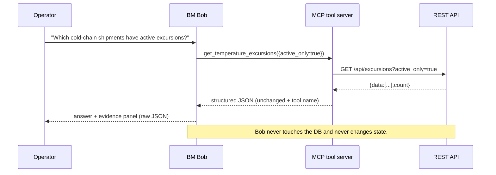
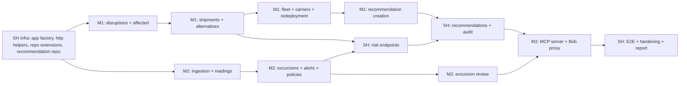

# Phase 3 — REST API and Bob/MCP Implementation Plan

**Project:** ChainSentinel — L2 Supply Chain Disruption Assistant & Fleet Utilisation Optimizer
**Date:** 2026-09-14
**Status:** PLAN — for team approval (checkpoint deliverable)
**Scope:** implement the frozen REST API and the grounded Bob/MCP tool layer. **No UI work in Phase 3** (screens are consumed in Phase 5). No ML. No new endpoints or tools.

---

## 0. Inputs read and current state

| Input | Status |
|---|---|
| Original reference files (official PDF, template guide, blueprint, Documents 1–2) | Read (unchanged) |
| `PHASE_1_SYSTEM_DESIGN.md` | Read — endpoint list, screens S1–S14, ownership |
| `docs/phase-0/scope-freeze.md`, `data-contract.md`, `api-contract.md` (+ Phase 1A amendments 24–28) | Read — source of truth for this plan |
| All M2 documents (`member-2-*`, 11 files) | Read — Bob tool catalogue, cold-chain API/UI, test plan |
| `PHASE_2_IMPLEMENTATION_PLAN.md` | **Not present** — see decision D8; Phase 2 was executed from the Phase 1 design + backlogs |
| `PHASE_2_FINAL_REVIEW.md` | Read — `APPROVED_FOR_PHASE_3` |
| `PHASE_2_DATA_GENERATOR_REPORT.md`, `PHASE_2_BACKEND_REPORT.md` | Read — claims verified |
| Backend source | Repositories + 5 deterministic services + validation exist; **no route layer**; `server.js` = health + 501 catch-all |
| Recommendation repository | **Missing** — required by endpoints 20/21/24/25 |
| MCP source | Placeholder only (`src/mcp-server/src/index.js` logs a TODO) |
| Database | PG16 healthy; 15 tables; seeded (48 shipments, 2,201 readings); ground truth verified cross-language |

**Phase mapping note:** the original `phase-plan.md` placed MCP/Bob in Phase 4. This checkpoint folds REST + MCP/Bob into Phase 3 (decision D1).

---

## 1–8. REST endpoints: methods, paths, schemas, errors, services, queries

Endpoint numbering follows `api-contract.md` (1–23) + Phase 1A amendments (24–28). All endpoints reuse existing Phase 2 services — no formula changes.

**Global conventions (contract §1, enforced):** JSON only · list responses `{data:[],count}` · detail responses are the resource · errors `{error:{code,message,details}}` · ISO-8601 UTC · empty results are `200` + `[]` · no DELETE endpoints · only endpoint 21 changes recommendation status · audit is append-only · actor defaults to `operator-1` per contract §1 (decision D6).

### 1.1 Master inventory

| # | Method + Path | Owner | Service | DB queries | Status codes | Screens | MCP tool |
|---|---|---|---|---|---|---|---|
| 1 | GET `/api/health` | SH | `db.ping` | — | 200, 500 | setup/demo | — |
| 2 | GET `/api/disruptions` | M1 | `matching.isDisruptionActive` | `listDisruptions` | 200, 400 | S1, S2 | `get_active_disruptions` |
| 3 | POST `/api/disruptions` | M1 | `validation.parse` + audit | `insertDisruption`, `listActiveDisruptions`, `appendAuditRecord` | 201, 400, 409 | S2 | — |
| 4 | PATCH `/api/disruptions/:id` | M1 | transition guard + audit | `getDisruption`, `updateDisruption` (new), `appendAuditRecord` | 200, 400, 404, 409 | S2 | — |
| 5 | GET `/api/disruptions/:id/affected-shipments` | M1 | `matchShipments` | `getDisruption`, `listShipments`, `listRoutes`, `listAllSegments` | 200, 404 | S3, S1 | `get_affected_shipments` |
| 6 | GET `/api/shipments` | M1 | filter composition | `listShipments` (extended), `getDisruption` | 200, 400, 404 | S3, S8 | — |
| 7 | GET `/api/shipments/:id` | M1 | `alternatives.routeCapacity` | `getShipment`, `getRoute`, `getCarrier`, `listSegmentsByRoute` | 200, 404 | S4 | — |
| 8 | GET `/api/shipments/:id/route-alternatives` | M1 | `routeAlternatives` | `getShipment`, `getRoute`, `listRoutesByOD`, `listAllSegments`, `listCarriers`, `listActiveDisruptions` | 200, 404 | S5 | `get_route_alternatives` |
| 9 | GET `/api/shipments/:id/carrier-alternatives` | M1 | `carrierAlternatives` | same as 8 | 200, 404 | S5 | `get_carrier_alternatives` |
| 10 | GET `/api/fleet/idle` | M1 | `idleAssets` | `listFleetAssets`, `listAllAssignments` | 200, 400 | S6, S7 | `get_idle_assets` |
| 11 | GET `/api/shipments/:id/redeployment-candidates` | M1 | `redeploymentCandidates` + `computeContention` | `getShipment`, `listSegmentsByRoute`, `listFleetAssets`, `listAllAssignments`, matching for contention | 200, 404 | S7 | `get_redeployment_candidates` |
| 12 | POST `/api/sensor-readings` | M2 | `computeQuality` + `nextEntityId` | `insertSensorReadings` (batch, new), `getShipment` | 200/201, 400 | simulator | — |
| 13 | GET `/api/shipments/:id/sensor-readings` | M2 | `computeQuality`, `sensorStatus` | `getShipment`, `listReadingsByShipment`, `getLatestPolicyForCargo` | 200, 400, 404 | S9, S11, S4 | `get_sensor_status` |
| 14 | GET `/api/excursions` | M2 | — (repo read + B-5 fields) | `listExcursions` | 200, 400, 404 | S8, S10, S4 | `get_temperature_excursions` |
| 15 | GET `/api/alerts/coldchain` | M2 | `sensorStatus` | `listExcursions` (active), `listShipments` (cold), latest-reading query (new) | 200 | S8 | — |
| 16 | GET `/api/temperature-policies` | M2 | — | `listTemperaturePolicies` | 200, 400 | S8/S10 (reference) | — |
| 17 | PUT `/api/temperature-policies/:id` | M2 | `validation.parse` + audit | `getLatestPolicyForCargo`, `insertTemperaturePolicy`, `appendAuditRecord` | 200, 400, 404 | policy editor (D7) | — |
| 18 | GET `/api/shipments/:id/risk` | SH | `matchShipments`, `detectExcursions`, `coldchainRisk`, `combinedScore` | `getShipment`, `listRoutes`, `listAllSegments`, `listActiveDisruptions`, `listReadingsByShipment`, `getLatestPolicyForCargo`, `insertRiskAssessment` | 200, 404 | S12, S1, S4 | `get_combined_risk` |
| 19 | GET `/api/risk/overview` | SH | same as 18 over actionable shipments | 18 + `listShipments`, `listRiskAssessments` | 200, 400 | S1, S12 | `get_risk_overview` |
| 20 | GET `/api/recommendations` | SH | — | `listRecommendations` (new repo) | 200, 400 | S4, S5, S7, S14 | — |
| 21 | POST `/api/recommendations/:id/decision` | SH | transition guard + audit | `getRecommendation`, `updateRecommendationDecision`, `appendAuditRecord` | 200, 400, 404, 409 | S4, S5, S7, S14 | — |
| 22 | GET `/api/audit` | SH | — | `listAuditRecords` | 200, 400 | S14 | `get_audit_log` |
| 23 | POST `/api/bob/query` | M2 | Bob proxy (503 when disabled) | — (proxies Bob; never touches DB) | 200, 400, 503 | S13 | — |
| 24 | POST `/api/recommendations` | SH/M1 | recompute via 8/9/11 + repo insert | alternatives/redeployment queries + `insertRecommendation`, `appendAuditRecord` | 201, 400, 404, 409 | S5, S7 | — |
| 25 | POST `/api/fleet/redeployments/recommend` | M1 | `redeploymentCandidates` re-validation | 11 queries + `insertRecommendation`, `appendAuditRecord` | 201, 400, 404, 409 | S7 | — |
| 26 | GET `/api/fleet` | M1 | `deriveOperationalState` + anomaly helper (new, A-7) | `listFleetAssets`, `listAllAssignments` | 200, 400 | S6 | — |
| 27 | GET `/api/carriers` | M1 | — | `listCarriers` | 200, 400 | S5 | — |
| 28 | PATCH `/api/excursions/:id` | M2 | transition guard + audit | `getTemperatureExcursion`, `updateExcursionStatus`, `appendAuditRecord` | 200, 400, 404, 409 | S10, S8 | — |

### 1.2 Request/response schemas (implementation detail)

| # | Request | Response (shape) | Errors |
|---|---|---|---|
| 2 | query `{status?, region_code?, limit=50}` | `{data:[Disruption + is_currently_active], count}` | `400 VALIDATION_ERROR` |
| 3 | `createDisruptionInputSchema` | `201` created Disruption | `400`; `409 CONFLICT` duplicate active same region + overlapping window |
| 4 | partial `{status?, end_time?, severity?, description?}` | updated Disruption | `404 DISRUPTION_NOT_FOUND`; `400`; `409` re-resolve/invalid transition |
| 5 | query `{include_delivered=false}` | `{data:[{shipment, impact_status, match_reason, matched_segment_ids, matched_disruptions[], timing_basis, confidence, impact_score, impact_factors}], count, disruption_id, computed_at}` | `404`; empty `data` valid |
| 6 | query `{status?, is_cold_chain?, disruption_id?, region_code?, limit=100}` | `{data:[Shipment], count}` | `400`; `404 DISRUPTION_NOT_FOUND` |
| 7 | — | Shipment + `route` + `carrier` + `segments[]` + `current_segment` + `route_capacity` + `next_segment` | `404 SHIPMENT_NOT_FOUND` |
| 8/9 | query `{limit=5, include_rejected=true}` | `{data:[{route|carrier, score, factors, constraints_checked[], reasons[]}], rejected[], count, not_actionable?}` | `404`; empty `data` + `rejected` valid |
| 10 | query `{region_code?, min_idle_minutes=0, limit}` | `{data:[{asset, idle_minutes, idle_since}], excluded:[{asset_id, reason, reserved_until?}], count}` | `400` |
| 11 | query `{limit=5, include_rejected=true}` | `{data:[{asset, score, factors{distance_km,idle_minutes,capacity_fit,contention_count,target_approximate,confidence_level,confidence_drivers}, constraints_checked[], reasons[]}], rejected[], excluded[], count}` | `404`; empty valid |
| 12 | `{readings:[sensorReadingInputSchema ≤500]}` | `{ingested, rejected:[{index, reason}], quality_flags:[{reading_id, flags[]}]}` | `400` (all invalid — D5); partial success allowed |
| 13 | query `{from?, to?, order=asc}` | `{data:[{id,timestamp,temperature_c}], count, quality{gaps,duplicates,out_of_order,implausible,sensor_status}, sensor{...}, policy{id,min_c,max_c}}` | `404`; `400` |
| 14 | query `{shipment_id?, severity?, status?, active_only?, limit=200}` | `{data:[Excursion + post_delivery, time_to_delivery_hours, recommended_action], count}` | `400`; `404` unknown shipment |
| 15 | — | `{data:[{type:"excursion"|"sensor_failure", severity?, shipment_id, excursion_id?, sensor_id?, summary, human_review_required}], count}` | `500` only |
| 16 | query `{include_history=false}` | `{data:[TemperaturePolicy], count}` | `400` |
| 17 | `policyUpdateInputSchema` | new policy version | `404 POLICY_NOT_FOUND`; `400` |
| 18 | query `{refresh=true}` | `{shipment_id, disruption_risk, coldchain_risk, combined_score, factors{disruption,coldchain,weights}, computed_at}` | `404` |
| 19 | query `{limit=25, include_zero=false}` | `{data:[risk rows + shipment summary], count, computed_at}` sorted desc | `400` |
| 20 | query `{shipment_id?, status?, type?, limit}` | `{data:[Recommendation], count}` | `400` |
| 21 | `decisionInputSchema` | updated Recommendation + `audit_record_id` | `404 RECOMMENDATION_NOT_FOUND`; `409` already decided; `400` |
| 22 | query `{entity_type?, entity_id?, limit=100, order=desc}` | `{data:[AuditRecord], count}` | `400` |
| 23 | `{prompt, context?}` | `{answer, evidence:[{tool,input,output}], tool_calls}` | `400`; `503 BOB_UNAVAILABLE` |
| 24 | `{type, shipment_id, route_id\|carrier_id\|asset_id, actor?, notes?}` | `201` pending Recommendation + `audit_record_id` | `400`; `404`; `409` duplicate pending |
| 25 | `{shipment_id, asset_id, actor?}` | `201` fleet_redeployment Recommendation + `audit_record_id` | `400`; `404`; `409` asset no longer eligible |
| 26 | query `{region_code?, type?, state?, limit=100}` | `{data:[{asset, operational_state, idle_minutes, next_assignment, anomalies[]}], count, computed_at}` | `400` |
| 27 | query `{status?, region_code?, mode?}` | `{data:[Carrier], count}` | `400` |
| 28 | `excursionStatusInputSchema` | updated Excursion + `audit_record_id` | `404 EXCURSION_NOT_FOUND`; `409` invalid transition; `400` critical close without note |

### 1.3 Server-side recompute rule (endpoints 24/25)

Client supplies **target IDs only**; the server re-derives the option from the current alternatives/redeployment results and recomputes `score`, `factors`, `constraints_checked`, `rejected_alternatives`. Client-supplied scores are ignored (contract §7 A-5). `modified_payload` semantics: decision D4.

---

## 7–8. MCP tools to expose (11 frozen — no additions)

Thin adapter (`src/mcp-server/`) over the REST API. Read-only. Returns endpoint JSON unchanged plus `tool` name. `BACKEND_URL` env (default `http://localhost:3001`).

| Tool | Input schema | Output | REST endpoint | Error handling |
|---|---|---|---|---|
| `get_active_disruptions` | `{}` | `{data:[Disruption], count}` | 2 (`?status=active`) | envelope passthrough |
| `get_affected_shipments` | `{disruption_id, include_delivered?}` | 5 response | 5 | `404` passthrough |
| `get_route_alternatives` | `{shipment_id, limit?}` | 8 response | 8 | empty = valid |
| `get_carrier_alternatives` | `{shipment_id}` | 9 response | 9 | empty = valid |
| `get_idle_assets` | `{region_code?, min_idle_minutes?}` | 10 response | 10 | `400` passthrough |
| `get_redeployment_candidates` | `{shipment_id}` | 11 response | 11 | empty = valid |
| `get_sensor_status` | `{shipment_id, from?, to?}` | 13 response (quality + sensor + policy) | 13 | `404` passthrough |
| `get_temperature_excursions` | `{shipment_id?, severity?, status?, active_only?}` | 14 response | 14 | empty = valid |
| `get_combined_risk` | `{shipment_id}` | 18 response | 18 | `404` passthrough |
| `get_risk_overview` | `{limit?, include_zero?}` | 19 response | 19 | `400` passthrough |
| `get_audit_log` | `{entity_type?, entity_id?}` | 22 response | 22 | empty = valid |

**Tool rules (frozen):** validate input; exactly one REST call per tool; JSON passthrough; no business logic; no DB access; no credentials; no mutation. Full per-tool specs: `docs/phase-0/member-2-bob-integration.md` §3.

---

## 9. Bob responsibilities

Bob **may:** query the 11 tools · summarise affected shipments · explain temperature alerts and severity · explain recommendations and rejected options · compare alternatives · generate the operational action brief · ask for a missing identifier.

Bob **must not:** invent shipments, readings, thresholds, carrier/fleet availability, routes, decisions or accuracy claims · compute scores · mutate state · answer from anything except tool JSON.

Grounding rules (enforced in the system prompt): tool-only answers · empty → "no data returned" (never "all clear") · tool error → report explicitly · ambiguous question → ask for the ID · unsupported question → say so · evidence (tool name + input + raw JSON) always attached · approvals only via UI → endpoints 21/28.

---

## 10. Bob-to-tool execution flow

Fallbacks: `BOB_ENABLED=false` → endpoint 23 returns `503`; UI shows "Bob is unavailable — the dashboard is fully functional"; MCP tools remain directly testable; a tool failure returns the standard envelope and is displayed verbatim.

---

## 11. Frontend screens consuming each endpoint

| Screen (design §8) | Endpoints consumed |
|---|---|
| S1 Overview / risk worklist | 2, 5, 18, 19 |
| S2 Disruptions (list + create) | 2, 3, 4 |
| S3 Affected shipments | 5, 6 |
| S4 Shipment detail (tabs) | 7, 13, 14, 18, 20, 21 |
| S5 Route/carrier comparison + decisions | 7, 8, 9, 20, 21, 24, 27 |
| S6 Fleet utilisation | 26, 10 |
| S7 Redeployment drawer | 10, 11, 20, 21, 24, 25 |
| S8 Cold-chain monitoring + alerts | 6 (cold filter), 14, 15, 16 |
| S9 Temperature history graph | 13 |
| S10 Excursion detail + review | 14, 16, 28 |
| S11 Sensor health | 13 |
| S12 Risk explanation | 18, 19 |
| S13 Bob chat + evidence panel | 23 (or MCP direct) |
| S14 Audit/history | 20, 21, 22 |

No UI is built in Phase 3; this mapping freezes what each endpoint must return so Phase 5 can consume it without contract changes.

---

## 12. Authentication / credential assumptions

- **API:** none — single trusted operator (documented limitation, contract §1). Actor defaults to `operator-1` (D6).
- **Database:** credentials only in `src/backend/.env` (git-ignored); never returned by any endpoint; the MCP server never connects to the database.
- **Bob:** `BOB_ENABLED=false` by default; `BOB_API_URL` / `BOB_API_KEY` read from env only, never logged or exposed. The enabled transport is D2.
- **Frontend:** no credentials, no env file; Vite proxy only (Phase 5).

---

## 13. Testing strategy

**Infrastructure prerequisites (blocking for tests):**
1. `createApp()` factory in `src/backend/src/app.js`; `server.js` becomes a thin listener (enables ephemeral-port API tests).
2. `asyncHandler` + error middleware in `src/backend/src/common/http.js` (AppError → envelope; unexpected → 500).
3. Seed reuse: export `loadFixtures(client, logistics, coldchain)` from `scripts/seed.js`; test helper seeds `TEST_DATABASE_URL` with the generated fixtures.

**Test files (node:test, concurrency 1):**

| File | Coverage | Est. tests |
|---|---|---|
| `test/api-logistics.test.js` | endpoints 2–11, 25–27: shapes, filters, empty results, rejections | ~25 |
| `test/api-coldchain.test.js` | 12–17, 28: batch partial failure, quality/sensor blocks, policy versioning, transitions | ~20 |
| `test/api-shared.test.js` | 18–22, 24: risk arithmetic vs ground truth, recommendation lifecycle, audit append-only | ~15 |
| `test/api-errors.test.js` | 400/404/409/503 matrix; envelope shape; unknown fields | ~12 |
| `test/e2e-flow.test.js` | disruption → affected → alternatives → recommendation → decision → audit; ingestion → excursion → risk | 2–3 |
| `test/mcp-tools.test.js` | all 11 tools: shape, read-only, error passthrough | ~11 |
| `test/bob-fallback.test.js` | 23 → 503 when disabled; no state change | ~3 |

**Existing suites must stay green:** 64 JS tests + 48 Python tests + `verify-seed.js` (15/15 matching, 14/14 excursions). Ground truth is the oracle for endpoints 5/8/9/11/13/14/18 (compare API output to `ground_truth.json` — do not rewrite formulas).

**Commands:** `npm test` (backend), `python -m unittest discover -s tests -t .` (generator), `npm run seed` + `node scripts/verify-seed.js` (data), `python validate.py` (contract).

**Bob grounding without credentials:** tool-layer tests only (shapes, empty/error handling, read-only). Live Bob tests are conditional on D2/Q6 and recorded as a documented limitation if unavailable.

---

## 14. Person-wise task division

### Member 1 — Logistics and Optimisation Engineer
| Task | Endpoints / artifacts | Depends on |
|---|---|---|
| M1-3.1 | Disruptions CRUD + affected shipments (2, 3, 4, 5) | I-1, I-2, I-5 |
| M1-3.2 | Shipments list/detail (6, 7) | I-1, I-5 |
| M1-3.3 | Route/carrier alternatives (8, 9) | M1-3.2 |
| M1-3.4 | Fleet idle, fleet list, carriers, redeployment (10, 11, 26, 27) | I-1, I-2, anomaly helper |
| M1-3.5 | Recommendation creation (24, 25) | M1-3.3/3.4, I-4 |
| M1-3.6 | API tests for 2–11, 24–27 | M1-3.1…3.5 |
| M1-3.7 | Review M2 endpoints + MCP tools | M2 tasks |

### Member 2 — Cold-Chain, AI and Bob Engineer
| Task | Endpoints / artifacts | Depends on |
|---|---|---|
| M2-3.1 | Ingestion + readings/health (12, 13) | I-1, I-2, I-6 |
| M2-3.2 | Excursions + alerts (14, 15) | M2-3.1 |
| M2-3.3 | Policies (16, 17) | I-1, I-6 |
| M2-3.4 | Excursion review lifecycle (28) | M2-3.2, I-4 |
| M2-3.5 | MCP server: 11 tools (D3) | M1-3.x + M2-3.x endpoints live |
| M2-3.6 | Bob proxy (23) 503 path + guarded forward (D2) | D2 |
| M2-3.7 | API tests for 12–17, 28 + MCP tool tests + grounding tests | M2-3.1…3.6 |
| M2-3.8 | Review M1 endpoints + recommendation flow | M1 tasks |

### Shared
| Task | Artifacts |
|---|---|
| SH-3.1 | Infrastructure: app factory, http helpers, route registration, query schemas (I-1…I-3, I-9) |
| SH-3.2 | Recommendation repository + decision guard (I-4) |
| SH-3.3 | Risk endpoints 18, 19 (match + excursions + risk service; snapshot persistence) |
| SH-3.4 | Recommendations list/decision + audit (20, 21, 22) |
| SH-3.5 | E2E flow tests + contract-shape sweep + error matrix |
| SH-3.6 | Integration fixes, `docs/PHASE_3_API_REPORT.md`, README/env updates |

---

## 15. Dependencies and implementation order

**Order:** (1) shared infra + repositories; (2) M1 disruptions/affected and M2 ingestion/readings in parallel; (3) M1 shipments/alternatives and M2 excursions/alerts/policies in parallel; (4) M1 fleet/redeployment; (5) shared risk; (6) recommendation creation + lifecycle + audit; (7) MCP server + Bob proxy; (8) E2E, hardening, report.

**Integration checkpoints:** contract-shape checkpoint (all endpoints return contract shapes on seeded data), ground-truth checkpoint (5/8/9/11/13/14/18 match `ground_truth.json`), Bob checkpoint (11 tools + 503 fallback), E2E checkpoint (full flow).

---

## 16. Phase 3 Definition of Done

1. All 28 endpoints implemented exactly per `api-contract.md` (+ amendments) — no extra endpoints.
2. Every endpoint has request/response/error tests; the error matrix (400/404/409/503) is covered.
3. Existing suites stay green: 64 JS + 48 Python; `verify-seed` still 15/15 and 14/14.
4. API output for endpoints 5/8/9/11/13/14/18 matches the generated ground truth (no formula changes).
5. E2E test passes: disruption → affected → alternatives → recommendation → decision → audit, and ingestion → excursion → risk.
6. MCP server exposes exactly the 11 frozen tools; all are read-only; tool contract tests pass.
7. Bob proxy returns `503 BOB_UNAVAILABLE` when disabled; dashboard-independent behaviour verified.
8. Conventions enforced: standard envelope everywhere, `{data,count}` lists, empty results `200`, no DELETE, single recommendation transition, append-only audit.
9. No credentials exposed; no ML; no UI; no changes to generator formulas or ground truth.
10. `docs/PHASE_3_API_REPORT.md` created (endpoints, tests, results, known issues, readiness).
11. Both members reviewed each other's endpoints (PR review).

---

## 17. REQUIRES_TEAM_DECISION

**Resolved (2026-09-14):** all nine decisions are recorded with final dispositions in `docs/PHASE_3_DECISIONS.md` (recommended defaults adopted). The table below is retained for traceability.

| # | Decision | Recommended default |
|---|---|---|
| D1 | Fold MCP/Bob into Phase 3 (originally Phase 4) | Approve |
| D2 | Bob transport when `BOB_ENABLED=true` (Q6 still open) | Implement the 503 path now; forward path behind env with the transport chosen when access is confirmed |
| D3 | MCP transport + SDK version pin | stdio transport, pin `@modelcontextprotocol/sdk` at implementation time |
| D4 | `modified_payload` semantics for decisions | Store payload + notes in the audit record; status becomes `modified`; no automatic re-execution |
| D5 | Ingestion when **all** readings are invalid | `400 VALIDATION_ERROR` with per-reading reasons (partial success stays `200`/`201`) |
| D6 | `actor` default per contract §1 | Make `actor` optional in decision/status/policy inputs, defaulting to `operator-1` |
| D7 | Policy editor UI (R6 configurable policies) | API-only in Phase 3; add a small editor to S8 in Phase 5 |
| D8 | `PHASE_2_IMPLEMENTATION_PLAN.md` missing | Proceed; treat `PHASE_1_SYSTEM_DESIGN.md` §16 + backlogs as the Phase 2 plan, or create a retrospective file |
| D9 | Contention computation scope (endpoint 11) | Compute over currently affected shipments (demo scale); revisit if slow |

No decision blocks the start of implementation with the recommended defaults.

---

## 18. Phase 3 risks (specific)

| Risk | Mitigation |
|---|---|
| Endpoint shapes drift from the contract | Contract-shape tests per endpoint; ground-truth comparisons |
| Recommendation repository arrives late | SH-3.2 is step 1; M1/M2 endpoints that need it are ordered after |
| Contention/N+1 queries slow the demo | Demo-scale datasets; latest-reading query for alerts; revisit in Phase 6 |
| Bob transport unknown (D2) | 503 path first; MCP tools testable without Bob |
| `actor`/`modified_payload` ambiguity | D4/D6 defaults recorded before implementation |

---

READY_FOR_PHASE_3_IMPLEMENTATION
