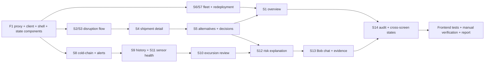

# Phase 5 — Scope and Implementation Plan (Dashboard)

**Project:** ChainSentinel — L2 Supply Chain Disruption Assistant & Fleet Utilisation Optimizer
**Date:** 2026-09-15
**Status:** **PLAN ONLY** — no code has been changed. Implementation must not begin until this plan is reviewed and approved (§12).
**Inputs read:** `PHASE_1_SYSTEM_DESIGN.md` (repo root — the referenced `docs/PHASE_1_SYSTEM_DESIGN.md` does not exist; path corrected) · `docs/PHASE_2_FINAL_REVIEW.md` · `docs/PHASE_3_FINAL_REVIEW.md` · `docs/PHASE_4_COMPLETION_REPORT.md` · `docs/PHASE_4_SCOPE_AND_PLAN.md` · `docs/PHASE_3_DECISIONS.md` · `api-contract.md` (+ §7/§8 amendments) · `data-contract.md` · `scope-freeze.md` · `member-1-logistics-ui.md` · `member-2-coldchain-ui.md` · `member-2-bob-integration.md` · `team-ownership.md` · `CONTRIBUTING.md` · current frontend scaffold (`src/frontend`, 4 files) · current backend/MCP/fixtures state.

---

## 1. Phase 5 scope

Per the approved design (`PHASE_1_SYSTEM_DESIGN.md` §16): **Phase 5 — Dashboard: all MVP screens on real APIs with all states. Gate: no mock data remains.**

In scope:

| # | Item | Notes |
|---|---|---|
| P5-1 | **Finding F1** — configure and verify the Vite `/api` dev proxy | First task; unlocks browser access without CORS |
| P5-2 | **Screens S1–S14** against the frozen REST API | No mock data; backend is the single source of truth |
| P5-3 | Screen-to-endpoint mapping (fields consumed) | §4; every screen maps to frozen endpoints only |
| P5-4 | Shared frontend foundation: API client, routing, state handling, components | §3; one client, one design system |
| P5-5 | Full state coverage: loading, empty, validation-error, unexpected-error, Bob 503, unknown/review, not-actionable, conflict | §5 |
| P5-6 | Frontend test and verification plan | §6 |
| P5-7 | Preserve all Phase 3/4 invariants | §7 |

**Out of scope (explicit):** F2–F8 from the Phase 3 review (unless separately approved); any backend/service/router/repository/migration/fixture/MCP/Bob change; any new endpoint; any computed score in the frontend; ML; authentication; deployment.

---

## 2. P5-1 — Vite proxy (F1)

**File:** `src/frontend/vite.config.js` (new)

```js
server: {
  port: 5173,
  proxy: { "/api": { target: "http://localhost:3001", changeOrigin: true } },
}
```

**Verification:** with the backend running and the dev server started, `GET http://localhost:5173/api/health` returns the backend JSON (`{"status":"ok","database":"up",...}`) and the browser shows no CORS errors. The frontend never needs backend credentials or an env file — all traffic is same-origin through the proxy.

**Why this preserves invariants:** zero backend change; the proxy is a dev-server concern only.

---

## 3. Frontend foundation

### 3.1 Technology (already declared, per ADR-001)

React 18 + Vite 5 (JavaScript), React Router 6, Recharts, plain CSS with design tokens. No UI framework, no state library (hooks + a small `useApi`).

### 3.2 API client structure

```
src/frontend/src/api/
├── client.js      request(path, {method, query, body}) → parsed JSON
│                  • builds query strings (drops undefined/null)
│                  • JSON body, content-type header
│                  • throws ApiError on !response.ok or network failure
├── ApiError.js    class ApiError { status, code, message, details }
│                  helpers: isValidation(), isConflict(), isNotFound(),
│                           isBobUnavailable(), isServerError()
└── endpoints.js   one thin function per frozen endpoint (28), e.g.
                   listDisruptions(filters) → client.get("/api/disruptions", filters)
                   No business logic, no arithmetic, no transformations
                   beyond naming/pass-through.
```

**Hard rule:** the frontend never computes scores, severities, risk weights, durations or rankings. It renders `score`, `factors`, `reasons`, `severity`, `impact_status`, `recommended_action` exactly as returned.

### 3.3 Hooks and state handling

```
src/frontend/src/hooks/
├── useApi.js      (fetcher, deps) → { data, loading, error, refresh }
│                  • resets to loading on dependency change
│                  • normalises errors to ApiError
├── usePolling.js  (refresh, intervalMs, enabled) — pauses when the tab is hidden
└── useDocumentTitle.js (small nicety)
```

- **Default polling:** 30 s on S8 (alerts) and S1 (overview); manual refresh on all other screens. *(Approval item A2.)*
- No caching layer in Phase 5 (demo scale); a route-level refresh on navigation is acceptable.

### 3.4 Routing (React Router)

| Route | Screen | Owner |
|---|---|---|
| `/` | S1 Overview | Shared |
| `/disruptions` | S2 Disruptions list + create | M1 |
| `/disruptions/:id/affected` | S3 Affected shipments | M1 |
| `/shipments/:id` (tabs `?tab=route\|risk\|sensors\|recommendations\|audit`) | S4 Shipment detail | M1 (tabs shared) |
| `/shipments/:id/alternatives` | S5 Route/carrier comparison + decisions | M1 |
| `/fleet` (tab `?tab=all\|idle`) | S6 Fleet utilisation + idle | M1 |
| drawer over S4/S6/S7 | S7 Redeployment | M1 |
| `/coldchain` | S8 Cold-chain monitoring (+ policy editor, D7) | M2 |
| `/shipments/:id/temperature` | S9 Temperature history | M2 |
| `/excursions/:id` | S10 Excursion detail + review | M2 |
| `/sensors` | S11 Sensor health | M2 |
| `/shipments/:id/risk` | S12 Risk explanation | M2 lead (risk rendering per team-ownership), M1 review |
| `/chat` | S13 Bob chat + evidence | M2 |
| `/audit` | S14 Audit/history | Shared (M1 screen) |

### 3.5 Shared components

| Group | Components |
|---|---|
| Layout | `AppShell` (nav + header), `PageHeader`, `Card`, `Tabs`, `Toolbar`, `FilterBar` |
| Data display | `DataTable` (sortable, empty-aware), `ScoreBar`, `FactorList`, `ReasonList`, `StatusBadge`, `MetricCard`, `JsonViewer`, `TimeSeriesChart` (Recharts wrapper with policy bounds + gap markers), `EvidencePanel` |
| States | `LoadingSkeleton`, `EmptyState`, `ErrorState` (code + message + retry), `UnknownReviewBanner`, `NotActionableBanner`, `ConfirmDialog`, `Toast` |
| Domain | `DisruptionForm`, `DecisionButtons`, `ExcursionReviewActions`, `PolicyEditor`, `RiskFactorTable`, `RedeploymentCard` |

**StatusBadge vocabulary (rendered from backend values only):** impact status, disruption status/severity, excursion severity, data quality, recommendation status, asset operational state, sensor status.

---

## 4. Screen-to-endpoint mapping (fields consumed)

Every endpoint below is frozen and implemented; **no new endpoints**.

| Screen | Endpoint(s) | Key response fields consumed |
|---|---|---|
| **S1** Overview / risk worklist | `GET /api/risk/overview?limit&include_zero` · `GET /api/disruptions?status=active` · (counts) `GET /api/alerts/coldchain` | `data[].shipment{id,cargo_type,is_cold_chain,status,deadline}`, `disruption_risk`, `coldchain_risk`, `combined_score`, `factors.{disruption,coldchain,weights}`, `computed_at`; disruption rows with `is_currently_active`; alert counts by type |
| **S2** Disruptions (list + create) | `GET /api/disruptions?status&region_code&limit` · `POST /api/disruptions` · `PATCH /api/disruptions/:id` | disruption fields + `is_currently_active`; POST validation `details.issues`; PATCH transitions; 409 duplicate/invalid transition |
| **S3** Affected shipments | `GET /api/disruptions/:id/affected-shipments?include_delivered` | `data[].shipment{...}`, `impact_status`, `match_reason`, `matched_segment_ids`, `matched_disruptions[]`, `timing_basis`, `confidence`, `impact_score`, `impact_factors`, `computed_at` |
| **S4** Shipment detail (tabs) | `GET /api/shipments/:id` · `/risk` · `/sensor-readings` · `GET /api/recommendations?shipment_id&status=pending` · `GET /api/audit?entity_id` | shipment + `route` + `carrier` + `segments[]` + `current_segment` + `next_segment` + `route_capacity`; risk factors (RC-3); readings/quality/sensor/policy; recommendation rows; audit rows |
| **S5** Route/carrier comparison + decisions | `GET /api/shipments/:id/route-alternatives` · `/carrier-alternatives` · `POST /api/recommendations` · `POST /api/recommendations/:id/decision` | `data[].{route|carrier, score, factors, constraints_checked, reasons}`, `rejected[].{route_id|carrier_id, rejected_reason}`, `not_actionable`, `not_actionable_reason`; 201 recommendation + `audit_record_id`; 409 stale/duplicate |
| **S6** Fleet utilisation + idle | `GET /api/fleet?region_code&type&state` · `GET /api/fleet/idle?region_code&min_idle_minutes` | fleet rows `{asset, operational_state, idle_minutes, next_assignment, anomalies[]}`; idle `data[]` + `excluded[].{asset_id, reason, until}` |
| **S7** Redeployment drawer | `GET /api/shipments/:id/redeployment-candidates` · `POST /api/fleet/redeployments/recommend` | `data[].{asset, score, factors{distance_km,idle_minutes,capacity_fit,contention_count,target_approximate,confidence_level,confidence_drivers}, reasons, constraints_checked}`, `rejected[]`, `excluded[]`; 409 `asset_not_eligible` → refresh |
| **S8** Cold-chain monitoring (+ policy editor, D7) | `GET /api/shipments?is_cold_chain=true` · `GET /api/alerts/coldchain` · `GET /api/temperature-policies` · `PUT /api/temperature-policies/:id` | cold shipment rows; alerts `type|severity|shipment_id|excursion_id|sensor_id|summary|human_review_required`; policy rows (versioned); 200 new version + validation issues |
| **S9** Temperature history | `GET /api/shipments/:id/sensor-readings?from&to&order=asc` | `data[].{timestamp,temperature_c}`, `quality{gaps,duplicates,out_of_order,implausible,sensor_status}`, `sensor{...}`, `policy{min_c,max_c}` |
| **S10** Excursion detail + review | `GET /api/excursions?shipment_id&limit` (find by id) · `PATCH /api/excursions/:id` | excursion fields incl. `severity`, `severity_rationale`, `data_quality`, `duration_min`, `peak_deviation_c`, `recommended_action`, `time_to_delivery_hours`, `status`, `post_delivery`; 409 invalid transition; 400 critical close without note |
| **S11** Sensor health | `GET /api/shipments?is_cold_chain=true` then per-shipment `GET /api/shipments/:id/sensor-readings` (sensor block) | `sensor{sensor_id,status,expected_interval_min,last_reading_at,minutes_since_last,readings_count,gap_count,failure_since}` |
| **S12** Risk explanation | `GET /api/shipments/:id/risk?refresh` | `disruption_risk`, `coldchain_risk`, `combined_score`, `factors.disruption.{impact_score,affected_disruption_ids,impact_status}`, `factors.coldchain.{worst_excursion_id,severity,peak_deviation_c,duration_min,time_to_delivery_hours,data_quality,cargo_sensitivity,excursion_count,confidence_level,confidence_drivers,recommended_action,human_review_required}`, `weights`, `computed_at` |
| **S13** Bob chat + evidence | `POST /api/bob/query` | `answer`, `evidence[].{tool,input,output}`, `tool_calls`; 503 → `BOB_UNAVAILABLE` fallback state; 400 validation |
| **S14** Audit/history | `GET /api/audit?entity_type&entity_id&order&limit` | `data[].{entity_type,entity_id,action,actor,timestamp,details}` |

**Design-note resolution (S10):** the design's §8 row mentioned `GET /api/excursions/:id`, but the frozen contract exposes `GET /api/excursions` (list with filters) — there is **no GET-by-id**. S10 therefore fetches `GET /api/excursions?shipment_id=…&limit=200` and selects the id, or receives the record via navigation state and refreshes through the list. No backend change. *(Recorded as PLAN interpretation A3.)*

**S11 note:** sensor health requires one sensor-block call per cold shipment (≈23 at demo scale). Acceptable; flagged as a Phase 6 performance candidate (would need a new endpoint, which is out of scope here).

---

## 5. State coverage

| State | Rule | Presentation |
|---|---|---|
| Loading | `useApi` in flight | Screen-appropriate skeletons (`LoadingSkeleton`, chart skeleton, table skeleton); never a blank page |
| Empty | `200` + `data: []` | `EmptyState` with the screen-specific message and a relevant CTA (e.g., S3 "No shipments affected by this disruption", S5 "No feasible alternatives" + grouped rejection reasons) |
| Validation error (400) | Write actions (create disruption, policy edit, decisions) | Field-level messages mapped from `error.details.issues[].path`; non-field issues → `Toast` |
| Unexpected error (500 / network) | Any call | `ErrorState` with code + message + Retry; no blank screens |
| Conflict (409) | Decisions/reviews/stale eligibility | `Toast` + automatic refresh of the affected query (e.g., duplicate recommendation, already decided, asset no longer eligible) |
| Bob 503 (`BOB_UNAVAILABLE`) | S13 | Fallback panel: "Bob is unavailable — the dashboard is fully functional"; input disabled; no fabricated answers; suggested questions hidden |
| Unknown / review | `impact_status = unknown_review`, `severity = unknown_review`, `policy_missing`, `missing_readings`, `sensor_failure` | Distinct `UnknownReviewBanner`/badge with the backend reason; never shown as "normal" |
| Not actionable | `not_actionable = true` (delivered/cancelled) | `NotActionableBanner` + disabled actions (S4/S5/S7) |
| Stale sensor feed | `sensor.status = failed/delayed` | Warning banner on S8/S9/S11 (expected with historical fixtures until the simulator posts — F2 stays out of scope but the UI must present it correctly) |

---

## 6. Frontend test and verification plan

### 6.1 Tooling (approval item A1)

Add **dev-only** dependencies: `vitest`, `jsdom`, `@testing-library/react`, `@testing-library/jest-dom`. Test config lives in `vite.config.js` (via `defineConfig` from `vitest/config`). No production runtime dependency is added.

### 6.2 Test layers

| Layer | Files | What is tested |
|---|---|---|
| API client | `src/api/client.test.js` | Query-string building (undefined dropped), JSON handling, `ApiError` mapping for 400/404/409/503/500 and network failure |
| Shared components | `src/components/*.test.jsx` | `LoadingSkeleton`, `EmptyState`, `ErrorState` (retry callback), `UnknownReviewBanner`, `NotActionableBanner`, `StatusBadge` vocabulary, `ScoreBar`/`FactorList` (renders backend values verbatim, no arithmetic), `EvidencePanel` |
| Screens | `src/screens/*.test.jsx` | One data-render test per screen (fixture JSON shaped exactly like the contract) + one state test per screen from §5 (loading/empty/error/503/unknown/409 as applicable) |
| Safety checks | `src/api/no-formulas.test.js` (static scan) | Frontend source contains no score/weight constants (`0.35`, `0.45`, `SEVERITY_WEIGHTS`, `impact_score` arithmetic patterns) |
| Fixtures | `test/fixtures/*.json` | Hand-written, contract-shaped samples clearly labelled as test fixtures (not seeded data) |

Fetch is mocked per test with `vi.spyOn(globalThis, "fetch")` — no extra mocking library.

**Target:** ≈45–60 frontend tests. **E2E (Playwright) is Phase 7**, not Phase 5.

### 6.3 Manual verification checklist

1. F1: `http://localhost:5173/api/health` returns backend JSON through the proxy.
2. Walk all 14 screens with the seeded development database; confirm no mock data and no formula computations (spot-check a score against the API response).
3. Force each state: stopped backend (error), empty filter (empty), invalid form (validation), duplicate decision (409), `BOB_ENABLED=false` (S13 fallback), historical fixture (sensor-failure banners).
4. Confirm delivered shipment (S007) shows the not-actionable banner and disabled actions.
5. Confirm `unknown_review` rows (S010 impact, S028/S036 excursions, S032/S033 policy) render the review banner with the backend reason.

### 6.4 Verification commands

```bash
# F1 proxy (two terminals)
cd src/backend  && npm run dev            # backend :3001
cd src/frontend && npm run dev            # frontend :5173
curl http://localhost:5173/api/health     # expect backend JSON via proxy

# frontend quality gates
cd src/frontend && npm install && npm test && npm run build

# backend invariants (must remain untouched and green)
cd src/backend  && npm test               # 144/144
node scripts/verify-seed.js               # 15/15 + 14/14
cd src/data-generator && python -m unittest discover -s tests -t . && python validate.py

# guard checks
rg "0\.35|0\.45|SEVERITY_WEIGHTS|combined_score\s*=" src/frontend/src   # expect no matches
Get-ChildItem src/frontend -Recurse -Filter ".env"                      # expect none
# backend untouched during Phase 5: no file under src/backend, src/mcp-server, src/data-generator, data/ modified
```

---

## 7. Invariant preservation (Phase 3/4)

Phase 5 touches **only** `src/frontend/**` plus documentation. Therefore:

| Invariant | Preservation argument | Check |
|---|---|---|
| I1 28 endpoints functional | No backend change | Full sweep optional; backend suites re-run |
| I2 0 unexpected 5xx | No backend change | `npm test` (144) + sweep if desired |
| I3 Bob 503 fallback | Frontend treats 503 as a first-class state (S13) | Component + manual check |
| I4 MCP GET-only/read-only | MCP untouched; browser cannot reach stdio MCP | Source timestamps unchanged |
| I5 no ML | No ML dependencies added to the frontend | Dependency scan |
| I6 no duplicated formulas | Enforced by the static scan test + code review rule | `no-formulas.test.js` + grep |
| I7 seed ground truth unchanged | Fixtures/data untouched | `verify-seed` + validator |
| I8 no secrets / references untouched | No frontend env, proxy only; reference files untouched | File checks |
| Backend/MCP/generator untouched | Phase 5 is frontend-only | Timestamp check at the Phase 5 review |

---

## 8. Files likely to be created or modified

**Created — configuration**
- `src/frontend/vite.config.js` (F1 proxy + Vitest config)

**Created — foundation**
- `src/frontend/src/App.jsx` (routes, shell)
- `src/frontend/src/api/client.js`, `src/frontend/src/api/ApiError.js`, `src/frontend/src/api/endpoints.js`
- `src/frontend/src/hooks/useApi.js`, `src/frontend/src/hooks/usePolling.js`, `src/frontend/src/hooks/useDocumentTitle.js`
- `src/frontend/src/utils/format.js` (dates, ids, percent display only — no scoring)
- `src/frontend/src/styles/tokens.css`, `src/frontend/src/styles/layout.css`, `src/frontend/src/styles/components.css`

**Created — components** (≈20)
- `src/frontend/src/components/AppShell.jsx`, `Navigation.jsx`, `PageHeader.jsx`, `Card.jsx`, `Tabs.jsx`, `Toolbar.jsx`, `FilterBar.jsx`
- `DataTable.jsx`, `ScoreBar.jsx`, `FactorList.jsx`, `ReasonList.jsx`, `StatusBadge.jsx`, `MetricCard.jsx`, `JsonViewer.jsx`, `TimeSeriesChart.jsx`, `EvidencePanel.jsx`
- `LoadingSkeleton.jsx`, `EmptyState.jsx`, `ErrorState.jsx`, `UnknownReviewBanner.jsx`, `NotActionableBanner.jsx`, `ConfirmDialog.jsx`, `Toast.jsx`
- Domain: `DisruptionForm.jsx`, `DecisionButtons.jsx`, `ExcursionReviewActions.jsx`, `PolicyEditor.jsx`, `RiskFactorTable.jsx`, `RedeploymentCard.jsx`

**Created — screens** (14)
- `src/frontend/src/screens/OverviewScreen.jsx` (S1) · `DisruptionsScreen.jsx` (S2) · `AffectedShipmentsScreen.jsx` (S3) · `ShipmentDetailScreen.jsx` (S4) · `AlternativesScreen.jsx` (S5) · `FleetScreen.jsx` (S6) · `RedeploymentDrawer.jsx` (S7) · `ColdChainScreen.jsx` (S8) · `TemperatureHistoryScreen.jsx` (S9) · `ExcursionDetailScreen.jsx` (S10) · `SensorHealthScreen.jsx` (S11) · `RiskExplanationScreen.jsx` (S12) · `BobChatScreen.jsx` (S13) · `AuditScreen.jsx` (S14)

**Created — tests**
- `src/frontend/src/api/client.test.js`, `src/frontend/src/api/no-formulas.test.js`
- `src/frontend/src/components/*.test.jsx` (state + display components)
- `src/frontend/src/screens/*.test.jsx` (one per screen)
- `src/frontend/test/setup.js`, `src/frontend/test/fixtures/*.json`

**Modified**
- `src/frontend/package.json` (scripts: `test`, `test:run`; dev deps per A1)
- `src/frontend/index.html` (title/meta)
- `src/frontend/src/main.jsx` (router + providers bootstrap, replacing the placeholder)
- `src/frontend/README.md` (run/test instructions)

**Created — documentation (at completion)**
- `docs/PHASE_5_UI_REPORT.md`

**Explicitly untouched:** `src/backend/**`, `src/mcp-server/**`, `src/data-generator/**`, `data/**`, `docs/phase-0/**` contracts, reference PDFs/DOCX/MD.

---

## 9. Dependency and implementation order



**Order:** (1) F1 proxy + API client + shell/routing + state components; (2) S2 → S3 (disruption flow); (3) S6/S7 (fleet); (4) S4 → S5 (shipment + decisions); (5) S8 → S9/S11 → S10 (cold-chain); (6) S1 and S12 (worklist + risk explanation); (7) S13 (Bob + evidence); (8) S14 (audit); (9) state hardening, tests, verification, `PHASE_5_UI_REPORT.md`.

**Parallelism:** M1 (S1–S7, S14) and M2 (S8–S13) work in parallel after the shared foundation. **Scope-cut order if time is short (per `scope-freeze.md` §4):** the essential six screens first — S1, S2, S3, S5, S6/S7, S8 — then S13; S4, S9–S12, S14 next.

---

## 10. Acceptance criteria

1. F1 verified: `http://localhost:5173/api/health` returns backend JSON through the Vite proxy; no CORS errors.
2. All 14 screens implemented, navigable, and rendered from **real** APIs (no mock data in the running app).
3. Every consumed field appears in the §4 mapping; no endpoint outside the frozen 28 is called.
4. All states in §5 are implemented and demonstrable (loading, empty, validation, unexpected, 409, Bob 503, unknown/review, not-actionable).
5. Backend-provided scores/severities/reasons are rendered verbatim; **no formulas in the frontend** (`no-formulas` scan passes).
6. Frontend tests pass (target ≈45–60); `npm run build` succeeds.
7. Backend invariants hold: 144/144 backend tests, 48/48 Python, validator PASS, `verify-seed` 15/15 + 14/14; no file under `src/backend`, `src/mcp-server`, `src/data-generator`, `data/` modified during Phase 5.
8. No secrets; no frontend `.env`; nothing but the proxy config references the backend origin.
9. `docs/PHASE_5_UI_REPORT.md` completed with screens, states, tests, evidence, known issues.

---

## 11. Risks and unresolved questions

### Risks

| ID | Risk | Mitigation |
|---|---|---|
| R1 | 14 screens is a large surface for two students | Essential-six first (scope-cut order §9); shared components amortise work |
| R2 | Test tooling adds dev dependencies | Dev-only; approval item A1; no runtime impact |
| R3 | Historical fixtures show stale-feed banners (F2) across cold-chain screens | UI presents the state correctly; demo-day regeneration handled in Phase 7 (F2 stays out of scope) |
| R4 | S11 per-shipment sensor calls (≈23) | Acceptable at demo scale; Phase 6 optimization candidate |
| R5 | Bob is disabled by default → S13 mostly shows the fallback | Treated as a first-class state; Phase 7 may demonstrate via MCP tool calls if Q6 is unresolved |
| R6 | API/client drift from the contract | Screens tested against contract-shaped fixtures; the client is a thin pass-through |
| R7 | Accidental formula duplication | Static scan test + review rule (no arithmetic beyond display formatting) |
| R8 | Backend touched accidentally | Phase 5 review re-checks timestamps under `src/backend`, `src/mcp-server`, `src/data-generator`, `data/` |

### Unresolved questions (approval items)

| ID | Question | Recommended default |
|---|---|---|
| A1 | Approve Vitest + Testing Library + jsdom as dev-only dependencies for the frontend? | Approve |
| A2 | Polling default: 30 s for S1/S8 with visibility pause, manual refresh elsewhere? | Approve |
| A3 | Resolve S10's design reference (`/api/excursions/:id` doesn't exist) to the frozen list endpoint? | Approve (no backend change) |
| A4 | Include the small policy editor (D7) in S8 during Phase 5? | Approve (already decided in D7) |
| A5 | S12 ownership: M2 lead (risk rendering) with M1 review? | Approve |
| A6 | Confirm F2–F8 remain out of Phase 5? | Approve |
| A7 | E2E (Playwright) deferred to Phase 7? | Approve |

---

## 12. Status

**PLAN ONLY** — no frontend code, configuration, dependency or documentation outside this plan has been changed. Implementation begins only after this plan (including A1–A7) is reviewed and approved.
