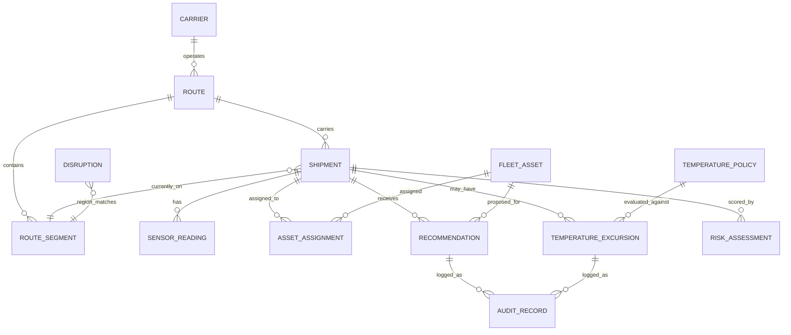

# Phase 0 — Data Contract

**Status:** APPROVED — Phase 1A closure (2026-09-14). Amendments A-3/B-1/B-6/RC-3 applied and B-C1 corrected; see the normative section at the end of this file.

---

## 1. Global conventions

| Convention | Rule |
|---|---|
| IDs | Human-readable, prefixed, immutable. Never reused. Generated by the data generator for seed data; generated by the backend for runtime records. |
| Timestamps | ISO 8601 UTC with `Z` in JSON; `timestamptz` in PostgreSQL. Example: `2026-09-14T09:12:00Z` |
| Money | Integer USD (`cargo_value_usd`, `cost_usd`, `planned_cost_usd`). No floats, no cents, no currency field in MVP. |
| Temperature | `numeric(5,1)` in °C; JSON number with at most one decimal. |
| Coordinates | `numeric(9,6)` lat/lon; synthetic but plausible values. |
| Booleans | Real booleans, never 0/1 or strings. |
| Enums | Stored as `text` with `CHECK` constraints; machine values are `snake_case`; display labels are the UI's concern. |
| Nullability | Explicit in every table below. `null` means "unknown/not applicable", never "zero". |
| Validation philosophy | Validate at the API boundary (`zod`), enforce referential integrity in the database (FKs), validate seed data with the generator validator before seeding. |

### 1.1 Controlled vocabulary — region codes

Disruption matching is exact string matching on `region_code`. Only these values may be used in seed data:

`IN-WEST-COAST`, `AE-JEBEL-ALI`, `SG-SINGAPORE`, `CN-EAST-COAST`, `US-WEST-COAST`, `EU-ROTTERDAM`, `US-EAST-COAST`, `IN-NORTH-ICD`

### 1.2 Controlled vocabulary — cargo types

`vaccine`, `insulin`, `fresh_produce`, `frozen_food`, `pharma_generic`, `electronics`, `apparel`, `machinery`

### 1.3 Entity Relationship Diagram



*(Note: `DISRUPTION → ROUTE_SEGMENT` is a region-code match, not a foreign key. `AUDIT_RECORD` is polymorphic — `entity_type` + `entity_id`, no FK.)*

---

## 2. Shipment

**Purpose:** a single cargo movement. The central entity for R1, R2, R3, P2.

**ID format:** `S###` — regex `^S\d{3}$` — example `S102`

| Field | Type | Required | Validation / notes |
|---|---|---|---|
| `id` | string | yes | unique, regex above |
| `route_id` | string | yes | FK → `route.id`; must exist |
| `cargo_type` | string | yes | in §1.2 vocabulary |
| `is_cold_chain` | boolean | yes | if true, `cargo_type` must have a `temperature_policy` row (enforced at evaluation, not at insert) |
| `cargo_value_usd` | integer | yes | ≥ 0 |
| `volume_units` | integer | yes | > 0; compared against asset/carrier capacity |
| `deadline` | timestamptz | yes | must be after `created_at` |
| `status` | string | yes | `planned \| in_transit \| delayed \| delivered \| cancelled`; `delivered`/`cancelled` excluded from active matching |
| `current_segment_id` | string | no | FK → `route_segment.id`; null when `planned` or after delivery; used for fleet proximity target |
| `created_at` | timestamptz | yes | |
| `updated_at` | timestamptz | yes | |

**Relationships:** N shipments → 1 route; N readings → 1 shipment; N excursions → 1 shipment; N recommendations → 1 shipment; N risk assessments → 1 shipment; 1 shipment → N assignments.

**Required validation:** route exists; cargo_type valid; deadline > created_at; volume > 0; status valid; `current_segment_id` (if present) belongs to `route_id`.

```json
{
  "id": "S102",
  "route_id": "R045",
  "cargo_type": "vaccine",
  "is_cold_chain": true,
  "cargo_value_usd": 520000,
  "volume_units": 12,
  "deadline": "2026-09-18T10:00:00Z",
  "status": "in_transit",
  "current_segment_id": "SEG-012",
  "created_at": "2026-09-10T08:00:00Z",
  "updated_at": "2026-09-14T06:30:00Z"
}
```

---

## 3. Route

**Purpose:** planned path for a shipment, served by one carrier. Candidate set for R2.

**ID format:** `R###` — `^R\d{3}$` — example `R045`

| Field | Type | Required | Validation / notes |
|---|---|---|---|
| `id` | string | yes | unique |
| `origin_node` | string | yes | node code, e.g. `INMUM`, `AEJEA` |
| `destination_node` | string | yes | ≠ origin |
| `carrier_id` | string | yes | FK → `carrier.id`; carrier must exist |
| `status` | string | yes | `active \| inactive`; inactive routes excluded from alternatives |
| `total_distance_km` | numeric(10,1) | yes | > 0 |
| `planned_duration_hours` | numeric(6,1) | yes | > 0 |
| `planned_cost_usd` | integer | yes | > 0 |
| `created_at` | timestamptz | yes | |

**Relationships:** N routes → 1 carrier; 1 route → N segments (ordered by `seq`); 1 route → N shipments.

**Required validation:** ≥ 2 segments per route (checked by validator); carrier exists; origin ≠ destination.

```json
{
  "id": "R045",
  "origin_node": "INMUM",
  "destination_node": "NLRTM",
  "carrier_id": "C07",
  "status": "active",
  "total_distance_km": 11240.0,
  "planned_duration_hours": 384.0,
  "planned_cost_usd": 84000,
  "created_at": "2026-08-01T00:00:00Z"
}
```

---

## 4. RouteSegment

**Purpose:** a leg of a route; the unit that disruptions match against (R1) and that alternatives must avoid.

**ID format:** `SEG-###` — `^SEG-\d{3}$` — example `SEG-012`

| Field | Type | Required | Validation / notes |
|---|---|---|---|
| `id` | string | yes | unique |
| `route_id` | string | yes | FK → `route.id` |
| `seq` | integer | yes | ≥ 1; unique per route; contiguous ordering recommended |
| `name` | string | yes | human label, e.g. `SEA-1 Mumbai–Jebel Ali` |
| `region_code` | string | yes | §1.1 vocabulary; the **only** disruption match key |
| `mode` | string | yes | `sea \| road \| rail \| air` |
| `origin_node` | string | yes | |
| `destination_node` | string | yes | |
| `distance_km` | numeric(10,1) | yes | > 0 |
| `planned_duration_hours` | numeric(6,1) | yes | > 0 |
| `capacity_units` | integer | yes | > 0 |
| `cost_usd` | integer | yes | > 0 |
| `dest_lat` | numeric(9,6) | yes | destination coordinates; fleet proximity target |
| `dest_lon` | numeric(9,6) | yes | |

**Relationships:** N segments → 1 route; disruptions match by `region_code`; shipments reference one segment as `current_segment_id`.

**Required validation:** route exists; `seq` unique per route; region_code in vocabulary; numeric ranges.

```json
{
  "id": "SEG-012",
  "route_id": "R045",
  "seq": 2,
  "name": "SEA-1 Mumbai–Jebel Ali",
  "region_code": "IN-WEST-COAST",
  "mode": "sea",
  "origin_node": "INMUM",
  "destination_node": "AEJEA",
  "distance_km": 1930.0,
  "planned_duration_hours": 96.0,
  "capacity_units": 220,
  "cost_usd": 14000,
  "dest_lat": 25.012800,
  "dest_lon": 55.061400
}
```

---

## 5. Carrier

**Purpose:** transport provider; the entity behind R2 carrier alternatives and route feasibility.

**ID format:** `C##` — `^C\d{2}$` — example `C07`

| Field | Type | Required | Validation / notes |
|---|---|---|---|
| `id` | string | yes | unique |
| `name` | string | yes | non-empty |
| `service_regions` | string[] | yes | subset of §1.1 vocabulary; ≥ 1 |
| `modes` | string[] | yes | subset of `sea \| road \| rail \| air`; ≥ 1 |
| `capacity_units` | integer | yes | > 0 |
| `cost_index` | numeric(4,2) | yes | 0.50–2.00; relative cost multiplier used by scoring |
| `reliability_score` | numeric(3,2) | yes | 0.00–1.00 |
| `status` | string | yes | `active \| inactive`; inactive excluded from alternatives |

**Relationships:** 1 carrier → N routes.

**Required validation:** ranges above; inactive carriers never appear in alternative lists (hard constraint).

```json
{
  "id": "C07",
  "name": "BlueWave Shipping",
  "service_regions": ["IN-WEST-COAST", "AE-JEBEL-ALI", "EU-ROTTERDAM"],
  "modes": ["sea"],
  "capacity_units": 900,
  "cost_index": 1.05,
  "reliability_score": 0.94,
  "status": "active"
}
```

---

## 6. Disruption

**Purpose:** an active event used to identify affected shipments (R1).

**ID format:** `D##` — `^D\d{2}$` — example `D01`

| Field | Type | Required | Validation / notes |
|---|---|---|---|
| `id` | string | yes | unique |
| `type` | string | yes | `weather \| port_strike \| geopolitical \| customs \| infrastructure` |
| `region_code` | string | yes | §1.1 vocabulary; match key |
| `start_time` | timestamptz | yes | |
| `end_time` | timestamptz | no | null = open-ended; if set, must be > `start_time` |
| `severity` | integer | yes | 1–5 |
| `status` | string | yes | `scheduled \| active \| resolved`; only `active` triggers matching |
| `description` | string | yes | non-empty, plain text |
| `created_by` | string | yes | actor label, e.g. `operator-1` |
| `created_at` | timestamptz | yes | |

**Relationships:** matches route segments by `region_code` (no FK); N recommendations derive from N affected shipments.

**Required validation:** severity 1–5; time window coherent; region in vocabulary; status valid.

```json
{
  "id": "D01",
  "type": "port_strike",
  "region_code": "IN-WEST-COAST",
  "start_time": "2026-09-14T06:00:00Z",
  "end_time": "2026-09-17T06:00:00Z",
  "severity": 4,
  "status": "active",
  "description": "Dock workers strike at Mumbai port; berth operations suspended.",
  "created_by": "operator-1",
  "created_at": "2026-09-14T06:05:00Z"
}
```

---

## 7. FleetAsset

**Purpose:** truck/container/vessel available for redeployment (R3).

**ID format:** `A###` — `^A\d{3}$` — example `A114`

| Field | Type | Required | Validation / notes |
|---|---|---|---|
| `id` | string | yes | unique |
| `type` | string | yes | `truck \| container \| vessel` |
| `capacity_units` | integer | yes | > 0 |
| `refrigerated` | boolean | yes | cold-chain shipments require `true` |
| `current_lat` | numeric(9,6) | yes | −90..90 |
| `current_lon` | numeric(9,6) | yes | −180..180 |
| `current_region_code` | string | yes | §1.1 vocabulary |
| `status` | string | yes | `available \| maintenance \| retired`; "idle" is **derived**, never stored |
| `available_since` | timestamptz | no | required when `status = available`; null otherwise; idle time = `now − available_since` |
| `created_at` | timestamptz | yes | |

**Relationships:** 1 asset → N assignments; 1 asset → N redeployment recommendations.

**Required validation:** status/available_since coherence; coordinate ranges; capacity > 0.

```json
{
  "id": "A114",
  "type": "truck",
  "capacity_units": 16,
  "refrigerated": true,
  "current_lat": 19.076000,
  "current_lon": 72.877700,
  "current_region_code": "IN-WEST-COAST",
  "status": "available",
  "available_since": "2026-09-14T03:20:00Z",
  "created_at": "2026-06-01T00:00:00Z"
}
```

---

## 8. AssetAssignment

**Purpose:** links an asset to a shipment; defines "reserved" and "currently assigned" (R3).

**ID format:** `AA-####` — `^AA-\d{4}$` — example `AA-0007`

| Field | Type | Required | Validation / notes |
|---|---|---|---|
| `id` | string | yes | unique |
| `asset_id` | string | yes | FK → `fleet_asset.id` |
| `shipment_id` | string | yes | FK → `shipment.id` |
| `start_time` | timestamptz | yes | |
| `end_time` | timestamptz | yes | > `start_time` |
| `reserved` | boolean | yes | `true` = planned/future reservation; blocks redeployment even if asset is otherwise idle |
| `status` | string | yes | `planned \| active \| completed \| cancelled` |
| `created_at` | timestamptz | yes | |

**Relationships:** N assignments → 1 asset; N assignments → 1 shipment.

**Required validation:** FKs exist; time window coherent; **no overlapping assignments for the same asset** — the validator detects overlaps and reports them as conflicts (test scenario 24); conflicting records are flagged, never silently resolved.

```json
{
  "id": "AA-0007",
  "asset_id": "A114",
  "shipment_id": "S102",
  "start_time": "2026-09-15T08:00:00Z",
  "end_time": "2026-09-15T20:00:00Z",
  "reserved": false,
  "status": "planned",
  "created_at": "2026-09-14T07:10:00Z"
}
```

---

## 9. SensorReading

**Purpose:** one IoT temperature reading for a cold-chain shipment (R4).

**ID format:** `SR-######` — `^SR-\d{6}$` — example `SR-000123`

| Field | Type | Required | Validation / notes |
|---|---|---|---|
| `id` | string | yes | unique |
| `shipment_id` | string | yes | FK → `shipment.id`; shipment should be cold-chain (warn if not) |
| `sensor_id` | string | yes | `SEN-###` format; one sensor per shipment in MVP |
| `timestamp` | timestamptz | yes | not in the future (ingestion rejects); readings may arrive out of order |
| `temperature_c` | numeric(5,1) | yes | plausible range −40.0..60.0; outside → stored but flagged `implausible` |
| `humidity_pct` | numeric(5,2) | no | 0..100 if present |
| `source` | string | yes | `simulated \| manual` |
| `created_at` | timestamptz | yes | ingestion time |

**Relationships:** N readings → 1 shipment.

**Computed data-quality flags (not stored; derived on read/evaluation):**

| Flag | Rule |
|---|---|
| `duplicate` | same `(sensor_id, timestamp)` appears more than once → first kept for evaluation, duplicates reported |
| `out_of_order` | `timestamp` earlier than the previously ingested reading → reordered by timestamp before evaluation |
| `implausible` | `temperature_c` outside −40..60 |
| `gap` | no reading for more than 2× the expected interval (30 min for a 15-min feed) |
| `sensor_failure` | no readings at all for an extended period (≥ 4× interval, 60 min) → distinct from a gap |

**Required validation:** FK exists; timestamp not future; humidity range if present.

```json
{
  "id": "SR-000123",
  "shipment_id": "S102",
  "sensor_id": "SEN-004",
  "timestamp": "2026-09-14T09:00:00Z",
  "temperature_c": 9.4,
  "humidity_pct": 61.20,
  "source": "simulated",
  "created_at": "2026-09-14T09:00:05Z"
}
```

---

## 10. TemperaturePolicy

**Purpose:** configurable rule set for excursion detection and severity (R5, R6).

**ID format:** `TP-<CARGO_TYPE>` uppercase — `^TP-[A-Z0-9_]+$` — example `TP-VACCINE`

| Field | Type | Required | Validation / notes |
|---|---|---|---|
| `id` | string | yes | unique per version set |
| `cargo_type` | string | yes | §1.2 vocabulary |
| `min_c` | numeric(5,1) | yes | < `max_c` |
| `max_c` | numeric(5,1) | yes | |
| `max_excursion_minutes` | integer | yes | ≥ 0; tolerance before severity escalates |
| `minor_deviation_c` | numeric(4,1) | yes | > 0 |
| `major_deviation_c` | numeric(4,1) | yes | > `minor_deviation_c` |
| `critical_duration_minutes` | integer | yes | > `max_excursion_minutes` |
| `version` | integer | yes | starts at 1; increments on every update |
| `effective_from` | timestamptz | yes | |
| `updated_by` | string | yes | actor label |
| `updated_at` | timestamptz | yes | |

**Relationships:** 1 policy (per cargo type, per version) → N excursions.

**Required validation:** ranges above; updating a policy creates a new version (old version retained for audit); missing policy for a cargo type → excursions classified `unknown_review`, never skipped.

**Illustrative seed values (placeholders — NOT regulatory claims; configurable at runtime):**

| cargo_type | min_c | max_c | max_excursion_minutes | minor_deviation_c | major_deviation_c | critical_duration_minutes |
|---|---|---|---|---|---|---|
| vaccine | 2.0 | 8.0 | 15 | 1.0 | 3.0 | 60 |
| insulin | 2.0 | 8.0 | 15 | 1.0 | 3.0 | 60 |
| fresh_produce | 0.0 | 4.0 | 20 | 1.0 | 3.0 | 90 |
| frozen_food | −20.0 | −15.0 | 10 | 2.0 | 5.0 | 45 |

```json
{
  "id": "TP-VACCINE",
  "cargo_type": "vaccine",
  "min_c": 2.0,
  "max_c": 8.0,
  "max_excursion_minutes": 15,
  "minor_deviation_c": 1.0,
  "major_deviation_c": 3.0,
  "critical_duration_minutes": 60,
  "version": 1,
  "effective_from": "2026-08-01T00:00:00Z",
  "updated_by": "operator-1",
  "updated_at": "2026-08-01T00:00:00Z"
}
```

---

## 11. TemperatureExcursion

**Purpose:** a detected breach, classified by severity (R5, R6).

**ID format:** `EX-####` — `^EX-\d{4}$` — example `EX-0003`

| Field | Type | Required | Validation / notes |
|---|---|---|---|
| `id` | string | yes | unique |
| `shipment_id` | string | yes | FK → `shipment.id` |
| `policy_id` | string | no | FK → `temperature_policy.id`; null when no policy matched (`unknown_review`) |
| `start_time` | timestamptz | yes | first breaching reading |
| `end_time` | timestamptz | no | null while ongoing |
| `peak_deviation_c` | numeric(4,1) | yes | max distance beyond the nearest limit (≥ 0) |
| `duration_min` | integer | yes | ≥ 0; computed from breaching readings |
| `severity` | string | yes | `warning \| major \| critical \| unknown_review` (display: Warning / Major / Critical / Unknown-Review) |
| `severity_rationale` | string | yes | machine reason codes, e.g. `duration>tolerance;magnitude<=major` |
| `data_quality` | string | yes | `complete \| missing_readings \| sensor_failure \| out_of_order` |
| `detected_at` | timestamptz | yes | |
| `status` | string | yes | `open \| acknowledged \| closed` |

**Relationships:** N excursions → 1 shipment; N excursions → 1 policy (or none).

**Required validation:** end ≥ start when present; severity/data_quality enums; if missing readings occurred inside the window → severity must be `unknown_review`; repeated excursions on one shipment are logged individually (shipment-level view shows worst).

```json
{
  "id": "EX-0003",
  "shipment_id": "S102",
  "policy_id": "TP-VACCINE",
  "start_time": "2026-09-14T08:15:00Z",
  "end_time": "2026-09-14T09:02:00Z",
  "peak_deviation_c": 2.4,
  "duration_min": 47,
  "severity": "major",
  "severity_rationale": "duration>tolerance;magnitude<=major",
  "data_quality": "complete",
  "detected_at": "2026-09-14T08:16:00Z",
  "status": "open"
}
```

---

## 12. Recommendation

**Purpose:** a generated, explainable suggestion awaiting human decision (R2, R3, P3, P4).

**ID format:** `REC-####` — `^REC-\d{4}$` — example `REC-0009`

| Field | Type | Required | Validation / notes |
|---|---|---|---|
| `id` | string | yes | unique |
| `type` | string | yes | `reroute \| carrier_change \| fleet_redeployment` |
| `shipment_id` | string | yes | FK → `shipment.id` |
| `route_id` | string | no | FK; required when `type = reroute` |
| `carrier_id` | string | no | FK; required when `type = carrier_change` |
| `asset_id` | string | no | FK; required when `type = fleet_redeployment` |
| `score` | numeric(4,3) | yes | 0.000–1.000 |
| `factors` | jsonb | yes | named factor → value map, e.g. `{"cost_delta_pct": -12, "eta_delta_h": 6, "capacity_margin": 0.34}` |
| `constraints_checked` | jsonb | yes | list of constraints evaluated and result |
| `rejected_alternatives` | jsonb | yes | top alternatives + rejection reason (may be empty array) |
| `status` | string | yes | `pending \| accepted \| rejected \| modified` |
| `created_at` | timestamptz | yes | |
| `decided_at` | timestamptz | no | set on first decision |
| `decided_by` | string | no | actor label |
| `notes` | string | no | operator notes on decision |

**Relationships:** N recommendations → 1 shipment; exactly one target (route/carrier/asset) per type; decisions produce audit records.

**Required validation:** score range; target coherence by type; status transitions only `pending → accepted | rejected | modified` (second decision → `409`).

```json
{
  "id": "REC-0009",
  "type": "reroute",
  "shipment_id": "S102",
  "route_id": "R089",
  "carrier_id": null,
  "asset_id": null,
  "score": 0.810,
  "factors": {"cost_delta_pct": -12, "eta_delta_h": 6, "capacity_margin": 0.34, "residual_risk": 0.05},
  "constraints_checked": ["carrier_active", "capacity_ok", "avoids_disrupted_region"],
  "rejected_alternatives": [{"route_id": "R091", "score": 0.620, "reason": "capacity_margin_below_minimum"}],
  "status": "pending",
  "created_at": "2026-09-14T09:12:00Z",
  "decided_at": null,
  "decided_by": null,
  "notes": null
}
```

---

## 13. RiskAssessment

**Purpose:** persisted snapshot of the combined priority score (P2).

**ID format:** `RSK-####` — `^RSK-\d{4}$` — example `RSK-0012`

| Field | Type | Required | Validation / notes |
|---|---|---|---|
| `id` | string | yes | unique |
| `shipment_id` | string | yes | FK → `shipment.id` |
| `disruption_risk` | numeric(4,3) | yes | 0.000–1.000 |
| `coldchain_risk` | numeric(4,3) | yes | 0.000–1.000 |
| `combined_score` | numeric(4,3) | yes | 0.000–1.000; must equal `α·disruption_risk + β·coldchain_risk` within 0.001 |
| `factors` | jsonb | yes | nested structure (RC-3): `{"disruption": {"impact_score": 0.86, "affected_disruption_ids": ["D01"], "impact_status": "blocked"}, "coldchain": {"worst_excursion_id": "EX-0005", "severity": "warning", "peak_deviation_c": 0.8, "duration_min": 0, "time_to_delivery_hours": 25.0, "data_quality": "complete", "cargo_sensitivity": 0.90, "excursion_count": 1}, "weights": {"alpha": 0.5, "beta": 0.5}}` |
| `computed_at` | timestamptz | yes | |

**Relationships:** N snapshots → 1 shipment (history retained; latest returned by default).

**Required validation:** ranges; combined-score arithmetic tolerance; shipment exists.

```json
{
  "id": "RSK-0012",
  "shipment_id": "S102",
  "disruption_risk": 0.780,
  "coldchain_risk": 0.300,
  "combined_score": 0.540,
  "factors": {
    "disruption": {"impact_score": 0.86, "affected_disruption_ids": ["D01"], "impact_status": "blocked"},
    "coldchain": {"worst_excursion_id": "EX-0005", "severity": "warning", "peak_deviation_c": 0.8, "duration_min": 0, "time_to_delivery_hours": 25.0, "data_quality": "complete", "cargo_sensitivity": 0.90, "excursion_count": 1},
    "weights": {"alpha": 0.5, "beta": 0.5}
  },
  "computed_at": "2026-09-14T09:12:00Z"
}
```

---

## 14. AuditRecord

**Purpose:** immutable decision/event log (P4).

**ID format:** `AUD-######` — `^AUD-\d{6}$` — example `AUD-000021`

| Field | Type | Required | Validation / notes |
|---|---|---|---|
| `id` | string | yes | unique, sequential |
| `entity_type` | string | yes | `shipment \| route \| carrier \| disruption \| fleet_asset \| sensor_reading \| temperature_policy \| temperature_excursion \| recommendation \| risk_assessment` |
| `entity_id` | string | yes | polymorphic reference; no FK by design |
| `action` | string | yes | `created \| updated \| activated \| deactivated \| ingested \| policy_updated \| decided_accepted \| decided_rejected \| decided_modified \| acknowledged \| closed` |
| `actor` | string | yes | actor label (MVP: `operator-1`) |
| `timestamp` | timestamptz | yes | |
| `details` | jsonb | yes | action-specific payload, e.g. rejection reason |

**Relationships:** polymorphic to any entity; never updated, never deleted.

**Required validation:** append-only enforced in code (no UPDATE/DELETE path); enums valid.

```json
{
  "id": "AUD-000021",
  "entity_type": "recommendation",
  "entity_id": "REC-0009",
  "action": "decided_accepted",
  "actor": "operator-1",
  "timestamp": "2026-09-14T09:20:00Z",
  "details": {"decision": "accepted", "notes": "Approved after checking capacity margin."}
}
```

---

## 15. Cross-entity invariants (validator-enforced)

1. Every FK resolves; no orphans.
2. Every route has ≥ 2 segments; every segment's `seq` is unique within its route.
3. Every `region_code` is in the §1.1 vocabulary; every disruption's region is covered by at least one segment.
4. No overlapping assignments for the same asset (conflicts flagged as test fixture 24).
5. Every cold-chain shipment has a matching temperature policy (or is a deliberate `unknown_policy` test fixture).
6. Recommendation target coherence by type (exactly one of route/carrier/asset).
7. Risk arithmetic within tolerance.
8. IDs unique per entity; timestamps parse as ISO 8601 UTC; money integers; temperatures one decimal.
9. Seed data carries `scenario_id` tags and ground truth where applicable; rerunning with the same seed produces identical fixtures.

## 16. Change control

- Schema changes: new numbered migration + this file updated in the same PR + both members' approval.
- Enum additions are backward-compatible (additive); enum removals/renames are breaking and require the full change-control path.
- The data contract is the source of truth for both generators, the seed validator, the API layer and the tests.

---

## 17. Phase 1A — Approved amendments (normative)

**Approved:** 2026-09-14 (`docs/PHASE_1_SIGNOFF.md`). These amendments are part of the frozen contract.

### A-3 — Shipment planned and actual times (approved)

Add to `shipment`:

| Field | Type | Required | Validation | Purpose |
|---|---|---|---|---|
| `planned_departure` | timestamptz | yes | < `planned_arrival` | Planned travel window start (matching A-1) |
| `planned_arrival` | timestamptz | yes | > `planned_departure` | Planned window end |
| `actual_departure` | timestamptz | no | only when departed | Delay metrics |
| `actual_arrival` | timestamptz | no | required when `status = delivered` | Delivery cutoff (post-delivery exclusion, B-5) |

Updated shipment example:

```json
{
  "id": "S102", "route_id": "R045", "cargo_type": "vaccine", "is_cold_chain": true,
  "cargo_value_usd": 520000, "volume_units": 12, "deadline": "2026-09-18T10:00:00Z",
  "status": "in_transit", "current_segment_id": "SEG-012",
  "planned_departure": "2026-09-05T12:00:00Z", "planned_arrival": "2026-09-17T06:00:00Z",
  "actual_departure": "2026-09-05T12:40:00Z", "actual_arrival": null,
  "created_at": "2026-09-10T08:00:00Z", "updated_at": "2026-09-14T06:30:00Z"
}
```

### B-1 — CargoProfile reference entity (approved)

**ID:** `cargo_type` (primary key, shared vocabulary).

| Field | Type | Required | Validation | Purpose |
|---|---|---|---|---|
| `cargo_type` | string | yes | unique; shared vocabulary | Join key with shipments and policies |
| `display_name` | string | yes | non-empty | UI/Bob display |
| `is_cold_chain` | boolean | yes | consistent with shipments of that type | Seed consistency guard |
| `sensitivity_weight` | numeric(3,2) | yes | 0.00–1.00 | Cold-chain risk input |
| `policy_required` | boolean | yes | true for cold-chain types | Validator rule |
| `notes` | string | no | free text | Honesty note |

Seed rows (`[ASSUMPTION]`, illustrative): vaccine 0.90 · insulin 0.90 · fresh_produce 0.60 · frozen_food 0.70 · pharma_generic 0.50 · non-cold types 0.00 with `policy_required = false`.

### B-6 — `data_quality` enum extended (approved)

`data_quality` values are now: `complete | missing_readings | sensor_failure | out_of_order | implausible`.

An implausible sole breach → `severity = unknown_review`, `data_quality = implausible` (see `member-2-excursion-detection.md`).

### RC-3 — `risk_assessment.factors` nested structure (approved)

Structure: `{ "disruption": {...}, "coldchain": {...}, "weights": {"alpha", "beta"} }` — see the updated example in §13. Flat risk factor keys are no longer valid.

### B-C1 — Example corrected (approved)

`EX-0003` now uses `peak_deviation_c = 2.4`, consistent with `severity = "major"` under `TP-VACCINE` (`major_deviation_c = 3.0`).

### Deferred

- A-4 (reliability scoring) and B-4 (risk modifiers) remain deferred; baseline rules apply.
