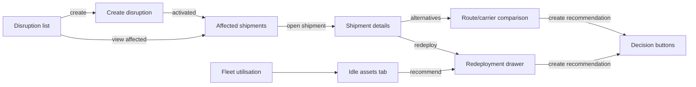

# Member 1 — Logistics UI Contract

**Role:** Logistics and Optimisation Engineer
**Status:** DRAFT — screens for the logistics half. The navigation shell, API client, design tokens and shared state components come from SH-04 (`phase-plan.md`); Member 2 owns cold-chain, alerts, Bob chat and audit screens.
**Related:** `api-contract.md` §3, `member-1-logistics-api.md`, `member-1-logistics-test-plan.md` (LT-22 UI states)

---

## 1. Screen inventory and mapping

| # | Screen | Route (suggested) | Essential-6 mapping | Owner |
|---|---|---|---|---|
| 1 | Disruption list | `/disruptions` | Overview / Disruption | M1 |
| 2 | Create disruption | `/disruptions/new` (modal or route) | Disruption | M1 |
| 3 | Affected shipments | `/disruptions/:id/affected` | Affected Shipments | M1 |
| 4 | Shipment details | `/shipments/:id` | Shipment Detail | M1 (logistics tabs) |
| 5 | Route/carrier comparison | `/shipments/:id/alternatives` | Route/Carrier Comparison | M1 |
| 6 | Fleet utilisation | `/fleet` | Fleet / Idle | M1 |
| 7 | Idle assets | `/fleet/idle` (tab of 6) | Fleet / Idle | M1 |
| 8 | Redeployment recommendation | drawer on 4/7 | Fleet / Idle + Shipment Detail | M1 |

Shared components used by every screen (from SH-04): app shell/nav, API client with error normalisation, `StatusBadge`, `ScoreBar`, `FactorList`, `EmptyState`, `ErrorState`, `TableSkeleton`, `ConfirmDialog`, `Toast`.

---

## 2. Screen specifications

### 2.1 Disruption list (`/disruptions`)

- **Purpose:** single source of truth for what is disrupted; entry point to impact analysis.
- **Data needed:** id, type, region, start/end, severity, status, `is_currently_active`, description.
- **API:** `GET /api/disruptions?status=&region_code=`
- **User actions:** filter by status/region; create new; activate/resolve (PATCH); open affected shipments; expand row for description/audit link.
- **Loading:** table skeleton (5 rows).
- **Empty:** "No disruptions recorded" + primary CTA "Create disruption".
- **Error:** inline retry banner; filters preserved on retry.
- **Edge cases:** open-ended end shows "Ongoing"; scheduled disruptions show distinct badge and are not clickable to affected list until active; resolved hidden by default filter but reachable; 409 on double-resolve shows toast "Already resolved".
- **Acceptance criteria:** active flag matches the frozen window rule; every row links to a working affected list; resolve action writes an audit record (visible on M2 audit screen).

### 2.2 Create disruption (`/disruptions/new`)

- **Purpose:** let the operator declare an event (the demo's triggering action).
- **Data needed:** type, region (dropdown from controlled vocabulary), start, end (optional), severity 1–5, description, activate-now toggle.
- **API:** `POST /api/disruptions`
- **User actions:** fill form; submit; cancel; on success navigate to affected shipments.
- **Loading:** submit button spinner; inputs disabled during submit.
- **Empty:** n/a (form).
- **Error:** field-level inline errors from `400 details`; `409` duplicate → banner "An identical active disruption already exists" with link to it.
- **Edge cases:** empty end = "open-ended" helper text; start in the past allowed (backdated activation); start in the future + activate-now → warning that it will not trigger matching yet; severity defaults to 3.
- **Acceptance criteria:** invalid region/severity never submits; successful create returns `D##` and the affected list loads immediately.

### 2.3 Affected shipments (`/disruptions/:id/affected`)

- **Purpose:** R1 visible output — the ranked blast radius.
- **Data needed:** shipment summary, `impact_status`, `impact_score`, `match_reason`, `matched_segment_ids`, `matched_disruptions`, `timing_basis`, `confidence`.
- **API:** `GET /api/disruptions/:id/affected-shipments`
- **User actions:** sort by score/status/deadline; filter by status/cold-chain; open shipment detail; copy match reason; toggle "include delivered".
- **Loading:** table skeleton; header shows disruption summary while loading.
- **Empty:** "No shipments affected by this disruption" (valid outcome, not an error).
- **Error:** retry banner; if disruption 404 → "Disruption not found" + back link.
- **Edge cases:** `unknown_review` badge with reason tooltip; multiple disruptions per row expandable; `timing_basis = unknown` shows a "timing unknown" chip; critical rows visually distinct (not colour-only — badge + icon).
- **Acceptance criteria:** every row shows a human-readable match reason; ranking order matches the API sort; empty state renders for the no-impact scenario (test LT-02).

### 2.4 Shipment details (`/shipments/:id`)

- **Purpose:** full context for one shipment before acting.
- **Data needed (logistics tabs):** shipment fields, route + segments timeline, carrier, current/next segment, planned vs actual times, route capacity, pending recommendations.
- **API:** `GET /api/shipments/:id`; `GET /api/recommendations?shipment_id=&status=pending`; risk/sensor tabs use M2 endpoints.
- **User actions:** switch tabs (Route, Risk, Sensors, Recommendations, Audit); open alternatives; open redeployment drawer; decide a pending recommendation.
- **Loading:** per-tab spinner/skeleton (tab content loads independently).
- **Empty:** Recommendations tab → "No pending recommendations" + CTA to alternatives/redeploy; Sensors tab (M2) handles its own empty state.
- **Error:** per-tab error message; other tabs remain usable.
- **Edge cases:** delivered shipment → banner "Delivered — read-only, no new recommendations" and action buttons disabled; missing planned times → "Timing unknown" note; segment timeline highlights the current segment.
- **Acceptance criteria:** no tab shows raw JSON; route timeline reflects `seq` order; actions are disabled for non-actionable statuses.

### 2.5 Route/carrier comparison (`/shipments/:id/alternatives`)

- **Purpose:** R2 visible output — ranked, explained alternatives.
- **Data needed:** ranked options (route or carrier) with score, factors, reasons, constraints, estimated ETA/cost, risk, confidence; rejected list with reasons.
- **API:** `GET /api/shipments/:id/route-alternatives`, `GET /api/shipments/:id/carrier-alternatives`, `POST /api/recommendations` (A-5), `POST /api/recommendations/:id/decision`
- **User actions:** switch Routes/Carriers tabs; expand factor breakdown; expand rejected options; select an option → "Create recommendation" → then Accept/Reject/Modify with notes.
- **Loading:** ranked card skeletons (3).
- **Empty:** "No feasible alternatives" + grouped rejection reasons (e.g. "2 overlap the disrupted region, 1 lacks capacity").
- **Error:** retry banner; `409` on decision shows "Already decided" and refreshes.
- **Edge cases:** single candidate shows confidence `medium` chip; `not_actionable` (delivered) hides action buttons; residual-risk note visible on affected options; reasons rendered from the shared display templates.
- **Acceptance criteria:** every option shows score + reasons + constraints + ETA/cost + confidence; rejected options never appear in the ranked list; creating a recommendation produces a `pending` row visible in the Recommendations tab.

### 2.6 Fleet utilisation (`/fleet`)

- **Purpose:** R3 visibility — every asset and its true state.
- **Data needed:** asset summary, `operational_state`, location/region, capacity, refrigeration, idle time, `next_assignment`, `anomalies`.
- **API:** `GET /api/fleet` (A-6)
- **User actions:** filter by region/type/state; sort by idle time; open asset row detail; jump to Idle tab; open redeployment for a shipment.
- **Loading:** table skeleton.
- **Empty:** "No fleet data" (seed missing) with setup hint.
- **Error:** retry banner.
- **Edge cases:** anomaly chips (`missing_availability_timestamp`, `stale_assignment`, `conflicting_assignments`) with explanations; reserved assets show next assignment; maintenance/retired visible but excluded from idle.
- **Acceptance criteria:** derived state matches `member-1-fleet-redeployment.md` §2 on every fixture; anomalies are visible, never hidden.

### 2.7 Idle assets (`/fleet/idle`, tab of 2.6)

- **Purpose:** answer "what can I redeploy right now".
- **Data needed:** idle assets with `idle_minutes`, region, capacity, refrigeration; excluded list with reasons.
- **API:** `GET /api/fleet/idle`
- **User actions:** filter by region/min idle; sort by idle duration; select an asset → choose a shipment → open redeployment drawer (or view candidate shipments).
- **Loading:** table skeleton.
- **Empty:** "No idle assets" + excluded panel explaining why (reserved/assigned/maintenance).
- **Error:** retry banner.
- **Edge cases:** reserved assets always in excluded panel with `reserved_until`; an asset idle 0–5 min still listed (min filter default 0); stale/conflicting anomalies highlighted.
- **Acceptance criteria:** reserved assets never appear in the idle table (LT-16); excluded reasons match API output.

### 2.8 Redeployment recommendation (drawer on 2.4 / 2.7)

- **Purpose:** R3 visible output — ranked, compatible assets for a specific shipment, with human decision.
- **Data needed:** ranked candidates (`distance_km`, `idle_minutes`, `capacity_fit`, `contention_count`, score, confidence), rejected and excluded lists.
- **API:** `GET /api/shipments/:id/redeployment-candidates`, `POST /api/fleet/redeployments/recommend` (A-5), decision endpoint.
- **User actions:** open drawer from a shipment or an idle asset; expand factors; select candidate → "Create recommendation" → Accept/Reject/Modify.
- **Loading:** drawer skeleton (2 cards).
- **Empty:** "No compatible idle assets" + rejected reasons (incompatible/too far/insufficient capacity).
- **Error:** retry; `409` "Asset no longer eligible" → auto-refresh candidate list.
- **Edge cases:** contention warning "also top candidate for N other shipments"; `target_approximate` note; asset that became reserved between ranking and creation (409 path); cold-chain shipment hides non-refrigerated assets entirely.
- **Acceptance criteria:** incompatible assets never ranked (LT-18); contention surfaced (LT-21); decision writes an audit record; no action is ever auto-executed.

---

## 3. Cross-screen state matrix (acceptance)

| Screen | Loading | Empty | Error | Partial data |
|---|---|---|---|---|
| 2.1 Disruptions | skeleton | CTA create | retry banner | open-ended chip |
| 2.2 Create | submit spinner | n/a | inline field errors + 409 banner | future-start warning |
| 2.3 Affected | skeleton | valid no-impact state | retry / 404 | unknown_review + timing-unknown chips |
| 2.4 Shipment detail | per-tab | per-tab | per-tab | delivered read-only banner |
| 2.5 Alternatives | card skeletons | no-option + grouped reasons | retry / 409 refresh | single-candidate confidence chip |
| 2.6 Fleet | skeleton | setup hint | retry | anomaly chips |
| 2.7 Idle | skeleton | excluded panel | retry | stale/conflict chips |
| 2.8 Redeployment | drawer skeleton | reasons list | retry / 409 refresh | contention + approximate target |

Every screen must pass its empty/loading/error states **before** it is marked done (Definition of Done, `phase-plan.md` §5).

---

## 4. UI conventions

- Scores always rendered with their factor breakdown (`ScoreBar` + `FactorList`) — never a bare number (P3).
- Status badges use text + icon, not colour alone (accessibility).
- All destructive/state-changing actions require a confirm step and show the resulting audit record link.
- No screen calls more than one domain's APIs for its primary content; cross-domain data (risk, sensors) is loaded in its own tab (M2 ownership).
- Frontend never computes business scores; it renders API-provided factors (single source of truth).

---

## 5. Open points for Member 2 / shared

1. SH-04 shared components (shell, badges, empty/error states) must land before screens are wired.
2. Audit screen (M2) must render logistics audit records (`disruption`, `recommendation`, `assignment` entity types).
3. Decision buttons on 2.5/2.8 call the shared decision endpoint; the same component is reused for cold-chain acknowledgements.
4. A-5/A-6/A-9 approval is required for screens 2.5/2.6/2.8 to have their full actions.
